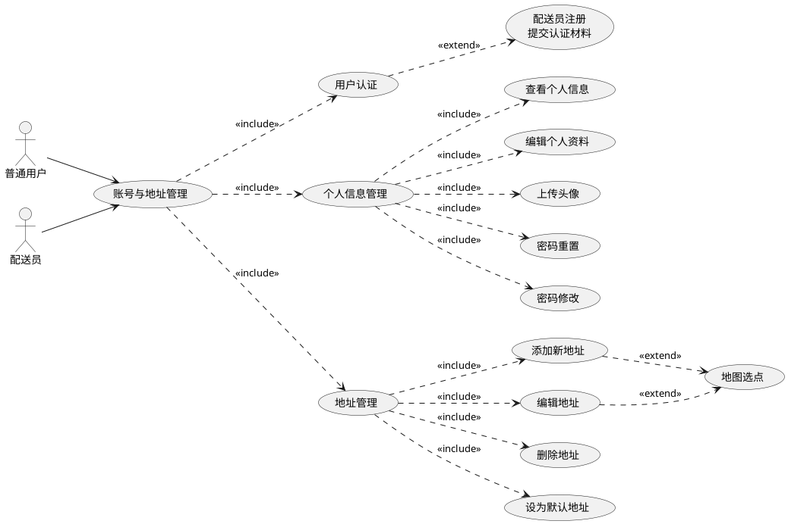
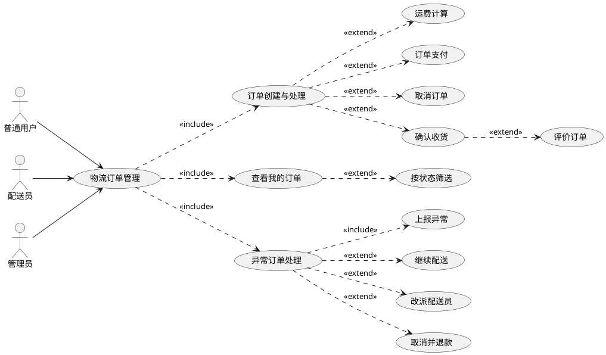
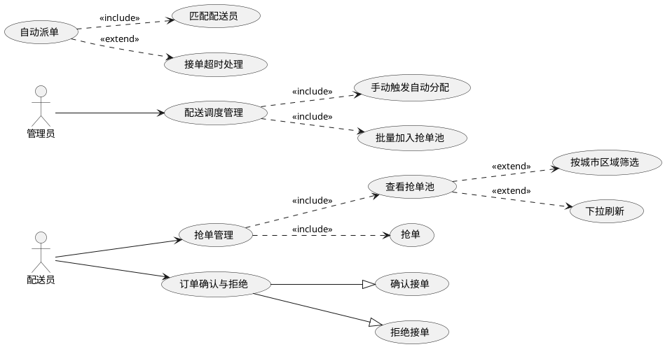
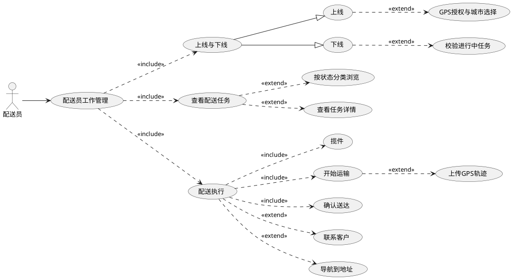
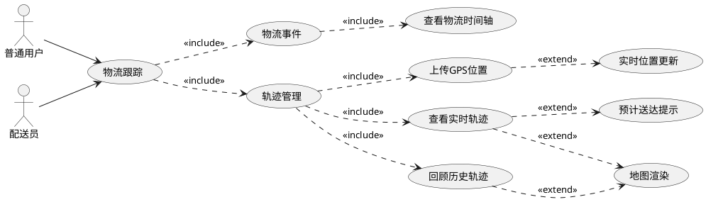
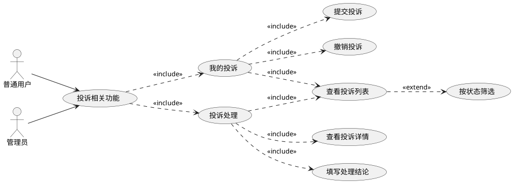
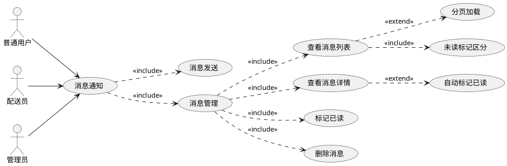
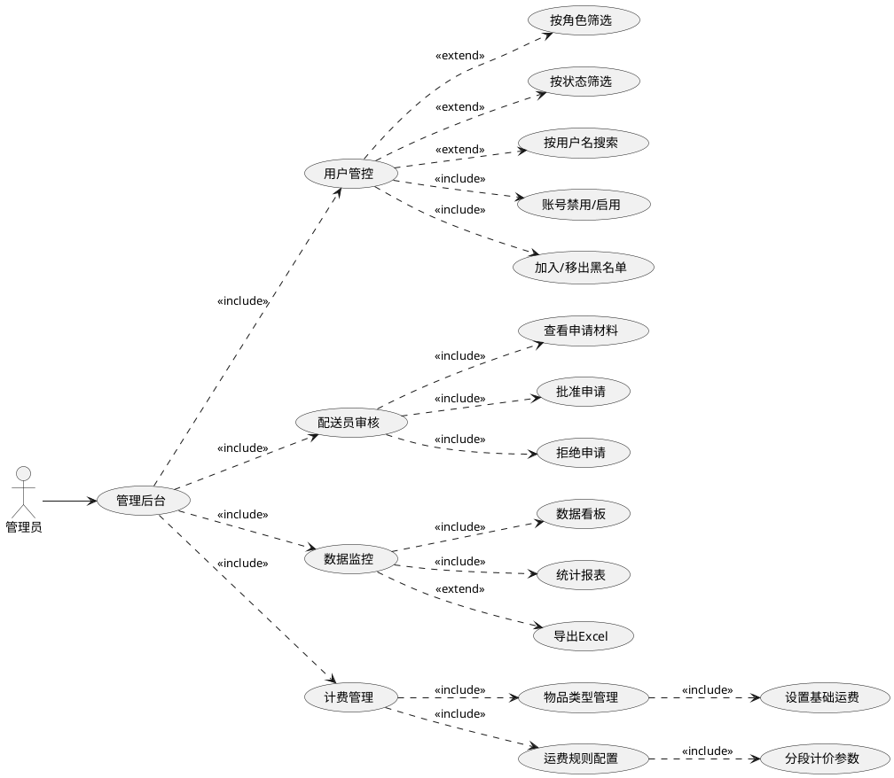

### 第 3 章 物流跟踪与管理系统需求分析

本章围绕物流跟踪与管理系统展开需求分析，重点梳理订单配送全流程和物流实时跟踪机制中涉及的业务场景，旨在厘清普通用户寄件下单与包裹跟踪、配送员揽派任务执行以及管理员全局监控调度三类角色的核心需求，为后续系统设计提供依据。非功能性需求方面，则从可靠性、安全性、可维护性、可扩展性和易用性五个维度阐明系统的质量属性要求。

3.1 系统的功能需求

3.1.1 账号与地址管理

账号与地址管理模块包含的功能有：用户认证、个人信息管理以及常用地址的增删改查管理，面向普通用户与配送员，用例如图3-1所示。

图3-1 账号与地址管理模块用例图

1）用户认证

用户认证是系统的基础功能，负责普通用户与配送员的注册审核和登录鉴权。用户首次使用App会进入注册页面，填写用户名、密码、姓名、手机号和角色等基本信息后提交，后台校验用户名和手机号是否已被注册，校验通过后创建账号并提示注册成功。配送员注册时，除基本信息外还需额外提交身份认证材料，包括身份证正反面照片、手持身份证照片、车辆类型与车牌号、驾驶证和行驶证照片、紧急联系人信息以及工作的城市和区域。配送员点击注册后会创建一个待审核状态的账号，同时生成待审核的申请记录。配送员申请未通过时，配送员不可进行登录；管理员通过申请后，账号状态更新为有效，此时配送员可正常登录。

用户在登录页面输入用户名和密码后提交登录，校验凭证正确后分配登录凭证，系统后台会根据用户角色进入到不同的客户端首页。若用户名不存在或密码错误，会提示"用户名或密码错误"，用户需要修改输入后重新登录。

2）个人信息管理

个人信息管理为用户提供个人资料维护和密码管理等功能。用户在个人中心页面可查看头像、姓名、手机号和角色等基本信息，页面支持下拉刷新获取最新数据。用户点击编辑资料可进入个人信息编辑页面，修改姓名、手机号和可选的邮箱信息，编辑时前端校验手机号为正确的11位格式、邮箱为合法格式，提交保存后返回个人中心并刷新展示。用户可在个人中心点击头像区域选择本地图片上传作为新头像，上传成功后即时更新展示。

密码重置用于忘记密码场景，用户无需登录即可在重置密码页面输入用户名发起重置，系统校验用户名存在后允许设置新密码，新密码长度不少于6位且需二次确认一致，重置成功后提示用户重新登录。

密码修改适用于已登录用户，用户在修改密码页面输入原密码、新密码和确认密码，三个密码输入框均支持切换明文或密文显示以便核对。系统校验原密码正确、新旧密码不相同、新密码长度不少于6位且两次新密码一致后，用加密方式将新密码更新至账号，提示用户重新登录完成密码更新。

3）地址管理

地址管理为普通用户提供常用收发货地址的增删改查功能，是后续寄件下单的数据基础。用户进入地址管理页面，以列表形式展示该用户保存的全部地址，每条地址显示联系人姓名、联系电话、省市区和详细地址。点击单条地址进入编辑页面，可修改联系人信息、地址详情和地图坐标，提交后更新并提示修改成功。用户可将某条地址设为默认地址，设为默认后其余地址的默认标记自动取消，寄件时寄件人信息初始填充为默认地址。

用户点击添加按钮进入地址填写页面，依次输入联系人姓名、联系电话、所在省市区和详细地址后，可通过地图选点获取位置的经纬度坐标。提交时校验必填字段均已填写，校验通过后保存地址。新地址可选择直接设为默认地址。地址列表删除操作，删除前弹出确认框防止误操作，删除后地址列表会清理掉被删除的地址信息。

3.1.2 物流订单管理

物流订单管理模块是本系统的核心业务模块，涵盖从创建物流订单、运费计算与订单支付到确认收货、取消订单、上报与处理异常订单的完整订单生命周期，涉及普通用户、配送员和管理员三类角色，用例如图3-2所示。

图3-2 物流订单管理模块用例图

1）订单创建与处理

订单创建与处理涵盖从下单创建、运费计算与支付到确认收货与评价的完整业务闭环。用户进入寄件页面，依次填写寄件人信息和收件人信息，包括寄件人姓名、电话、省市区和详细地址，以及收件人姓名、电话、省市区和详细地址。用户可从地址簿选择已有地址，或使用当前定位作为发货点。然后用户需要选择物品类型并填写预估重量，选择物品类型后系统根据其基础运费规则展示运费明细供用户确认。用户还需选择上门取件时间，可选填备注信息。用户确认信息无误后提交订单，系统生成唯一订单号并提示下单成功，同时订单状态被初始化为待支付。

用户在订单详情页点击去支付后，完成订单支付，支付成功后订单状态更新为已支付，并向用户发送支付成功通知。支付完成后订单等待系统为其匹配配送员。用户可在订单未支付和已支付时取消订单，用户在详情页面点击取消订单后，根据订单当前状态判断是否允许取消：待支付和已支付状态的订单可直接取消。若订单已支付，已付金额自动退回用户钱包。已完成、已取消等终态的订单不允许取消。

用户收到货物后，在订单详情页点击确认收货，校验当前状态为已送达后将订单状态更新为已收货，页面随即展示评价入口。用户可对本次配送服务进行星级评分并填写文字评价，提交后保存评价记录并提示评价成功。该评价将计入对应配送员的综合评分。

2）查看我的订单

查看我的订单为用户提供全部历史订单的浏览与实时状态跟踪功能。用户进入我的订单页面，按创建时间倒序展示该用户的所有订单，每条记录显示订单号、当前状态标签和收件人信息和寄件人信息的摘要。点击单条订单进入详情页，展示寄件人与收件人的姓名、联系电话和地址，物品描述与重量，以及运费明细。详情页顶部提供一个地图组件，地图上会展示寄件和收件地址的定位；地图组件下会根据订单当前状态动态展示可执行的操作按钮，例如待支付订单显示去支付按钮，已送达订单显示确认收货按钮，允许取消状态的订单显示取消订单按钮。

3）异常订单处理

配送员在配送过程中如遇货物损坏、收件地址错误、收件人无法联系等异常情况，可在客户端上报异常，选择异常类型并填写详细描述。配送员上报异常后订单更新为异常状态，并暂停当前配送流程，寄件用户在订单列表和详情中会看到订单状态变为处理中。

管理员可以查看异常订单列表，点击某个异常订单后会看到物流订单详情和异常处理按钮。管理员可根据异常类型选择对应的处理方式：对于可恢复的异常订单可以选择继续配送，订单恢复至异常前的活动状态；对于能够更换配送员的异常订单可以选择改派，清除原配送关系并将订单退回已支付状态待重新分配；对于无法继续配送的异常订单只能选择取消并退款，订单更新为取消状态同时会退回用户支付的运费。

3.1.3 配送调度

图3-3 配送调度模块用例图

配送调度模块在订单支付完成后介入，负责将待配送订单分配至合适的配送员。模块的核心机制包括系统自动派单、配送员接单确认与抢单以及管理员的调度管理，涉及配送员和管理员两类角色，用例如图3-3所示。

1）自动派单

订单支付成功后触发自动派单流程。系统后台的匹配算法根据订单寄件地址搜索附近在线的可用配送员，综合评估各配送员的当前距离、顺路程度和已接单数量等因素进行加权评分，自动选出最优配送员进行分配。分配成功后订单状态更新为配送员待确认，同时向被分配配送员推送新订单通知并生成待确认任务记录。若附近无可用的在线配送员，系统自动将订单转入抢单池供配送员抢单。若配送员在设定时间内未确认接单，系统自动拒绝该分配并将订单重新投入分配流程，保证订单不会长期滞留。

2）订单确认与拒绝

配送员收到自动派单后，在任务页面的待确认列表中查看待处理订单的详细信息。配送员确认接单后订单状态更新为待揽件并记录接单事件；配送员也可直接拒绝接单，拒绝后订单状态回退至已支付并转入抢单池。拒绝操作需校验订单当前仍处于待确认状态，防止并发场景下的状态冲突。

3）抢单管理

自动派单未找到合适配送员的订单或被配送员拒绝接单的订单会转入抢单池。抢单池按照订单寄件地址所在的城市和区域进行分组管理，配送员进入抢单大厅后，展示其工作城市各区域抢单池中的待抢订单列表，每条订单卡片显示订单号、取件地址和收件地址的摘要和预计距离。配送员可通过下拉刷新获取抢单池中的最新订单。

配送员在抢单大厅选中目标订单后点击抢单按钮，实时校验该订单仍在抢单池中且配送员当前接单数未达上限，校验通过则将该订单分配给该配送员并从抢单池中移除。若在提交瞬间该订单已被其他配送员抢走，提示抢单失败并刷新订单列表。抢单成功后订单状态更新为待揽件，配送员可在任务列表中开始后续配送流程。

4）配送调度管理

管理员可在后台对配送调度进行人工干预。对于长期处于待支付或已支付状态仍未进入分配流程的订单，管理员可在后台手动触发自动分配，系统重新执行配送员匹配算法为该订单匹配最优配送员。当抢单池中订单长期未被领取时，管理员可将待支付或已支付状态的订单批量加入抢单池，扩大抢单池的订单供给，提升配送员的抢单积极性及订单分配效率。

3.1.4 配送员工作管理

配送员工作管理模块面向配送员，提供工作状态的上下线控制、配送任务查看以及从揽件、运输到送达的配送任务全流程执行功能，用例如图3-4所示。

图3-4 配送员工作管理模块用例图

1）上线与下线

配送员点击上线时需授权读取GPS位置信息，配送员位置信息上传后更新配送员状态为在线，此后配送员可被分派订单和参与抢单。配送员点击下线时，会校验当前没有进行中的配送任务，校验通过后将状态设为离线并停止接收新订单。若仍有未完成的任务，提示先完成配送后再下线。配送员退出登录时自动执行下线操作。

2）查看配送任务

查看配送任务为配送员提供按状态分类的任务浏览视图。配送员进入任务页面，按状态将配送任务分为待取件、配送中和已完成等分类展示，可快速切换分类查看对应状态的任务列表。点击单条任务可进入详情页查看订单完整信息。

3）配送执行

配送执行是配送员接单后对配送任务进行全流程操作的核心环节，涵盖揽件、运输与送达三个关键节点。配送员到达寄件地址后点击揽件，揽件成功后订单状态更新为已揽件，记录揽件时间与地点并生成揽件物流事件。揽件完成后配送员可以开始运输流程，配送员点击开始运输后，订单状态更新为运输中。运输过程中，后台以固定时间间隔采集并上传配送员GPS经纬度坐标，持续记录配送轨迹，用户可通过物流跟踪模块实时查看包裹位置与运输路线。配送员到达收件地址后执行确认送达操作，订单状态更新为已送达，系统记录送达时间与送达地点，同时向用户推送送达通知，提醒其及时确认收货。

3.1.5 物流跟踪

物流跟踪模块是系统的核心特色功能，为用户提供从下单到签收全过程的物流事件记录与展示，支持配送员实时轨迹的可视化跟踪，用例如图3-5所示。

图3-5 物流跟踪模块用例图

1）物流事件

订单流转的各关键节点自动记录物流事件，生成带有时间戳和地点信息的事件节点。物流事件的触发节点包括：用户提交订单、订单支付成功、配送员确认接单、配送员揽件完成、包裹进入运输环节、配送员开始末端派送、配送员确认送达、用户确认收货，以及异常上报与处理等非正常节点。每条事件记录包含事件类型、发生时间和关联地点，共同构成订单完整的物流履历。

用户进入订单详情页后，以物流时间轴的形式按时间正序展示该订单从创建到当前时刻的全部物流事件。时间轴中的每条事件节点以图标区分类型，标注事件描述、记录时间和地点。处于进行中的节点与已完成节点在视觉上加以区分，异常事件以警示样式突出显示。

2）轨迹管理

配送员在运输物流订单期间，客户端以固定时间间隔自动采集当前GPS经纬度坐标，连同采集时刻的时间戳一并上传至服务端。上传在配送员处于运输中状态下持续进行，配送员离线或配送员点击确认送达后自动停止。轨迹上传在客户端后台静默执行，不需要配送员手动干预以确保轨迹的连续性。

用户进入订单详情页面后，会在地图组件上看到寄件地址和收件地址两个固定标记点。若订单当前处于运输中环节，地图上叠加展示配送员的实时位置标记和从寄件点到当前位置的移动轨迹线，配送员的位置标记随轨迹数据更新而动态移动。对于已完成的订单，地图上会展示该物流订单的完整物流轨迹，用户可回顾包裹的全程运输路线。

3.1.6 投诉相关功能

投诉相关功能模块为用户提供配送服务问题的反馈与申诉渠道，同时为管理员提供投诉受理与处置工具，用例如图3-6所示。

图3-6 投诉相关功能模块用例图

1）我的投诉

我的投诉为用户提供对配送服务问题的在线反馈渠道，支持提交投诉与查看处理进度。用户在订单详情页点击投诉按钮进入投诉页面，选择投诉类型（服务态度问题、配送延误、物品损坏、物品丢失和其他问题）后填写投诉标题和详细内容。提交后生成投诉单并标记为待处理状态，同时记录投诉人与被投诉配送员的关联信息。用户可在我的投诉页面查看已提交投诉的列表，每条记录显示投诉单号、投诉类型、提交时间和处理状态，点击单条投诉可查看完整内容和处理进度。

用户在我的投诉页面中，可对待处理状态的投诉发起撤销操作。撤销后投诉单状态更新为已撤销，不再进入管理员的处理流程。已处理和已撤销的投诉不可再次撤销。

2）投诉处理

管理员可在管理后台查看所有投诉列表及待处理投诉数量，点击单条投诉进入详情页查看投诉内容、关联订单信息和投诉双方信息。管理员审核后需填写处理结论和处理说明，提交后投诉单状态更新为已处理，同时向投诉人和被投诉配送员通知处理结果。

3.1.7 消息通知

消息通知模块在订单状态变更、投诉处理进展等关键业务节点自动向相关用户生成通知消息，并提供消息的集中查看与管理功能，用例如图3-7所示。

图3-7 消息通知模块用例图

1）消息发送

在以下业务环节自动生成通知并推送至用户消息中心：用户支付成功后通知订单已进入配送准备阶段；配送员接单成功后通知用户配送员已接单并告知联系方式；配送员揽件后通知快件已揽收；订单已送达后通知收件人及时确认收货；订单发生异常后通知下单用户异常原因及处理进展；用户发起投诉后通知投诉人投诉已受理；投诉处理完成后通知双方处理结论；用户评价配送员后通知被评价的配送员；配送员审核通过或拒绝后通知申请人审核结果。

2）消息管理

消息管理为用户提供系统通知的集中查阅、标记已读与清理的统一入口。用户进入消息中心页面，按时间倒序展示当前用户收到的全部消息列表，支持分页加载。每条消息显示类型图标、标题和正文摘要，未读消息以加粗样式和红点标记区分。用户点击单条消息进入详情页查看完整内容，进入后自动将该消息标记为已读。

用户可在消息列表中点击删除按钮移除单条消息，删除后从列表中移除。用户也可在详情页手动标记为已读。列表页顶部提供全部已读按钮，用户点击后将全部未读消息批量标记为已读。

3.1.8 管理后台

管理员有权限访问管理后台模块，此模块提供用户管控、配送员审核、数据监控以及计费管理等运营管理功能，用例如图3-8所示。

图3-8 管理后台模块用例图

1）用户管控

用户管控为管理员提供对系统注册用户的集中管理能力，支持状态控制与黑名单机制。管理员进入用户管控页面，以表格形式展示全部用户列表，支持按用户名搜索及按角色和状态筛选。每条记录显示用户名、姓名、手机号、角色和状态信息。管理员选中用户后可执行禁用或启用、加入黑名单或解封等操作，操作完成后列表实时刷新。管理员可单独查看当前黑名单中的用户列表。

2）配送员审核

配送员审核用于对新注册配送员提交的认证材料进行人工核验。管理员进入配送员审核页面，展示待审核的配送员申请列表，每条显示申请人姓名、手机号、申请时间和审核状态。管理员点击单条申请可查看完整的申请材料，包括身份证照片、车辆照片、驾驶证信息和紧急联系人资料。管理员审阅后可批准或拒绝申请，拒绝时需填写拒绝原因，申请状态更新后向申请人推送审核结果通知。

3）数据监控

管理员有权限访问运营统计数据，管理端提供数据看板和统计报表两个入口。数据看板以柱状图、环形图和进度条等形式集中展示今日新单、今日收入、配送中订单和今日完成单量等核心指标，以柱状图分别呈现近12天的订单趋势与收入趋势，以环形图展示订单状态分布情况，并以进度条形式展示在线配送员、活跃用户和抢单池订单数等实时运营数据。订单概览区域则汇总展示订单总数、实收累计金额、已支付订单数和已送达订单数。统计报表页面在数据看板的基础上，进一步提供注册用户总数、普通用户数、配送员数、今日新注册用户数和当前在线配送员数等用户概况数据，涵盖待支付、已支付、待确认、待揽件、已送达和已取消等全状态的订单明细汇总，同时展示最多14天的订单按日趋势以及抢单池内订单数与待补救订单数。

4）计费管理

计费管理为管理员提供物品分类与运费规则的配置能力，是订单运费计算的基础支撑。管理员可管理物品类型列表，对分类进行添加、编辑和删除操作，并为每种物品类型设置基础运费和每公斤附加费。新增或修改的配置内容即时生效，后续下单的订单按最新规则计算运费。

3.2 系统的非功能性需求

3.2.1 可靠性需求

可靠性需求一般认为是软件在规定条件下、给定时间段内正确完成预期功能的几率，直接影响用户对系统的信赖程度。对物流管理系统而言，订单能否如期履约、资金流转是否准确无误，都取决于系统的可靠程度，因此可靠性建设是不可或缺的环节。

系统需要具备应对异常情况的容错能力，从并发争抢资源到服务升级中断，再到网络波动，都不应导致业务数据进入不一致的状态。这要求在数据库层面充分利用事务的原子性、一致性、隔离性和持久性保障，结合合理的锁策略化解并发写入冲突。系统还需具备故障后的快速恢复能力，服务崩溃时应能在短时间内重新拉起，数据若不幸损坏则需有备份可供回档。当新版本上线存在隐患时，灰度发布和回滚机制能将影响控制在最小范围。此外，代码质量是可靠性的根源，应通过充分的测试和评审减少程序缺陷。

结合本系统的业务特点，容错性的实现重点在于订单全生命周期的状态管理。下单、支付、派单、取件、配送、签收等环节之间有着严格的前后依赖，每个状态变更都须封装在数据库事务中执行，并选取合适的隔离级别以防脏读和幻读。对于抢单这类典型并发场景，需要乐观锁确保一个订单最终只被一名配送员获取，避免重复分配。而对于支付完成触发派单、派单完成通知配送员这类跨越多个处理单元的异步操作，单靠数据库事务已无法覆盖，系统通过消息中间件配合本地消息表来保证事件通知的最终必达，借助重试和补偿机制处理中间环节的暂时性失败，避免订单在某一阶段长期滞留。在部署层面，本系统采用 Docker 容器化方案，配合健康探针与自动重启策略，使服务在异常中断后能快速恢复可用状态，满足易恢复性的要求。

3.2.2 安全性需求

物流管理系统承载着大量用户隐私数据、交易凭证和资金记录，在开放网络环境下运行，安全保障是底线要求。本系统从以下几个层面来保证安全性：

在传输与存储安全方面，系统与客户端之间的所有通信都应走加密信道，使用 TLS 协议保障数据在传输途中不被窃听或篡改，部署正式的 SSL/TLS 证书以抵御中间人攻击。服务端仅将必须公开的入口（如注册登录、验证码获取）设为匿名可访问，其余接口全部纳入认证保护体系，阻断未经验证的请求。

在访问控制方面，系统采用基于角色的权限管理模型，为不同的参与者设定独立的操作边界。普通用户只能发起与自身相关的业务，配送员只能操作已分配的任务和查看自身收益，管理员则专注于全局性的审核与治理工作。权限校验不仅作用于接口准入层面，还需深入到数据归属层面，当多个角色访问同一类资源时，系统必须判定当前访问者是否为该数据的合法相关方，仅允许在其权限范围内获取信息。

在接口安全方面，本系统作为前后端分离架构的后端服务，通过 RESTful 接口对外暴露能力。为了防止内部数据结构的非预期泄露，应当为每个接口独立定义输入和输出的传输模型，确保服务端控制哪些字段可以对外呈现、哪些字段允许客户端写入，杜绝因直接映射数据库表结构而引发的越权访问或数据篡改风险。对于支付等涉及资金变动的接口，须保证调用幂等性，同一笔支付请求不论被重复提交多少次，最终只产生一次扣款效果。钱包账户的每笔收支均需生成完整流水记录，形成可追溯的资金轨迹。

3.2.3 可维护性和可扩展性需求

一个具备良好工程素质的系统，应当具备可维护性和可扩展性，能从容应对需求迭代、底层组件升级乃至技术栈变迁，改动成本尽可能低。

业务功能应按领域边界拆解为独立且职责聚焦的模块单元，模块之间通过明确的接口契约交互，内部实现细节对外不可见。利用依赖注入机制，各模块可以在不修改代码的情况下灵活装配与替换，新功能的加入只需扩展现有模块或在新的模块中复用已有能力，无需大面积改动。系统还需具备可观测性：关键业务流程上应埋设足够的日志记录点，当线上出现问题时，运维人员能依据日志链路快速定位异常发生的位置和上下文。各类基础设施的接入（数据存储、缓存、异步消息、文件服务等）统一收敛到配置文件进行声明式管理，切换底层组件时仅修改配置项，业务逻辑保持不变。

基于本系统的业务特征，订单与派单模块是扩展需求最为集中的区域。派单策略不应被固化在某一特定实现中，而是抽象出通用接口，当前支持的自动匹配派单和配送员主动抢单两种模式各自遵循该接口的约定独立实现，未来若需引入竞价派单、预约时段派单等新模式，开发人员只需按照同样的接口规范新增一个策略单元，已有代码无需调整。实时消息通知模块基于 WebSocket 的发布-订阅模型构建，位置轨迹更新、订单状态变化、新单提醒等不同业务事件按主题通道分别推送，新增消息种类时直接利用现有推送框架即可完成，不会影响其他消息通道的稳定性。

3.2.4 易用性需求

物流管理系统的服务对象涵盖了普通消费者、配送人员和后台管理者，使用门槛的高低直接关系到各方的接受度和使用频率，因此易用性是系统设计时必须重点考量的非功能性指标。

在界面体验层面，系统各功能页面的布局和交互模式应保持统一风格。相似的操作（如订单列表查询、配送进度更新）在不同模块中呈现一致的交互路径，降低用户记忆负担。当用户操作出错或系统处理异常时，反馈信息应当即时呈现且表述清晰易懂，应当能够说明当前状况和建议的解决方式。操作按钮和功能入口的文案应准确传达其行为，让用户清晰的知道点击后的结果。

在本系统中，用户管理地址、下单寄件、跟踪包裹、确认收货等核心流程在设计上力求直观简洁，普通用户无需阅读帮助文档即可独立完成操作。配送员端的任务列表、取件确认、送达登记等功能同样注重操作效率，减少不必要的步骤跳转。后端接口遵循一致的命名规范和返回格式，使得前端开发者在对接不同业务接口时能复用同一套处理逻辑，降低接入和维护成本。对于需要实时感知变化的信息，系统通过 WebSocket 长连接主动将数据下发至客户端，无需用户手动刷新页面，显著提升了信息获取的时效性和操作的连贯感。

3.3 本章小结

本章从功能性需求与非功能性需求两个方面对物流跟踪与管理系统进行了系统分析。功能需求部分通过各模块的用例建模与业务流程描述，界定了账号与地址管理、物流订单管理、配送调度、配送员工作管理、物流跟踪、投诉相关功能、消息通知和管理后台共八个功能模块的具体需求，明确了普通用户、配送员和管理员三类角色在各模块中的参与范围和操作权限。非功能需求部分从可靠性、安全性、可维护性、可扩展性和易用性五个维度出发，结合系统业务特征阐明了系统的质量属性要求，为后续章节的系统设计与实现提供了依据。
