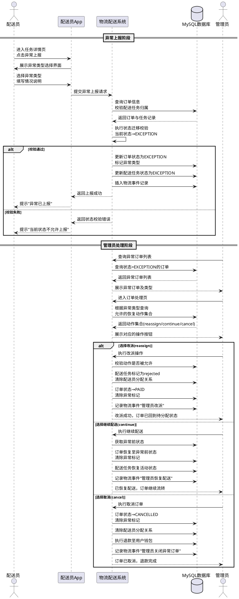
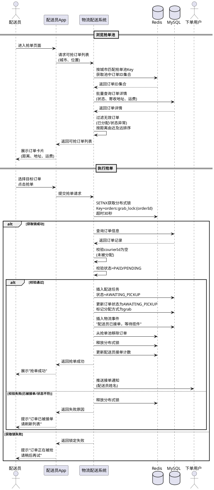
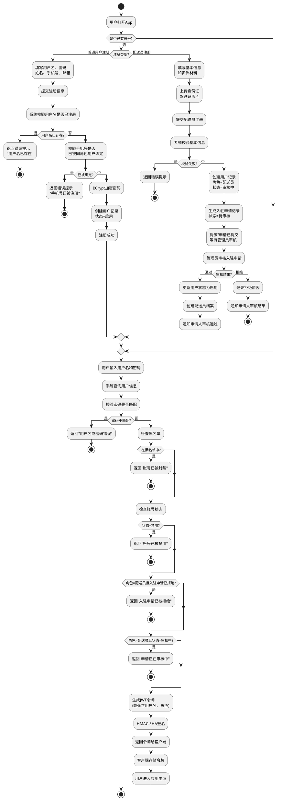

# 第四章 系统设计

## 4.1 系统总体设计

### 4.1.1 功能模块设计

系统的功能模块划分考虑到App面向普通用户、配送员与管理员三类角色的特点，主要按照寄件下单、运力调度、配送执行与物流跟踪的业务流程进行划分，各模块内的具体功能则依据角色权限展开。界面路由及后端控制器的组织均参照功能模块划分的结果。本系统共划分为8个功能模块，各模块的内容如下：

1) 账号与地址模块，所有用户有访问权限，功能有：用户注册与登录、配送员入驻申请与资质材料提交、令牌刷新、密码重置与修改、个人资料维护、头像上传，以及常用地址的增删改查与默认地址管理；
2) 物流订单模块，普通用户有访问权限，功能有：创建寄件订单、运费计算、订单支付与支付状态查询、我的订单列表及详情查询、取消订单、确认收货与配送评价；此外包含钱包功能，支持余额查询、充值与交易记录查询，配送员侧提供收入统计与提现记录查询；
3) 配送调度模块，管理员与配送员有访问权限，功能有：管理员对待分配订单执行自动派单或加入抢单池，配送员查看抢单池订单列表与执行抢单，以及自动分配后配送员的接单确认与拒绝；
4) 配送员工作模块，配送员有访问权限，功能有：上下线管理，上线需授权位置信息并绑定工作城市，下线校验无进行中任务后方可执行；配送任务按状态分类浏览、揽件确认、运输状态更新、送达确认、异常上报，以及个人配送历史与数据看板；
5) 物流跟踪模块，所有认证用户有访问权限，功能有：订单物流事件时间轴查询、配送员实时位置采集与上报、订单轨迹点查询与轨迹历史回顾；系统通过WebSocket实现位置数据与订单状态的实时推送；
6) 投诉反馈模块，所有用户有访问权限，功能有：提交投诉、我的投诉列表及详情查询、按订单查询投诉、撤销投诉，以及管理员侧的投诉受理与处理结论填写；
7) 消息通知模块，所有认证用户有访问权限，功能有：通知列表查询、未读数量统计、标记已读与全部已读、删除通知，系统在订单状态变更与投诉处理进展等节点自动生成通知；
8) 管理后台模块，管理员有访问权限，功能有：用户列表查询、用户启用禁用与拉黑解封，配送员入驻申请审核与黑名单管理，异常订单查询与恢复处理，投诉列表与处理，物品类型与运费规则配置，以及数据看板与统计报表。

根据功能模块划分和各模块的功能，系统功能模块图如图 4-1 所示。

图 4-1 系统功能模块图

### 4.1.2 应用架构设计

系统使用 Spring Boot 框架开发，按照 MVC 模式开发的通常做法，将系统的应用架构分为表现层、控制层、服务层、数据访问层和数据层。分层架构的做法能使软件结构更加清晰，使代码更容易阅读和维护。

在本系统中，表现层为系统前端部分，通过 HTTP 协议和 WebSocket 协议与后端交互。控制层通过 RESTful 风格的控制器开放 API 供表现层的前端调用，共包含 24 个控制器，根据功能类别分为面向普通用户的控制器和面向管理员的控制器两组，管理员控制器统一放置在 admin 子包下。服务层整合了系统中的订单服务、配送调度服务、支付服务、追踪服务、钱包服务等业务逻辑，控制器将这些服务作为依赖进行调用。数据访问层基于 MyBatis 框架，通过 Mapper 接口和 XML 映射文件提供访问数据库的接口，数据最终在 MySQL 数据层存储。

此外，系统中还包含安全认证、消息队列和实时通信等中间件，为控制层与服务层提供认证授权、异步消息传递和双向实时通信等功能支撑。系统的应用架构图如图 4-2 所示。

图 4-2 系统应用架构图

### 4.1.3 技术架构设计

系统基于 Spring Boot 框架构建，使用 Java 作为开发语言，通过 Maven 进行项目依赖管理。用户访问服务时，客户端通过 HTTP 协议发送请求至后端 REST API，经安全认证过滤器校验后由对应的控制器处理业务请求。请求过程中，后端程序访问 MySQL 关系型数据库进行数据持久化，访问 Redis 内存数据库进行缓存与状态管理，通过 RabbitMQ 消息队列进行异步消息传递，利用对象存储服务管理用户上传文件，并通过 WebSocket 协议实现客户端与服务端的实时双向通信。

系统在控制层与服务层之间通过依赖注入的方式解耦，服务层封装了订单管理、配送调度、实时追踪、消息通知等核心业务逻辑。根据系统各组件的协作关系与数据流，系统的技术架构图如图 4-3 所示。

图 4-3 系统技术架构图

## 4.2 系统数据库设计

本系统使用 MySQL 作为数据库。在数据库设计中，需要根据需求分析的结果设计数据表和表间联系，结合数据库管理系统的特点，合理设置表的字段类型、索引和外键约束，构造数据库模式的最优方案。数据库设计中涉及命名时，使用下划线命名法（snake_case），字符集使用 UTF-8；数据库需定时备份，备份间隔每日一次，至少保存 7 天；数据库的性能状况，包括 CPU 使用率、内存使用率、存储用量、请求数等指标，通过监控软件实时监控。

### 4.2.1 数据 ER 模型设计

通过分析和归纳系统需求，总结出系统中的实体和实体间的关系，即数据库的概念模型。ER 模型即是描述概念模型的工具，能通过 ER 图清晰展示其中的结构，主体部分如图 4-4 所示。从图可知，系统中主要存在 1:N、1:1 和 1:0..1 三类联系。以订单为核心实体，一个用户可以创建多个订单（1:N），一个订单至多分配给一个配送员（1:0..N），一个订单对应一条支付记录（1:0..1），一条订单可产生多条物流事件记录和多个轨迹点（1:N）。以用户为核心，一个用户拥有一个钱包（1:1），可发出多条评价和投诉、拥有多个常用地址（1:N）。配送员则与配送任务、评价、状态记录等构成 1:N 关联；一个物品类型对应一条价格规则，属 1:1 联系。

图 4-4 智慧物流配送平台数据库 ER 模型图

### 4.2.2 数据库表设计

ER 图反映了系统中实体和实体间的联系，根据 ER 图、具体需求和数据库特性，对数据库的表结构进行设计。系统共设计 18 张数据表，表间关联关系通过字段命名约定和索引实现逻辑引用，本节按业务模块顺序介绍各数据表的结构设计，其中只包含用到的核心字段。

1）用户表

用户表存储系统中全部用户的账号信息与鉴权数据。角色通过 role 字段区分，密码经 BCrypt 算法加密保存，保证密码原文不可逆推。数据表的结构如表 4-5 所示。

**表 4-5 用户表（users）结构**

| 序号 | 字段名 | 类型 | 主键 | 索引 | 唯一 | 非空 | 自增 | 描述 |
|:---:|:---|:---|:---:|:---:|:---:|:---:|:---:|:---|
| 1 | id | BIGINT | ✓ | ✓ | ✓ | ✓ | ✓ | 用户ID |
| 2 | username | VARCHAR(50) | | ✓ | ✓ | ✓ | | 用户名 |
| 3 | password | VARCHAR(255) | | | | ✓ | | 密码 |
| 4 | role | VARCHAR(20) | | ✓ | | ✓ | | 角色 |
| 5 | name | VARCHAR(50) | | | | | | 真实姓名 |
| 6 | phone | VARCHAR(20) | | ✓ | ✓ | | | 手机号 |
| 7 | status | TINYINT | | | | | | 状态 |

2）地址表

地址表存储用户的常用地址信息，包含联系人、详细地址与经纬度坐标。每位用户可维护多个地址，通过 user_id 字段关联至用户表，其中一条可标记为默认地址供下单时快速填充。经纬度建有复合索引以支持位置查询。数据表的结构如表 4-6 所示。

**表 4-6 地址表（addresses）结构**

| 序号 | 字段名 | 类型 | 主键 | 索引 | 唯一 | 非空 | 自增 | 描述 |
|:---:|:---|:---|:---:|:---:|:---:|:---:|:---:|:---|
| 1 | id | BIGINT | ✓ | ✓ | ✓ | ✓ | ✓ | 地址ID |
| 2 | user_id | BIGINT | | ✓ | | ✓ | | 用户ID |
| 3 | contact_name | VARCHAR(50) | | | | | | 联系人姓名 |
| 4 | contact_phone | VARCHAR(20) | | | | | | 联系人电话 |
| 5 | detail_address | VARCHAR(255) | | | | | | 详细地址 |
| 6 | latitude | DECIMAL(10,8) | | ✓ | | | | 纬度 |
| 7 | longitude | DECIMAL(11,8) | | ✓ | | | | 经度 |
| 8 | is_default | TINYINT | | | | | | 是否默认 |

3）配送员申请表

配送员申请表存储普通用户申请成为配送员时提交的认证资料，涵盖身份信息、驾驶证信息、车辆信息与意向工作区域。申请提交后进入待审核状态，管理员审核通过则用户角色变更为配送员，审核拒绝时记录原因供申请人查看。数据表的结构如表 4-7 所示。

**表 4-7 配送员申请表（courier_applications）结构**

| 序号 | 字段名 | 类型 | 主键 | 索引 | 唯一 | 非空 | 自增 | 描述 |
|:---:|:---|:---|:---:|:---:|:---:|:---:|:---:|:---|
| 1 | id | BIGINT | ✓ | ✓ | ✓ | ✓ | ✓ | 申请ID |
| 2 | user_id | BIGINT | | ✓ | | ✓ | | 申请人ID |
| 3 | status | VARCHAR(20) | | ✓ | | | | 审核状态 |
| 4 | id_card_no | VARCHAR(18) | | | ✓ | ✓ | | 身份证号 |
| 5 | vehicle_type | VARCHAR(20) | | | | ✓ | | 车辆类型 |
| 6 | vehicle_plate | VARCHAR(20) | | | | | | 车牌号 |
| 7 | work_city | VARCHAR(50) | | | | | | 工作城市 |
| 8 | work_district | VARCHAR(100) | | | | | | 工作区域 |
| 9 | review_time | TIMESTAMP | | | | | | 审核时间 |
| 10 | reviewer_id | BIGINT | | | | | | 审核人ID |
| 11 | reject_reason | VARCHAR(500) | | | | | | 拒绝原因 |

4）配送员状态表

配送员状态表记录每位配送员的实时工作状态、当前位置与当前接单数量，为订单智能分配提供数据支持。每位配送员唯一对应一条状态记录，状态随上下线操作与订单接单完成实时更新，分配算法仅筛选空闲状态的配送员。数据表的结构如表 4-8 所示。

**表 4-8 配送员状态表（courier_status）结构**

| 序号 | 字段名 | 类型 | 主键 | 索引 | 唯一 | 非空 | 自增 | 描述 |
|:---:|:---|:---|:---:|:---:|:---:|:---:|:---:|:---|
| 1 | id | BIGINT | ✓ | ✓ | ✓ | ✓ | ✓ | 记录ID |
| 2 | courier_id | BIGINT | | ✓ | ✓ | ✓ | | 配送员ID |
| 3 | status | VARCHAR(20) | | ✓ | | | | 状态 |
| 4 | current_lat | DECIMAL(10,8) | | | | | | 当前纬度 |
| 5 | current_lng | DECIMAL(11,8) | | | | | | 当前经度 |
| 6 | current_order_count | INT | | | | | | 当前订单数 |

5）订单表

订单表是系统的核心数据表，记录订单从创建到完成的完整业务信息，包含订单号、关联用户与配送员、物品信息、订单状态、运费金额、分配方式及异常类型等字段。订单通过全局唯一订单号标识，status 字段跟踪订单当前所处阶段，dispatch_type 区分分配方式，exception_type 在异常发生时记录异常类别。数据表的结构如表 4-9 所示。

**表 4-9 订单表（orders）结构**

| 序号 | 字段名 | 类型 | 主键 | 索引 | 唯一 | 非空 | 自增 | 描述 |
|:---:|:---|:---|:---:|:---:|:---:|:---:|:---:|:---|
| 1 | id | BIGINT | ✓ | ✓ | ✓ | ✓ | ✓ | 订单ID |
| 2 | order_no | VARCHAR(32) | | ✓ | ✓ | ✓ | | 订单号 |
| 3 | user_id | BIGINT | | ✓ | | ✓ | | 下单用户ID |
| 4 | courier_id | BIGINT | | ✓ | | | | 配送员ID |
| 5 | goods_type_id | INT | | | | | | 物品类型ID |
| 6 | goods_weight | DECIMAL(8,2) | | | | | | 物品重量 |
| 7 | status | VARCHAR(32) | | ✓ | | ✓ | | 订单状态 |
| 8 | total_amount | DECIMAL(10,2) | | | | | | 运费金额 |
| 9 | dispatch_type | VARCHAR(20) | | | | | | 分配方式 |
| 10 | exception_type | VARCHAR(30) | | ✓ | | | | 异常类型 |

6）订单地址表

订单地址表以快照形式保存每条订单的寄件与收件地址，通过 type 字段区分。订单创建时写入地址快照，后续用户修改常用地址不影响已生成订单的历史记录，保证订单数据的独立性。数据表的结构如表 4-10 所示。

**表 4-10 订单地址表（order_addresses）结构**

| 序号 | 字段名 | 类型 | 主键 | 索引 | 唯一 | 非空 | 自增 | 描述 |
|:---:|:---|:---|:---:|:---:|:---:|:---:|:---:|:---|
| 1 | id | BIGINT | ✓ | ✓ | ✓ | ✓ | ✓ | 记录ID |
| 2 | order_id | BIGINT | | ✓ | | ✓ | | 订单ID |
| 3 | type | VARCHAR(10) | | ✓ | | ✓ | | 类型 |
| 4 | contact_name | VARCHAR(50) | | | | | | 联系人姓名 |
| 5 | contact_phone | VARCHAR(20) | | | | | | 联系人电话 |
| 6 | detail_address | VARCHAR(255) | | | | | | 详细地址 |
| 7 | latitude | DECIMAL(10,8) | | | | | | 纬度 |
| 8 | longitude | DECIMAL(11,8) | | | | | | 经度 |

7）配送任务表

配送任务表记录配送员与订单的对应关系以及配送流程中接单、揽件、送达三个关键操作的时间节点。任务状态随配送进度实时更新，为配送员端任务列表与管理后台调度提供数据支撑。数据表的结构如表 4-11 所示。

**表 4-11 配送任务表（delivery_tasks）结构**

| 序号 | 字段名 | 类型 | 主键 | 索引 | 唯一 | 非空 | 自增 | 描述 |
|:---:|:---|:---|:---:|:---:|:---:|:---:|:---:|:---|
| 1 | id | BIGINT | ✓ | ✓ | ✓ | ✓ | ✓ | 任务ID |
| 2 | order_id | BIGINT | | ✓ | | ✓ | | 订单ID |
| 3 | courier_id | BIGINT | | ✓ | | ✓ | | 配送员ID |
| 4 | status | VARCHAR(32) | | ✓ | | | | 任务状态 |
| 5 | accept_time | TIMESTAMP | | | | | | 接单时间 |
| 6 | pickup_time | TIMESTAMP | | | | | | 取件时间 |
| 7 | delivery_time | TIMESTAMP | | | | | | 送达时间 |

8）物流事件表

物流事件表记录订单全生命周期中各关键节点的事件信息，包含节点状态、事件描述、发生地点与操作人，按时间正序排列即可形成完整的物流轨迹视图，为用户端物流时间轴提供数据来源。数据表的结构如表 4-12 所示。

**表 4-12 物流事件表（logistics_events）结构**

| 序号 | 字段名 | 类型 | 主键 | 索引 | 唯一 | 非空 | 自增 | 描述 |
|:---:|:---|:---|:---:|:---:|:---:|:---:|:---:|:---|
| 1 | id | BIGINT | ✓ | ✓ | ✓ | ✓ | ✓ | 事件ID |
| 2 | order_id | BIGINT | | ✓ | | ✓ | | 订单ID |
| 3 | status | VARCHAR(30) | | ✓ | | | | 节点状态 |
| 4 | description | VARCHAR(255) | | | | | | 节点描述 |
| 5 | location | VARCHAR(100) | | | | | | 地点描述 |
| 6 | operator_id | BIGINT | | | | | | 操作人ID |

9）订单轨迹表

订单轨迹表记录配送员在配送过程中上传的实时位置坐标序列，用于绘制配送轨迹与回放配送路径。轨迹数据先写入 Redis 缓存再批量持久化至本表，兼顾写入性能与数据可靠性。accuracy 字段记录定位精度，供卡尔曼滤波算法判断坐标可信度。数据表的结构如表 4-13 所示。

**表 4-13 订单轨迹表（order_tracks）结构**

| 序号 | 字段名 | 类型 | 主键 | 索引 | 唯一 | 非空 | 自增 | 描述 |
|:---:|:---|:---|:---:|:---:|:---:|:---:|:---:|:---|
| 1 | id | BIGINT | ✓ | ✓ | ✓ | ✓ | ✓ | 轨迹ID |
| 2 | order_id | BIGINT | | ✓ | | ✓ | | 订单ID |
| 3 | courier_id | BIGINT | | | | | | 配送员ID |
| 4 | latitude | DECIMAL(10,8) | | | | | | 纬度 |
| 5 | longitude | DECIMAL(11,8) | | | | | | 经度 |
| 6 | accuracy | DECIMAL(10,2) | | | | | | 精度 |

10）消息通知表

消息通知表存储系统向各端用户推送的消息通知。支付成功、接单、揽件、送达等关键业务节点发生时系统自动生成通知记录，支持按用户类型分类推送。数据表的结构如表 4-14 所示。

**表 4-14 消息通知表（notification）结构**

| 序号 | 字段名 | 类型 | 主键 | 索引 | 唯一 | 非空 | 自增 | 描述 |
|:---:|:---|:---|:---:|:---:|:---:|:---:|:---:|:---|
| 1 | id | BIGINT | ✓ | ✓ | ✓ | ✓ | ✓ | 通知ID |
| 2 | user_id | BIGINT | | ✓ | | ✓ | | 接收用户ID |
| 3 | user_type | VARCHAR(20) | | ✓ | | ✓ | | 用户类型 |
| 4 | type | VARCHAR(50) | | ✓ | | ✓ | | 通知类型 |
| 5 | title | VARCHAR(200) | | | | ✓ | | 通知标题 |
| 6 | content | TEXT | | | | | | 通知内容 |

11）评价表

评价表存储用户对配送员的服务评价数据。每笔订单仅可评价一次，评价包含一至五分的评分、文字内容与评价标签，评价提交后计入配送员综合评分，作为配送调度评分的参考依据之一。数据表的结构如表 4-15 所示。

**表 4-15 评价表（courier_reviews）结构**

| 序号 | 字段名 | 类型 | 主键 | 索引 | 唯一 | 非空 | 自增 | 描述 |
|:---:|:---|:---|:---:|:---:|:---:|:---:|:---:|:---|
| 1 | id | BIGINT | ✓ | ✓ | ✓ | ✓ | ✓ | 评价ID |
| 2 | courier_id | BIGINT | | ✓ | | ✓ | | 配送员ID |
| 3 | order_id | BIGINT | | ✓ | | ✓ | | 订单ID |
| 4 | user_id | BIGINT | | | | ✓ | | 评价用户ID |
| 5 | rating | INT | | | | ✓ | | 评分 |
| 6 | content | VARCHAR(500) | | | | | | 评价内容 |
| 7 | tags | VARCHAR(255) | | | | | | 评价标签 |

12）投诉表

投诉表存储用户提交的投诉信息。投诉通过全局唯一投诉单号标识，关联被投诉的订单与配送员，管理员处理后记录处理人ID与处理结论。数据表的结构如表 4-16 所示。

**表 4-16 投诉表（complaint）结构**

| 序号 | 字段名 | 类型 | 主键 | 索引 | 唯一 | 非空 | 自增 | 描述 |
|:---:|:---|:---|:---:|:---:|:---:|:---:|:---:|:---|
| 1 | id | BIGINT | ✓ | ✓ | ✓ | ✓ | ✓ | 投诉ID |
| 2 | complaint_no | VARCHAR(32) | | ✓ | ✓ | ✓ | | 投诉单号 |
| 3 | order_id | BIGINT | | ✓ | | | | 关联订单ID |
| 4 | user_id | BIGINT | | ✓ | | ✓ | | 投诉用户ID |
| 5 | courier_id | BIGINT | | ✓ | | | | 被投诉配送员ID |
| 6 | type | VARCHAR(30) | | | | ✓ | | 投诉类型 |
| 7 | title | VARCHAR(200) | | | | ✓ | | 投诉标题 |
| 8 | content | TEXT | | | | ✓ | | 投诉内容 |
| 9 | status | VARCHAR(20) | | ✓ | | | | 状态 |
| 10 | handler_id | BIGINT | | | | | | 处理人ID |
| 11 | result | VARCHAR(255) | | | | | | 处理结果 |

13）用户钱包表

用户钱包表存储用户与配送员的账户余额信息。每位用户唯一对应一条钱包记录，支付时从余额扣款，退款时自动恢复，所有资金变动同步写入钱包流水表以保证账务可追溯。数据表的结构如表 4-17 所示。

**表 4-17 用户钱包表（wallets）结构**

| 序号 | 字段名 | 类型 | 主键 | 索引 | 唯一 | 非空 | 自增 | 描述 |
|:---:|:---|:---|:---:|:---:|:---:|:---:|:---:|:---|
| 1 | id | BIGINT | ✓ | ✓ | ✓ | ✓ | ✓ | 钱包ID |
| 2 | user_id | BIGINT | | ✓ | ✓ | ✓ | | 用户ID |
| 3 | balance | DECIMAL(10,2) | | | | | | 可用余额 |
| 4 | total_income | DECIMAL(10,2) | | | | | | 累计收入 |

14）支付记录表

支付记录表存储每笔订单的支付信息，通过全局唯一支付单号标识，记录支付方式、金额、支付状态与支付时间，为用户端支付结果展示与管理后台账务对账提供数据来源。数据表的结构如表 4-18 所示。

**表 4-18 支付记录表（payment_records）结构**

| 序号 | 字段名 | 类型 | 主键 | 索引 | 唯一 | 非空 | 自增 | 描述 |
|:---:|:---|:---|:---:|:---:|:---:|:---:|:---:|:---|
| 1 | id | BIGINT | ✓ | ✓ | ✓ | ✓ | ✓ | 记录ID |
| 2 | payment_no | VARCHAR(32) | | ✓ | ✓ | ✓ | | 支付单号 |
| 3 | order_id | BIGINT | | ✓ | | ✓ | | 订单ID |
| 4 | pay_method | VARCHAR(20) | | | | | | 支付方式 |
| 5 | amount | DECIMAL(10,2) | | | | ✓ | | 支付金额 |
| 6 | status | VARCHAR(20) | | ✓ | | | | 状态 |
| 7 | pay_time | TIMESTAMP | | | | | | 支付时间 |

15）钱包流水表

钱包流水表记录钱包中每一笔资金变动的明细，是账务审计与用户对账的数据基础。流水记录包含变动金额、变动后余额与关联订单号，以便追溯资金去向。数据表的结构如表 4-19 所示。

**表 4-19 钱包流水表（wallet_transaction）结构**

| 序号 | 字段名 | 类型 | 主键 | 索引 | 唯一 | 非空 | 自增 | 描述 |
|:---:|:---|:---|:---:|:---:|:---:|:---:|:---:|:---|
| 1 | id | BIGINT | ✓ | ✓ | ✓ | ✓ | ✓ | 流水ID |
| 2 | user_id | BIGINT | | ✓ | | ✓ | | 用户ID |
| 3 | order_id | BIGINT | | ✓ | | | | 关联订单ID |
| 4 | type | VARCHAR(20) | | | | | | 类型 |
| 5 | amount | DECIMAL(10,2) | | | | | | 金额 |
| 6 | balance_after | DECIMAL(10,2) | | | | | | 变动后余额 |

16）物品类型表

物品类型表存储系统支持的物流物品分类，用户下单时据此匹配计价规则。每种类型通过编码与名称标识，管理员可通过 is_active 字段控制是否对外可用。数据表的结构如表 4-20 所示。

**表 4-20 物品类型表（goods_types）结构**

| 序号 | 字段名 | 类型 | 主键 | 索引 | 唯一 | 非空 | 自增 | 描述 |
|:---:|:---|:---|:---:|:---:|:---:|:---:|:---:|:---|
| 1 | id | INT | ✓ | ✓ | ✓ | ✓ | ✓ | 类型ID |
| 2 | code | VARCHAR(50) | | ✓ | ✓ | ✓ | | 类型编码 |
| 3 | name | VARCHAR(100) | | | | ✓ | | 类型名称 |
| 4 | description | VARCHAR(255) | | | | | | 类型描述 |
| 5 | is_active | TINYINT | | ✓ | | | | 是否启用 |

17）物品定价规则表

物品定价规则表存储不同物品类型对应的计费规则，每种物品类型唯一对应一条规则。规则包含基础费用与每公斤价格，与距离定价规则共同构成运费计算体系：运费由基础费用、物品重量乘以每公斤价格、距离费用三部分相加得出。管理员可通过后台动态调整规则。数据表的结构如表 4-21 所示。

**表 4-21 物品定价规则表（pricing_rules）结构**

| 序号 | 字段名 | 类型 | 主键 | 索引 | 唯一 | 非空 | 自增 | 描述 |
|:---:|:---|:---|:---:|:---:|:---:|:---:|:---:|:---|
| 1 | id | BIGINT | ✓ | ✓ | ✓ | ✓ | ✓ | 规则ID |
| 2 | goods_type_id | INT | | ✓ | ✓ | ✓ | | 物品类型ID |
| 3 | base_fee | DECIMAL(10,2) | | | | ✓ | | 基础费用 |
| 4 | price_per_kg | DECIMAL(10,2) | | | | ✓ | | 每公斤价格 |

18）距离定价规则表

距离定价规则表存储基于配送距离的阶梯计费规则，通过距离上限与下限定义计价区间。系统计算运费时根据寄收地址间直线距离匹配对应区间，叠加物品定价规则得出最终运费。数据表的结构如表 4-22 所示。

**表 4-22 距离定价规则表（distance_pricing_rules）结构**

| 序号 | 字段名 | 类型 | 主键 | 索引 | 唯一 | 非空 | 自增 | 描述 |
|:---:|:---|:---|:---:|:---:|:---:|:---:|:---:|:---|
| 1 | id | BIGINT | ✓ | ✓ | ✓ | ✓ | ✓ | 规则ID |
| 2 | distance_min | DECIMAL(8,2) | | ✓ | | ✓ | | 最小距离 |
| 3 | distance_max | DECIMAL(8,2) | | ✓ | | ✓ | | 最大距离 |
| 4 | base_fee | DECIMAL(10,2) | | | | ✓ | | 基础费用 |
| 5 | price_per_km | DECIMAL(10,2) | | | | ✓ | | 每公里价格 |

## 4.3 系统主要功能详细设计

### 4.3.1 订单状态机设计

订单是物流配送平台贯穿始终的核心业务对象，其生命周期覆盖了从用户下单到最终签收的全部环节。系统引入有限状态机模型对订单状态的合法变迁路径进行统一管理，各状态间的转换关系构成订单流转的完整规则体系。

系统共定义了十种订单状态：待支付（PENDING）、已支付（PAID）、配送员待确认（AWAITING_COURIER_CONFIRM）、待揽件（AWAITING_PICKUP）、已揽件（PICKED_UP）、运输中（IN_TRANSIT）、已送达（DELIVERED）、已完成（COMPLETED）、已取消（CANCELLED）和异常待处理（EXCEPTION）。各状态间的合法流转路径如图 4-5 所示。

图 4-5 订单状态机流转图

```plantuml
@startuml
[*] --> 待支付(PENDING) : 用户提交订单

待支付 --> 已支付(PAID) : 支付成功
待支付 --> 已取消(CANCELLED) : 用户取消

已支付 --> 配送员待确认(AWAITING_COURIER_CONFIRM) : 管理员自动分配
已支付 --> 待揽件(AWAITING_PICKUP) : 配送员抢单成功
已支付 --> 已取消 : 用户取消

配送员待确认 --> 待揽件 : 配送员确认接单
配送员待确认 --> 已支付 : 配送员拒绝接单\n(退回抢单池)
配送员待确认 --> 异常待处理 : 分配异常

待揽件 --> 已揽件(PICKED_UP) : 配送员揽件
待揽件 --> 异常待处理 : 揽件异常

已揽件 --> 运输中(IN_TRANSIT) : 开始运输
已揽件 --> 异常待处理 : 运输异常

运输中 --> 已送达(DELIVERED) : 配送员送达
运输中 --> 异常待处理 : 运输异常\n不可抗力

已送达 --> 已完成(COMPLETED) : 用户确认收货

已完成 --> [*]
已取消 --> [*]

异常待处理 --> 已支付 : 管理员改派\n(物品未交接)
异常待处理 --> 已取消 : 管理员取消\n(退款)
异常待处理 --> 已揽件 : 管理员继续配送\n(物品已交接)

@enduml
```

依据上述状态机定义的合法转换关系，订单从创建至完成的完整流转过程可具体划分为四个阶段。下单与支付阶段中，用户提交订单后系统创建订单记录并设置状态为待支付（PENDING），用户发起支付后系统校验钱包余额、执行扣减并将订单状态更新为已支付（PAID）。分配与确认阶段中，管理员执行自动分配，系统按综合评分算法从候选配送员中选取得分最低者指派至该订单，订单进入配送员待确认（AWAITING_COURIER_CONFIRM）状态；配送员确认接单后状态更新为待揽件（AWAITING_PICKUP），若拒绝接单则回退至已支付状态重新进入分配队列。揽件与运输阶段中，配送员完成揽件后状态更新为已揽件（PICKED_UP），开始运输后进入运输中（IN_TRANSIT）。送达与签收阶段中，配送员确认送达后状态更新为已送达（DELIVERED），用户确认收货后订单迁移至已完成（COMPLETED）终态。

### 4.3.2 订单异常处理设计

订单异常处理是确保配送业务有序运行的重要保障。配送过程中可能出现配送员失联、揽件受阻、物品损毁等多种异常情形，系统设计了分类分级处理机制以应对不同的异常场景。该机制以订单状态机中定义的异常状态（EXCEPTION）为核心，围绕异常类型的分类定义、恢复动作的声明式约束以及异常上报与处理的完整流程三个方面展开。

1）异常分类设计

配送过程中可能遭遇多种异常情形，系统共设计了七种异常类型，按物品是否已交接以及可否恢复划分为可恢复（物品未交接）、可恢复（物品已交接）和不可恢复三个层级，并为每种异常类型显式声明了允许的恢复动作集合。管理员在处理页面仅能看到当前异常类型允许执行的操作按钮，从设计层面杜绝了误操作的可能。七种异常类型的定义如表 4-2 所示。

表4-2 订单异常类型与恢复动作设计

| 异常类型码 | 异常名称 | 层级 | 可恢复 | 允许恢复动作 | 处理后订单状态 |
|---|---|---|---|---|---|
| COURIER_NOT_RESPONDING | 配送员未响应 | 可恢复（物品未交接） | 是 | REASSIGN、CANCEL | REASSIGN→PAID / CANCEL→CANCELLED |
| PICKUP_PENDING_ISSUE | 揽件受阻 | 可恢复（物品未交接） | 是 | REASSIGN、CANCEL | REASSIGN→PAID / CANCEL→CANCELLED |
| PICKUP_ISSUE | 揽件异常 | 可恢复（物品已交接） | 是 | CONTINUE、CANCEL | CONTINUE→PICKED_UP / CANCEL→CANCELLED |
| TRANSIT_ISSUE | 运输异常 | 可恢复（物品已交接） | 否 | CANCEL | CANCEL→CANCELLED |
| GOODS_LOST | 快件灭失 | 不可恢复 | 否 | CANCEL | CANCEL→CANCELLED |
| GOODS_DAMAGED | 货品损毁 | 不可恢复 | 否 | CANCEL | CANCEL→CANCELLED |
| FORCE_MAJEURE | 不可抗力 | 不可恢复 | 否 | CANCEL | CANCEL→CANCELLED |

三种恢复动作的含义与状态流转规则如下：REASSIGN（改派）清除原配送员分配关系，订单从 EXCEPTION 回到 PAID 状态重新进入分配队列，此动作仅对物品尚未交接给配送员的异常类型开放；CONTINUE（继续配送）将订单恢复至进入异常前的活动状态继续配送流转，适用于物品已在配送员手中的场景；CANCEL（取消）关闭订单并迁移至 CANCELLED 终态，所有异常类型均允许取消，系统同步执行退款流程将已付金额退还至用户钱包。

2）异常上报与处理流程设计

配送员遭遇异常时，通过任务详情页的异常上报入口选择异常类型并填写描述后提交。系统接收到上报请求后首先校验配送任务归属，确认当前配送员有权操作该订单，进而执行状态迁移校验；校验通过后将订单状态更新为 EXCEPTION，同步标记异常类型、更新配送任务状态并记录物流事件。管理员在后台查询异常订单列表，进入处理页后系统根据订单的异常类型返回允许执行的恢复动作集合，前端据此展示对应的操作按钮。管理员选择改派时，系统清除原配送员分配关系使订单回到已支付状态重新进入分配队列；选择继续配送时，系统获取异常前的活动状态并恢复至该状态继续流转；选择取消时，系统将订单迁移至已取消状态，清除异常标记并自动执行退款至用户钱包。异常上报与处理的完整交互流程如图 4-6 所示。

图 4-6 订单异常上报与处理时序图



### 4.3.3 配送调度设计

配送调度模块负责将已支付但尚未分配的订单匹配至合适的配送员，是连接订单与运力的关键环节。系统支持自动分配与抢单两种调度模式，二者互为补充，保障不同运力密度场景下订单的高效匹配。

1）自动派单算法设计

自动分配的目标是从当前在线的候选配送员中选出一位综合最优人选。该问题本质是一个多目标优化问题，需在配送员到取件点的距离、顺路程度以及工作负载之间做出平衡。系统设计了综合评分函数，对每位候选配送员计算评分，最终选取评分最低（即综合代价最小）的配送员，评分公式如式 (4-1) 所示。

\[
S = w_r \cdot D_r + w_d \cdot D_d + w_l \cdot n
\tag{4-1}
\]

其中各符号含义为：\( S \) 为候选配送员的综合评分，值越小越优；\( D_r \) 为顺路附加里程（公里），即配送员为取新订单需额外绕行的距离；\( D_d \) 为直线距离（公里），即配送员当前位置到取件点的 Haversine 球面距离；\( n \) 为配送员当前的配送订单数（含进行中的任务）；\( w_r \) 为顺路里程权重，默认取 10.0，由于 \( D_r \) 的量级通常远小于 \( D_d \)，取较高的 \( w_r \) 使顺路性在综合评分中占据主导地位；\( w_d \) 为直线距离权重，默认取 1.0；\( w_l \) 为负载惩罚系数，默认取 1.5，即每多一单折合 1.5 公里的等效代价。

直线距离 \( D_d \) 采用 Haversine 公式计算，如式 (4-2) 所示：

\[
D_d = 2R \cdot \arcsin\left(\sqrt{\sin^2\!\left(\frac{\Delta\varphi}{2}\right) + \cos\varphi_1 \cdot \cos\varphi_2 \cdot \sin^2\!\left(\frac{\Delta\lambda}{2}\right)}\right)
\tag{4-2}
\]

其中 \( R = 6371 \) km 为地球半径，\( \varphi_1, \lambda_1 \) 和 \( \varphi_2, \lambda_2 \) 分别为配送员位置和取件点位置的纬度和经度（弧度制）。

顺路附加里程 \( D_r \) 的计算方法为：遍历该配送员当前所有进行中的配送任务（处于待确认、待揽件、已揽件或运输中状态），对每个任务确定其"下一关键节点"——尚未揽件的订单以寄件地为节点，已揽件的订单以收件地为节点。对每个关键节点，计算配送员直接前往该节点的距离与先取新订单再前往该节点的距离差值，取所有差值中的最小值作为 \( D_r \)，即式 (4-3) 所示：

\[
D_r = \min_{i=1}^{k}\ \max\!\bigl(0,\ d(c, s) + d(s, a_i) - d(c, a_i)\bigr)
\tag{4-3}
\]

其中 \( c \) 为配送员当前位置，\( s \) 为新订单取件点，\( a_i \) 为第 \( i \) 个关键节点，\( k \) 为配送员当前进行中的任务数。若配送员当前手中无在送订单，则 \( D_r = 0 \)。

为控制计算开销，系统仅对直线距离最近的前 \( K \)（默认 \( K = 32 \)）位候选配送员执行顺路精算，其余候选人仅按直线距离和负载排序。

自动分配的全流程如下：系统首先根据订单取件点的城市和经纬度信息，在配置的搜索半径（默认 5 公里）范围内查找在线可用的配送员；若未找到且配置了自动扩圈策略，则将搜索半径扩大（默认扩至 15 公里）重新搜索；仍未找到时，降级为按城市查找所有在线配送员。筛选出未达到最大接单数上限（默认 5 单）的配送员后，按上述评分公式计算每位候选人的分数，选取得分最低者执行分配。

2）抢单模式设计

抢单模式将订单分配的决策权交由配送员，适用于运力相对充裕或订单时效要求不高的业务场景。抢单池以Redis的Set数据结构实现，按城市与行政区域划分为独立的键空间，确保配送员仅能浏览其注册工作城市范围内的待抢订单。

配送员进入抢单页面后，客户端调用抢单池查询接口，传入当前城市与经纬度参数。系统以城市名匹配Redis中对应的抢单池Key集合，取出池内全部订单ID，随后批量查询各订单的寄收地址、运费及状态信息，过滤已分配或状态异常的无效记录，按配送距离由近及远排序输出，便于配送员优先选取顺路订单。配送员选定目标订单并点击抢单后，客户端提交抢单请求。系统通过Redis的SETNX命令获取锁（Key为 `orders:grab_lock:{orderId}`，超时30秒），保证同一订单在同一时刻至多被一位配送员锁定。成功获取锁后，系统依次校验订单未被其他配送员分配（courierId为空）且订单状态仍为待支付或已支付。校验通过后，系统插入配送任务记录、更新订单状态为待揽件并标记分配方式为grab，记录物流事件后从抢单池中移除该订单。抢单成功后配送员客户端即时获得反馈，系统同时向下单用户推送接单通知。抢单的时序图如图 4-7 所示。

图 4-7 配送员抢单时序图



### 4.3.4 物流跟踪设计

物流跟踪模块是系统面向App端用户的核心功能之一，负责在配送过程中将配送员的实时位置以可视化方式呈现给用户，从而提升用户对配送过程的可感知性与信任感。该模块需解决以下四个关键技术问题：配送员GPS位置数据的可靠采集与上报、原始轨迹数据的滤波降噪与冗余压缩、位置数据经WebSocket实时推送至App端的双向同步，以及轨迹数据的缓存策略与持久化存储。

1）位置数据上报与预处理

配送员在执行配送任务期间，Android客户端通过设备GPS模块按固定周期采集当前位置的纬度、经度、速度及方向等参数，并调用服务端位置上报接口进行提交。服务端接收到原始位置数据后，依次执行两级预处理操作：

第一级为卡尔曼滤波降噪。GPS信号在建筑物密集区域或天气不佳时存在漂移现象，直接使用原始坐标会导致轨迹出现不符合实际移动规律的异常跳变。系统为每个配送中的订单维护独立的卡尔曼滤波器状态（存储在Redis中），对每一次上报的位置进行递推滤波。卡尔曼滤波器的预测-更新循环如式 (4-4) 至 (4-7) 所示。

\[
\hat{P}_k = P_{k-1} + Q
\tag{4-4}
\]

\[
K_k = \frac{\hat{P}_k}{\hat{P}_k + R}
\tag{4-5}
\]

\[
\hat{x}_k = x_{k-1} + K_k (z_k - x_{k-1})
\tag{4-6}
\]

\[
P_k = (1 - K_k) \hat{P}_k
\tag{4-7}
\]

其中 \( x_{k-1} \) 为上一时刻的状态估计值（经滤波后的纬度或经度），\( P_{k-1} \) 为上一时刻的估计误差协方差，\( Q \) 为过程噪声协方差（默认取 \( 10^{-5} \)），\( R \) 为观测噪声协方差（默认取 \( 10^{-3} \)），\( z_k \) 为当前GPS原始观测值，\( K_k \) 为卡尔曼增益，\( \hat{x}_k \) 为滤波后的最优估计值。系统对纬度和经度分别独立滤波，初始状态以首次上报的原始值作为估计值、协方差设为 1.0。

第二级为静止点过滤。对于连续上报的位置点，若与上一有效点的Haversine距离小于 5 米，则判定为静止噪点并将其丢弃，避免在轨迹中积累大量重复坐标，同时减少数据存储和传输压力。该阈值既能够保留有效的位置变动信息，又能有效压缩因配送员原地停留而产生的冗余记录。

2）轨迹数据流与缓存策略

轨迹数据在系统中的完整流转路径如图 4-8 所示。配送员上报的位置数据经滤波与去重处理后，同步写入Redis缓存与MySQL数据库，并经由WebSocket通道实时推送至订阅了该订单追踪频道的客户端。

图 4-8 轨迹数据流示意图

```plantuml
@startuml
actor 配送员
participant "配送员App" as App
participant "物流配送系统" as System
database "Redis缓存" as Redis
database "MySQL数据库" as DB
participant "用户App" as UserApp
actor 用户

配送员 -> App : 开启配送任务\nGPS自动采集位置
App -> App : 获取经纬度、速度、方向
App -> System : 上报原始位置数据

System -> Redis : 读取上一次滤波状态
Redis --> System : 返回历史状态

System -> System : 执行卡尔曼滤波\n消除GPS测量噪声
System -> System : 计算与上一有效点间距\n(Haversine公式)

alt 间距 ≥ 5米(有效移动)
    System -> Redis : 追加轨迹点至轨迹列表
    System -> Redis : 更新配送员最新位置
    
    System -> DB : 异步持久化至轨迹表
    
    System -> UserApp : 实时推送位置更新
    UserApp -> 用户 : 地图平滑移动\n配送员图标
else 间距 < 5米(静止噪点)
    System -> System : 丢弃该位置点
end

note bottom of Redis
  Redis缓存策略:
  - 轨迹列表有效期2小时
  - 到期后自动清除
  - 定时任务批量同步至MySQL
end note

@enduml
```

Redis缓存在轨迹数据流中承担两项关键职责：其一，为每个处于配送状态的订单维护一条轨迹列表（键格式为 `order:track:{orderId}`），存储近期上报并通过滤波和去重校验的有效位置点，供前端查询完整轨迹时快速读取；其二，维护一个以配送员ID为键的最新位置键值对（键格式为 `courier:latest:{courierId}`），供地图标注、配送距离计算等需获取配送员当前所在位置的场景进行快速查询。缓存中的轨迹数据均设置有有效期（默认2小时），到期后自动清除以控制内存占用。系统通过定时任务将Redis中缓存的轨迹数据批量持久化至MySQL的订单轨迹表，从而在缓存的高读写性能与持久存储的可靠性之间取得平衡。

当用户查询某订单的完整轨迹时，系统合并Redis缓存与MySQL数据库两端的轨迹点数据，经去重后按时间顺序组装返回，确保查询结果兼具实时性和完整性。

3）轨迹展示设计

用户在地图页面查看配送轨迹时，系统将全部轨迹点按上报时间顺序以连线方式绘制于地图上，直观还原配送员从起点至当前位置的完整行驶路线。前端接收到WebSocket推送的最新位置更新后，通过地图SDK的动画接口平滑移动配送员图标，实现配送员位置实时跟随的视觉效果。同时，系统支持历史轨迹的分时段回放功能，用户可以选定起止时间，回顾配送员在特定配送阶段的行驶路径详情。

### 4.3.5 用户认证与权限管理设计

用户认证与权限管理模块是系统安全体系的入口，承担用户注册、身份凭证签发与校验、配送员入驻资质审核以及基于角色的访问控制等职责。系统区分普通用户、配送员和管理员三种角色，各角色拥有互不重叠的功能权限集合：普通用户可创建订单、查看订单状态及评价配送员；配送员可接取订单、更新配送进度及查看个人收入；管理员可审核入驻申请、管理全量订单及查看系统统计数据。接口级权限控制通过在JWT令牌载荷中嵌入角色字段实现，服务端过滤层根据该字段判定请求是否具备访问目标资源的权限。

1）普通用户注册设计

普通用户注册环节需完成用户名、密码、姓名及手机号等基本信息的采集与校验。系统首先校验用户名是否已被占用，若已存在则直接返回错误提示；继而校验手机号是否已被同角色的其他用户绑定。两项校验均通过后，系统采用BCrypt单向哈希算法对明文密码进行加密存储，该算法的盐值内置与计算成本可调的特性确保了即使数据库发生泄露，攻击者也无法在有限时间内还原明文密码。用户记录创建时将状态字段默认设为启用，注册完成后用户即可凭用户名与密码登录系统。

2）配送员入驻申请与审核设计

配送员入驻申请通过独立的注册入口提交，其在普通用户注册所需信息的基础上，额外采集真实姓名、身份证号、车辆类型、车牌号及驾驶证号等法定从业资质信息，并要求上传身份证与驾驶证照片作为审核佐证材料。提交后，系统依次完成两项操作：创建用户记录，角色字段设为配送员、状态字段设为审核中；生成入驻申请记录并标记为待审核，进入管理员审核队列。管理员在后台查看申请详情，核验资质材料的真实性与完整性后，可选择通过或拒绝。审核通过后，用户状态由审核中更新为启用，系统同步创建配送员档案，配送员可上线接单；审核拒绝时，系统记录拒绝原因，用户可据此修改材料后重新提交。

3）用户登录与认证设计

用户登录时，系统依据用户名查询用户记录，按以下顺序执行多级校验：首先校验密码是否匹配；然后依次检查用户是否已被加入黑名单、账号状态字段是否为启用；对于配送员角色，还需额外校验其入驻申请是否已被拒绝或尚处于审核中。全部校验通过后，系统生成JWT令牌返回至客户端。令牌载荷中编码了用户名与角色字段，并使用HMAC-SHA256算法进行签名以防止载荷被篡改。客户端将令牌存储于本地安全存储区域，后续发起的每次HTTP请求均在Authorization请求头中携带该令牌，服务端通过JwtAuthenticationFilter拦截并校验令牌的有效性与角色权限。令牌设有有效期，过期后用户需重新登录以获取新令牌。用户认证的完整流程如图 4-9 所示。

图 4-9 用户认证流程图



## 4.4 本章小结

本章按照物流配送平台的需求，对系统进行了总体设计、数据库设计和主要功能的详细设计。在总体设计中，对系统的功能模块从软件设计的角度进行了划分，从基于 Spring Boot 的 Web 工程角度设计了系统的后端应用架构，根据系统运行环境、代码管理和相关组件进行了架构设计。在数据库设计中，分析了数据库设计的要求，按照需求设计了数据库的 ER 模型和核心数据表。在主要功能详细设计中，对订单状态机、订单异常处理、配送调度、物流跟踪以及用户认证与权限管理这五项核心模块进行了具体设计，给出了配送调度评分公式、卡尔曼滤波公式、Haversine距离计算公式等关键算法的数学表述。
