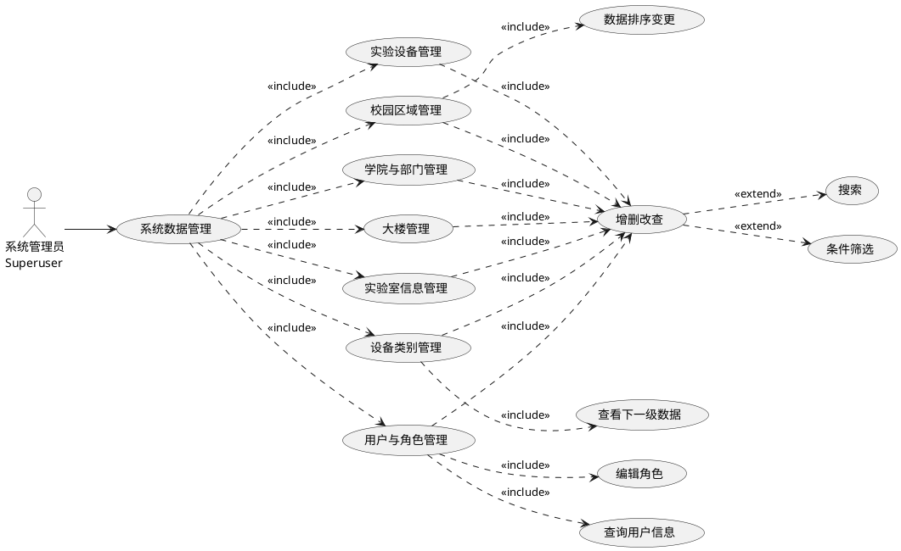
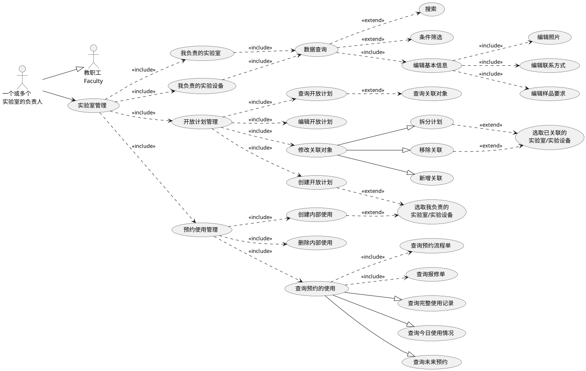
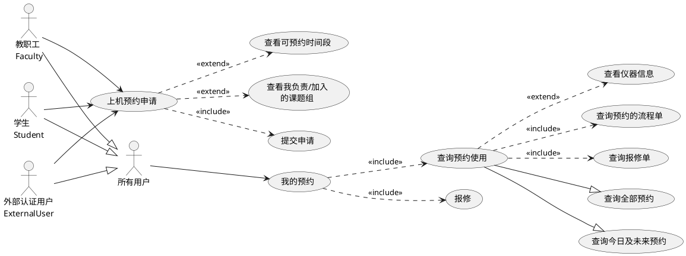
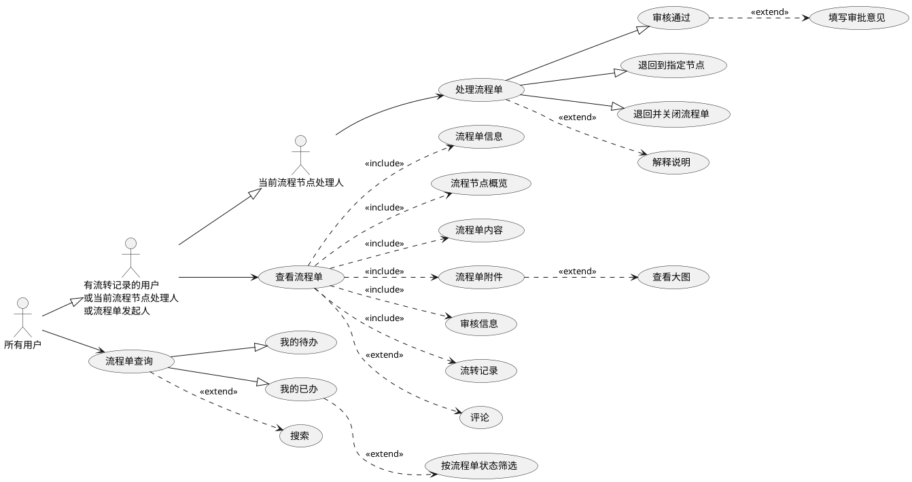
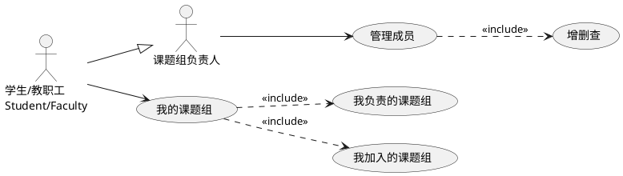
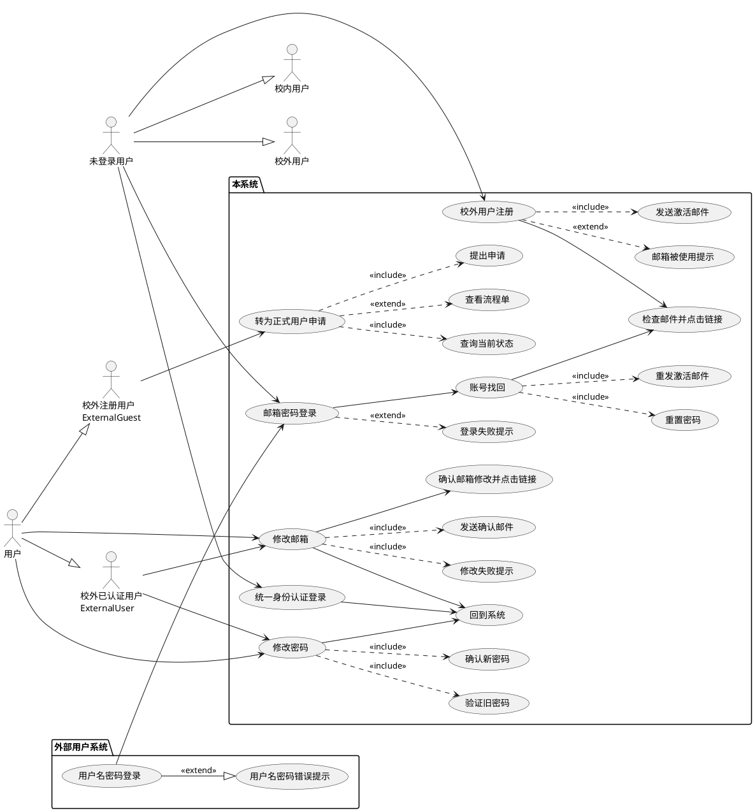
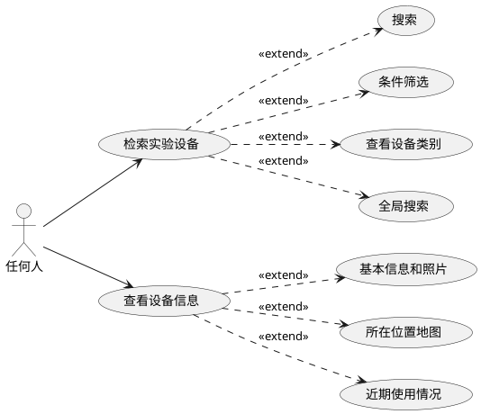

### SHANGHAI UNIVERSITY

# 毕业论文（设计）

### UNDERGRADUATE THESIS (PROJECT)

### 题目：面向资源共享的实验室和实验设备

### 预约管理系统设计与实现

### 学院 计算机工程与科学学院

### 专业 计算机科学与技术

### 学号 18120159

### 学生姓名 钟坤林

### 指导教师 高洪皓

### 起讫日期 2022.02.21—2022.06.03

上海大学毕业论文（设计）

### 目录

摘要 ....................................................................................................................... III ABSTRACT .................................................................................................................. IV 

第 1 章 绪论................................................................................................................. 

1 1.1 选题背景及意义............................................................................................. 
1 1.2 国内外研究现状............................................................................................2 

1.3 本文的研究目标及内容................................................................................. 3 

1.4 本文组织结构................................................................................................. 4 

第 2 章 相关技术概述................................................................................................. 5 

2.1 ASP.NET Core 框架 ....................................................................................... 5 

2.1.1 MVC 设计模式 .................................................................................. 5 2.1.2 EF Core 数据访问技术 ...................................................................... 6 2.1.3 ASP.NET Core 应用架构 ................................................................... 7 2.2 PostgreSQL 数据库 ........................................................................................ 7 2.3 前端相关技术................................................................................................. 8 2.3.1 React 库 .............................................................................................. 8 2.3.2 RTK 查询 ............................................................................................ 8 2.4 单点登录与 OAuth 2.0 协议 .......................................................................... 9 2.5 本章小结......................................................................................................... 9 第 3 章 实验室和实验设备预约管理系统需求分析............................................... 10 3.1 系统的功能需求........................................................................................... 10 3.1.1 系统数据管理................................................................................... 10 3.1.2 实验室管理....................................................................................... 11 3.1.3 用户预约........................................................................................... 13 3.1.4 流程单中心....................................................................................... 14 3.1.5 课题组相关功能............................................................................... 16 3.1.6 用户账号和 OAuth 登录 .................................................................. 16 3.1.7 设备检索........................................................................................... 18 3.1.8 数据统计和分析............................................................................... 19 3.2 系统的非功能性需求................................................................................... 19 3.2.1 可靠性需求....................................................................................... 19 3.2.2 安全性需求....................................................................................... 20 3.2.3 可维护性和可扩展性需求............................................................... 20 3.2.4 易用性需求....................................................................................... 21 3.3 本章小结....................................................................................................... 21 第 4 章 实验室和实验设备预约管理系统设计....................................................... 22 4.1 系统总体设计............................................................................................... 22 4.1.1 功能模块设计................................................................................... 22

I
4.1.2 应用架构设计................................................................................... 23 4.1.3 技术架构设计................................................................................... 23 4.2 系统数据库设计........................................................................................... 24 4.2.1 数据 ER 模型设计 ........................................................................... 24 4.2.2 数据库表设计................................................................................... 25 4.3 系统主要功能详细设计............................................................................... 32 4.3.1 设备预约功能详细设计................................................................... 32 4.3.2 流程单相关模块详细设计............................................................... 35 4.3.3 用户账号功能详细设计................................................................... 37 4.3.4 系统数据管理功能详细设计........................................................... 38 4.4 本章小结....................................................................................................... 39 第 5 章 实验室和实验设备预约管理系统实现....................................................... 40 5.1 项目整体配置实现....................................................................................... 40 5.1.1 前端项目配置................................................................................... 40 5.1.2 后端项目配置................................................................................... 41 5.2 系统功能实现............................................................................................... 42 5.2.1 系统数据管理功能实现................................................................... 42 5.2.2 实验室管理功能实现....................................................................... 44 5.2.3 用户预约功能实现........................................................................... 45 5.2.4 流程单中心功能实现....................................................................... 47 5.2.5 用户账号功能实现........................................................................... 49 5.2.6 统计分析功能实现........................................................................... 52 5.3 系统构建与部署实现................................................................................... 54 5.4 本章小结....................................................................................................... 55 第 6 章 实验室和实验设备预约管理系统运行与测试........................................... 56 6.1 系统主要用例运行....................................................................................... 56 6.1.1 用户检索、预约与审批流程........................................................... 56 6.1.2 系统数据管理................................................................................... 62 6.1.3 实验室管理....................................................................................... 65 6.2 系统测试....................................................................................................... 70 6.2.1 系统功能测试................................................................................... 70 6.2.2 系统非功能性测试........................................................................... 73 6.3 本章小结....................................................................................................... 74 第 7 章 总结和展望................................................................................................... 75 7.1 工作内容总结............................................................................................... 75 7.2 下一步工作展望........................................................................................... 76 致谢 ....................................................................................................................... 77 参考文献....................................................................................................................... 78 附录 A 部分源程序清单........................................................................................... 80

II

上海大学毕业论文（设计）

# 面向资源共享的实验室和实验设备

# 预约管理系统设计与实现

### 摘要

高校和科研机构实验室拥有规模庞大的实验设备资源，在管理和共享实验设

备过程中，存在实验设备的使用率和效益不高、实验设备共享管理模式和预约方 式不够完善等问题。基于这些问题，将实验室和设备纳入信息化管理是促进实验 资源共享的必然要求。 在充分研究实验室和实验设备预约需求的前提下，本文分析现有系统优缺点， 基于 ASP.NET Core 和 React 技术构建单页面应用，设计并实现了信息化的实验室

和实验设备预约管理系统，支撑实验室和实验设备的预约管理工作。 系统功能模块包括系统数据管理、实验室管理、设备检索、用户预约、课题 组管理、工作流管理、外部用户账号相关功能，以及通过 OAuth 2.0 协议连接外 部用户系统或单点登录系统的模块。其中，实验室管理模块管理设备开放计划和 内部使用；用户预约模块允许有权限的用户提交预约申请，查询预约申请进度；

工作流管理模块提供处理流程单和跟踪流程状态的功能；用户账号模块实现外部 用户注册、登录、邮箱密码修改等功能。 本文设计实现的实验室和实验设备预约管理系统提高了平台的适用范围，满 足大型仪器和普通设备的预约使用与管理需要，在预约流程方面优化了用户体验。 实现过程充分利用编程语言和平台特性，使工作流模块通用化。利用该系统能满

足学校和科研机构的实验设备预约管理需求，对实验设备的资源开放共享起到积 极作用。

关键词：预约管理系统，实验设备，开放共享，ASP.NET Core，React

III

上海大学毕业论文（设计）

### ABSTRACT

The labs of universities and research institutions have a large scale of equipment resources. In the process of managing and sharing equipment, there are problems such as the low utilization rate and efficiency of equipment, and the imperfect management mode and reservation method. Based on these problems, labs and equipment need information management to promote the sharing of experimental resources.

This paper studies the requirement of lab and equipment reservation and analyzes the advantages and disadvantages of existing systems. To support the management of lab and equipment reservations, an informalized reservation management system has been designed and implemented, which is a single-page application based on ASP.NET Core and React technology.

The functional modules of the system include system data management, laboratory management, equipment retrieval, equipment reservation, research group management, workflow management, external user accounts, and the module to connect to single sign- on systems through the OAuth 2.0 protocol. Among them, the lab management module allows lab managers to maintain equipment open plans and uses; the user reservation

module allows users with authority to submit reservation applications and query their progress; the workflow management module allows users to approve or track the workflows; the user account module allows external users to register, log in, modify emails and change passwords. The lab and equipment reservation management system in this paper improves the scope of application, meets the needs of reservation and management of large

instruments and common equipment, and optimizes the user experience of the reservation process. The implementation makes full use of the programming language and platform features to generalize the workflow module. The system can be utilized to satisfy the demand for lab equipment reservation management in universities and research institutions, and have a positive effect on the open sharing of resources for lab

equipment.

Keywords: Reservation management system, Lab equipment, Open sharing, ASP.NET Core, React

IV

上海大学毕业论文（设计）

### 第 1 章 绪论

1.1 选题背景及意义

高校和科研机构实验室不仅是面向师生开展实践教学的场所，还是服务于科

[1] 研创新的阵地。规模庞大的实验设备资源，需要面向校内和社会共享，以满足 学校师生和科研机构、企业等校外单位的使用需求。然而，高校和科研机构在管 理和共享实验设备过程中，还存在如下诸多问题： 实验设备的使用率和效益不高。随着高等教育的投入提高，高校和科研机构

建立了大量功能全面的实验室，导致重复购买现象大量发生。同时，我国高校教 育资源存在分配不足、分配不均衡等问题，其中以 985、211、双一流高校和其他 普通高校的对比最为明显，尤其是一些高校面临实验设备不足，影响正常科研的

[2] 情况。2000 年，教育部印发《高等学校仪器设备管理办法》，对提高仪器使用效

[3] 益提出了要求，以期更好服务教学科研。

实验设备共享管理模式和预约方式不够完善。在各学校推出开放实验设备预 约平台之前，多数依靠教师的人际关系或学术地位获取其他学校的共享设备资源。 而即使有了预约平台，由于预约制度的不完善，依然需要教师的关系才能预约。 一些学校注册校外账号需要校内实验室教师协助，还有的学校虽然有仪器共享平 台，但在校外却无法访问，整个预约流程都需要校内教师协助，学生预约实验设

备相对较为困难。 基于上述问题，将实验室和设备纳入信息化管理是促进实验资源共享的必然 要求。信息化管理为实验仪器使用率的提高提供了技术支持，不仅是仪器投入所

[4] 获得的效益问题，更是科学研究和人才培养的需要。通过对实验室资源的信息 化整合和流程体验的优化升级，可以帮助用户更方便地预约使用实验设备，提高

实验室的利用率。 本文设计的实验室和实验设备预约管理系统，在调研现有实验设备预约系统、 预约流程、流程管理产品等的基础上，实现了设备检索、设备预约、开放计划管 理、内部使用管理、OAuth 2.0 外部用户系统登录等功能，重点支持不同类型实验 室场景下的预约，以及预约审核流程的用户体验，解决现有系统预约难的问题， 能更好支撑实验室和实验设备的管理工作。

上海大学毕业论文（设计）

1.2 国内外研究现状

随着国内外高校信息化的不断建设，高校构建了不同的实验室信息化管理平 台。在基础的设备信息管理之上，国内各高校均向师生或社会提供了面向资源共 享的实验设备开放预约功能，但使用场景并不完全相同，目前主要包括以下类型：

[5] 大型科研设备的开放共享。这类平台主要按照国家要求，用于高价值设备 的开放预约，这类设备使用前通常需要完成相应培训，并经过严格审核。系统核

心特性有：费用结算系统，按照预约时长或实验项目进行收费；多级审核系统，

[7-8] 包括对样品是否符合要求、培训是否完成、操作人员等项目的审核。 开放式实验教学模式下的实验预约。部分高校的实验教学采取学生自主预约

[8] 的方式，允许学生在规定时间内选取意向的实验项目，通常有人数限制。这类 系统通常支持考勤统计、实验数据验证等督学功能，有的也能接入人脸识别考勤

机等设备，使系统更智能化。 此外，在当前高校或科研机构的管理模式下，实验设备资产的数据一般由专

[9] 门的资产管理系统或实验室信息管理系统进行管理维护。因此，通过自建、外

[10] 包等方式单独建立实验设备开放共享平台成为国内机构的首选方式。 近年来，随着物联网理念的推广，实验室管理开始运用物联网技术为实验室

预约管理提供新的方案。实验室管理中的物联网技术可用于实验人员的管理，通 过实验室的智能门禁系统或设备的智能电源管理系统，进行考勤、使用者身份识

[11-13] 别和使用记录的审计。 国外由于财政模式等方面的不同，在实验室信息化管理的系统设计上存在一 定的差异。相比于购买或租用昂贵的实验室信息管理系统，国外的大学更多以订

阅 SaaS 模式的实验室管理平台的方式管理实验室。SaaS（软件即服务），指服务 提供商不需要交付软件，只需要将软件托管在服务提供商处，服务提供商再通过

[14] Web 交付服务。通过这种方式交付的服务由于有功能齐全、无需维护、使用方

[15] 便等特性，被广泛用于 OA 系统、CRM 系统等场景。 订阅 SaaS 模式的实验室管理平台亦作为中小型研究机构、高校学院和实验 室的一种选择，这类平台通过云服务等方式降低机构投入的安装和运维成本，提

供丰富的定制化功能，使得能在有限成本内满足用户的实验室信息管理、设备预

[16] 定、费用结算等需求。 以 Clustermarket 公司提供的实验室管理和预约平台为例，这一平台以 SaaS 方式交付，具有实验设备管理、用户管理、公告管理、报表等功能，实验室管理 员可设置设备预约费用、币种、计费方式、预约时间、重复方式等预约规则，用

上海大学毕业论文（设计）

[17] 户可通过多种方式支付设备使用费用，也可以在使用后进行评价。此系统在预 约体验和预约流程灵活度上更有优势，但审核采取实验室管理员独立审核的方式， 无法满足多级审核的需要，此外由实验室管理员自行管理设备列表的模式也无法

满足日益增长的信息化需要。 尽管国外的模式不能完全适用于国内高校和科研机构的需要，但仍有可以借 鉴之处，结合国内预约平台的发展现状和趋势，本文拟开发的预约系统设计和实 现将重点关注：
1) 提升预约使用流程的体验，尽量减少预约过程中的阻碍，例如通过时间线 等图表直观展示设备可用情况、将预约规则以非常清晰的方式列出、支持移动设

备使用、增加满意度评价和报修功能等；
2) 提高系统的可靠性，可将需要对外提供服务的预约功能和内部设备管理功 能划分开以确保内部信息系统的安全性。

1.3 本文的研究目标及内容

基于高校实验室面向师生和社会开放的需要，本文设计和开发了一套支撑实 验室和实验设备预约的管理信息系统，解决实验设备预约难问题。系统中包含以 下主要功能模块：系统数据管理，系统管理员维护实验设备、实验室、分类等数

据；实验室管理，实验室管理员管理设备开放计划和内部使用；设备检索，支持 设备查找、所在位置和空闲时间查询等功能；用户预约，有预约权限的用户提交 预约申请和查询预约申请进度；课题组管理，用户查看自己负责和加入的课题组， 课题组负责人管理成员；工作流管理，用户查看、审核或退回流程单，跟踪流程 状态；外部用户账号相关功能，实现外部用户注册、登录、邮箱密码修改等功能；

连接外部用户系统或单点登录系统。 本文的实验室和实验设备预约系统，考虑了现有大型仪器共享平台和开放实 验模式下普通仪器预约平台的能力，既能满足大型仪器的开放预约和管理要求， 也能满足校内师生对普通仪器的预约使用需要，提高了平台的适用范围。此系统 具有通过 OAuth 2.0 协议连接外部用户系统的能力，可以接入各高校和机构使用

此协议的统一身份认证系统，实现单点登录。此外，系统设计和实现中，充分考 虑模块的通用性，利用好编程语言和平台的特性，完成工作流、数据管理、邮件 发送等模块的设计。

上海大学毕业论文（设计）

1.4 本文组织结构

本文分为 7 章，论文的组织结构如下： 第 1 章为绪论，介绍了开发实验室和实验设备预约系统的背景和国内外研究 现状，概述本文所研究的内容和要达到的目标。 第 2 章为相关技术概述，概述了系统设计、实现和部署过程中应用的主要相 关技术，对后端开发框架、数据库、前端技术和单点登录技术进行了介绍。

第 3 章为实验室和实验设备预约管理系统需求分析，提出系统的功能需求和 非功能性需求，为系统设计提供依据。 第 4 章为实验室和实验设备预约管理系统设计，进行了系统总体设计、数据 库设计和主要功能详细设计。 第 5 章为实验室和实验设备预约管理系统实现，按照需求和设计完成系统配

置、功能实现、构建和部署。 第 6 章为实验室和实验设备预约管理系统运行与测试，展示系统主要用例的 运行流程，对系统进行功能测试和非功能性测试。 第 7 章为总结和展望。

上海大学毕业论文（设计）

### 第 2 章 相关技术概述

本章对实验室和实验设备预约管理系统开发过程中应用的主要技术进行概 述。系统选择使用 ASP.NET Core 框架作为后端框架，React 作为前端框架，基于 B/S 架构开发单页应用程序（SPA），通过 Docker 部署。

2.1 ASP.NET Core 框架

ASP.NET Core 是微软开源的高性能跨平台 Web 框架，内置依赖注入（DI）

[18] 能力，并且能够托管在 Docker 中部署，目前最新的稳定版本是 6.0。本系统选 用 ASP.NET Core 作为后端框架基于以下原因：作为面向对象语言，C# 语言比 Java

语言更合理，具有优秀的泛型设计、类属性、内置功能全面的日期时间支持、LINQ 支持等，编程语言具有显著优势；ASP.NET Core 框架下拥有 EF Core 数据访问框 架，能够在程序中使用 LINQ 方式编写查询语句，大幅提高编写具有各种复杂查 询信息管理系统的效率。本次系统编写使用的平台和框架的版本为 .NET 6 和 ASP.NET Core 6.0，均为当前最新的稳定版本。

2.1.1 MVC 设计模式

早期网站开发通常将用户界面和程序功能逻辑等代码结合在一起，在这种代 码组织模式下，当系统规模达到一定程度时，对程序低层的修改会影响大量页面，

[19] 为系统的开发和维护造成困难。MVC（Model-View-Controller）设计模式将软 件分为模型、视图和控制器三个部分，分别表示内部数据状态、模型数据解释和 程序行为定义，通过关注点分离使程序结构更清晰，让 Web 应用可测试，已成为 ASP.NET Core 的推荐模型。MVC 模型中，模型、视图和控制器的交互如图 2-1 所 示，从图可知，视图层将用户请求通知到控制器，由控制器完成逻辑处理，对模

型进行状态改变后，按照程序逻辑选择视图，视图从模型中获取数据并返回给用

[20] 户。

图 2-1 MVC 模型示意图

在基于 ASP.NET Core 的 MVC 应用中，当用户请求 URI，ASP.NET Core MVC 运行时会通过路由引擎查找路由表，决定由哪个控制器处理请求，控制器处理请

上海大学毕业论文（设计）

求后并决定返回结果的类型，通过视图引擎得到结果，最终由 ASP.NET Core 框 架返回 HTTP 响应。ASP.NET MVC 的请求处理模型如图 2-2 所示。

图 2-2 ASP.NET MVC 请求处理模型

2.1.2 EF Core 数据访问技术

EF Core（Entity Framework Core）是微软开源的对象关系映射（ORM）框架

[21] ，通过 C# 代码建模，能够使用 EF 迁移功能，根据模型创建数据库，并在模型 更新时让数据库同步进行数据或架构的迁移。在系统开发中，使用 EF Core 技术 可以使用 LINQ 强大的链式调用功能，用访问模型的方式进行数据库访问，屏蔽

了数据库的具体实现，实现了数据访问层和数据层的分离。

图 2-3 EF Core 架构 EF Core 的实体访问基于实体数据模型（EDM），由概念模型、映射模型和存 储模型组成，从业务层面到数据库层面进行分层，使不需要关心数据在数据库中

的存储结构。EF Core 的架构如图 2-3 所示，从图可知，业务层面到数据库需要经 过 LINQ 到实体转换、对象服务、EntityClient 提供程序和 ADO.NET 数据提供程 序，前二者由 EF Core 提供，使用 LINQ 编写数据查询代码后，EF Core 通过后二

上海大学毕业论文（设计）

者转换为数据库 SQL 查询，并与数据库通信，后二者对于不同数据库种类有单独

[22] 的实现。

2.1.3 ASP.NET Core 应用架构

图 2-4 是典型的 ASP.NET Core 架构，将系统分为客户端、应用服务、数据存 储和外部服务三个层面的四个部分，通过分层架构使 Web 程序具有灵活性和可维 护性，其中应用服务层基于 MVC 模型。在这一架构中，每层仅有一个职责，且只依赖同层和更低的层，例如模型和数据访问层可以互相依赖，但与数据存储隔[23] 离，应用服务层中其他的组件通过数据访问层与数据库交互。MVC 模式提倡 在模型层面负责业务逻辑上的用户输入验证，使用 C# 的特性（Attribute）能够完 成这一点。

图 2-4 ASP.NET Core 应用架构示意图

2.2 PostgreSQL 数据库

PostgreSQL 是开源的对象—关系数据库管理系统（ORDBMS），起源于 1986年，是一款功能强大开源数据库管理系统。PostgreSQL 内置数据类型中包含了[24] JSON，能更好地支持系统中业务对存储复杂数据结构的需求。同时，这款数据 库对 SQL 的支持更好，便于编写数据分析相关的 SQL。MySQL 和 PostgreSQL 同 属最流行的开源数据库之一，和 MySQL 相比，PostgreSQL 有更多针对复杂查询[26-27] 等需求的高级特性，具体比较如表 2-1 所示。

上海大学毕业论文（设计）

表 2-1 PostgreSQL 与 MySQL 比较

功能或特性 PostgreSQL MySQL 宣传口号 世界上最先进的开源数据库 世界上最流行的开源数据库

支持哈希联接（Hash Join），性能较8.0 版本前只支持嵌套循环联接 数据库表联接性能 高（Nest Loop Join），大表联接慢

读写没有行锁（通过其他机制实现读写有行锁甚至提升到表锁，高并发 读写性能 ACID），性能高读写性能下降严重 支持公用表表达式 CTE，有效简化

子查询性能复杂查询，同时降低查询复杂度，提子查询支持较差，复杂查询优化较差 高性能

在较早版本就已支持 array、json、虽然在新版本已支持存储 JSON 数 数据类型支持 jsonb 等文档格式，性能较高据，但性能比 PostgreSQL 差

支持通用反向索引 GIN，支持全文检 不支持 GIN，需要外部组件实现全文 检索能力索、JSON 数据检索等特性，且较为 搜索功能 轻量级 SQL 支持在主流数据库中最高，且 SQL 支持 SQL 支持一般 可扩展

2.3 前端相关技术

2.3.1 React 库

React 是 Meta（原 Facebook）开源的前端库，基于组件构建用户界面，提供[27] MVC 模型中的视图部分，帮助开发者构建基于数据变化的大型 Web 应用。自 2019 年 2 月发布的 React 16.8.0 版本开始，React 增加 Hooks 特性，使 React 组件 开发由类组件逐渐转换为函数式组件。相比于类组件，函数式组件更容易处理组 件的状态和副作用（Effects），由于函数式组件开发过程中，可以在函数顶层任何 位置引入 Hooks，因此可以将实现同一个功能的代码放在一起，实现关注点分离，[28] 使代码有更好的可维护性。基于函数式组件和 Hooks 特性，许多开源库实现了 异步查询、Cookie 管理、路由等功能简化了前端代码编写，本项目的组件也全部 使用函数式组件。

2.3.2 RTK 查询

RTK 查询（RTK Query）是强大的数据获取和缓存工具，通过 React Hooks 特 性统一提供数据获取、缓存以及加载状态的特性，简化基于 React 的 Web 开发过[29] 程中大量需要加载数据的情况，减少重复代码。RTK 查询是 Redux Toolkit 的 插件，后者基于状态管理库 Redux 提供简化配置、减少样板代码等功能。

2.4 单点登录与 OAuth 2.0 协议

传统登录方式通常基于各系统独立的用户名和密码，在信息化迅速发展以及 系统数量上升的情况下，需要一种技术实现一次登录多处访问，而不需要在每个 系统进行注册。这就是单点登录所解决的问题，通过单独的身份识别系统，用户

[30] 只需用统一的账号在其中一个系统登录一次，就可以访问所有相关联的系统。 目前主流的方案为 OpenID 和 SAML。

OAuth 是一个允许第三方应用访问用户在一个网站存储的资源的开放标准， 是 OpenID 的补充，OAuth 2.0 是 OAuth 的当前版本。在 OAuth 协议下，客户端 访问受保护资源前，必须先获得资源拥有者（用户）的访问许可，然后用访问许

[31] 可换取访问令牌（Access Token），客户端通过访问令牌获取受保护的资源。该 机制流程如图 2-5 所示，其中：Resource Owner，资源拥有者，一般是用户；Authorization Owner，授权服务器，能验证资源拥有者身份、发放访问令牌的服务 器；Resource Server，资源服务器，提供受保护资源；Client——客户端，一般是 浏览器。OAuth 2.0 被广泛应用于各大网站、社交平台，如微信登录、微博登录、 QQ 登录等都是通过 OAuth 2.0 实现。

图 2-5 OAuth 2.0 流程示意图 OAuth 2.0 虽无单点登录功能，但只要用 OAuth 2.0 协议实现第三方账号登录 功能，再省去注册步骤，即可实现统一身份认证登录的功能。具体流程为：用户 请求登录—通过 OAuth 2.0 获取 Access Token—服务器通过 Access Token 获取用户信息—通过用户信息注册或登录。通过 OAuth 2.0 实现的统一身份认证登录可 降低系统与授权服务器用户系统的藕合，适合旧系统的改造和新系统的渐进设计。

2.5 本章小结

本章对系统开发中使用的技术进行了概述。系统后端使用 ASP.NET Core 框 架，介绍了 ASP.NET 框架的优势、MVC 设计模式、EF Core 数据访问技术和应 用架构；通过 PostgreSQL 和 MySQL 的比较，解释数据库选择的原因；前端技术 方面，对 React 和 RTK 查询做了简要介绍；最后，介绍了单点登录和 OAuth 2.0协议，并介绍了系统中使用 OAuth 2.0 实现统一身份认证登录的原理。

### 第 3 章 实验室和实验设备预约管理系统需求分析

本章将对系统的需求进行调研，特别是对预约流程进行充分研究，使系统设 计细节能更好地满足功能完善和易于使用的目标，重点是满足校内外用户预约实 验设备等需要，解决预约难问题。

3.1 系统的功能需求

3.1.1 系统数据管理

系统数据管理模块包含的功能有：实验室信息、实验设备、学院与部门、用 户与角色、校园区域、大楼和设备类别的增删改查管理功能。参与此部分功能的 角色为系统管理员（Superuser），用例如图 3-1 所示。

图 3-1 系统数据管理模块用例图

此模块具有相似的查询、创建、编辑和删除记录功能，因此操作应保持一致 性。系统数据管理模块具体包含以下子模块： 

1）实验室信息管理 

实验室是管理实验设备预约和开放使用的主体，实验室负责人具有审核预约、 设置开放时间等权限，因此，实验室信息由系统管理员进行维护，功能包括查询、创建、编辑和删除实验室记录。实验室信息包含名称、所在区域、所在大楼、所 属部门、房间号和负责人工号信息。创建和编辑时，所在区域、所在大楼和所属 部门要读取对应类别的最新数据，形成关联。删除时需确认实验室的设备数、开 放计划数和内部使用数均为 0 才允许删除，否则删除按钮置灰。

2）实验设备管理 

实验设备由于是所在单位资产范畴，因此也由系统管理员负责维护管理，功 能包括查询、创建、编辑和删除实验设备记录。创建实验设备需提供名称、型号、制造商、购买日期、照片、联系方式、样品要求、分类和所属实验室信息。由于 实验设备数量大，用户可通过所在区域、所在大楼、所属学院或部门、所属实验 室、分类等信息筛选实验设备。如果设备的开放计划和预约使用数不全为 0 则不 允许删除。

3）学院与部门管理 

系统管理员可在学院与部门管理子模块查询、创建、编辑和删除学院与部门信息。学院与部门包括名称和分管领导工号两个信息字段，分管领导具有审核预 约等权限。如果部门存在关联的实验室数据，则不允许删除。 

4）用户与角色管理 

系统管理员通过此模块查询用户信息，包括校内用户的学工号、姓名和角色， 以及校外用户的用户 ID、姓名、邮箱和角色。除了查询，系统管理员也可以设置用户的姓名和角色。编辑角色时，系统管理员不允许移除自己的“系统管理员”角 色，以免造成系统中“系统管理员”角色的缺位等问题。 

5）校园区域管理 

系统管理员可查看和设置系统中的校园区域数据，具体信息有名称、区域中 心经度和区域中心纬度。经纬度数据通过高德地图选点，用于在创建大楼时提供默认坐标。校园区域是有顺序的，需要有调整记录顺序的功能。不允许删除关联 了大楼的校园区域。

6）大楼管理 

大楼信息包括名称、地址、所在区域、经度和纬度，创建和编辑时大楼所在 区域展示最新数据以建立关联，经纬度通过地图选点。不允许删除存在实验室的大楼。 

7）设备类别管理 

系统的设备类别分为一级分类、二级分类和三级分类，用 3 级 ID 表示，例 如 2-0-0 是一级分类，2-3-0 是二级分类，2-3-4 是三级分类。查询过程中只显示同 一级别的分类，通过点击一级分类和二级分类的分类名，可进入此分类的下级分类页面。如果分类有派生分类或关联了实验设备，则不能删除。

3.1.2 实验室管理

实验室管理是实验室和实验设备基本信息查询修改、开放计划和使用管理，当教职工（Faculty）角色的用户管理一个或多个实验室时，可以使用此模块的功 能，用例如图 3-2 所示。

图 3-2 实验室管理模块用例图

1）我负责的实验室

此子模块列出用户负责的实验室信息，展示 ID、名称、所在区域、大楼、房 间号、所属部门、设备数和开放计划数信息。点击设备数，可跳转到我负责的实 验设备页面，筛选此实验室的设备。 

2）我负责的实验设备 

此子模块列出用户负责的实验设备信息，可编辑设备的照片、联系方式和样品要求。由于用户负责的实验设备可能较多，需可以按照所在校园区域、所在大 楼、所属学院和部门、所属实验室、所属分类等进行筛选。

3）开放计划管理 

开放计划即实验设备的开放时间，用户需在实验室管理员指定的时间内进行 预约。开放计划可以是单次开放，也可以在指定日期内按周重复。创建开放计划，用户需要指定至少一个自己负责的实验室或实验设备，选择是否按周重复，设置 生效日期或日期范围与重复日，设置开放时间段长度、开始时间、时间段数量（结 束时间），还要设置是否允许校内用户和校外用户预约。 开放计划管理需要修改关联对象功能，用于调整开放计划的作用于哪些实验 室和实验设备的范围。关联对象修改分为添加、拆分和移除 3 种操作：添加关联对象，选择用户负责的未关联的实验室或实验设备，将开放计划应用到这些对象； 拆分开放计划可复制当前开放计划，将选择的已关联实验室或实验对象的关联关系转移到新的开放计划；移除关联对象可取消选择的实验室或实验设备和开放计 划的关联，如果关联对象全部移除，则开放计划也一并删除。 开放计划管理需在用户权限许可的范围内操作，不允许因实验室管理员的变更导致开放计划处于异常状态，如无人可管理、无关联对象等。在开放计划查询 结果中显示的关联实验室和实验设备，只显示用户管理的部分，如果没有关联对 象，则不显示开放计划。 

4）预约使用管理 

预约使用包括用户预约（含流程中预约）和内部使用，用户预约由师生和外 部用户发起，内部使用由实验室负责人发起。查询时，用户可选择全部使用记录、今日使用和未来预约三种显示选项，排序分别使用 ID 降序、时间升序和日期时 间降序，以满足不同的查询需求。创建内部使用亦按照开放计划的重复格式，可 选择按周重复，填写生效日期或日期范围与重复日，提供开始结束时间和预约类 型，提交以创建内部使用。 用户预约使用记录总是关联了流程单，可能还关联了报修单，因此需要提供链接查看这些流程单内容。用户预约不能删除，内部的预约需要删除功能。

3.1.3 用户预约

用户预约模块的功能包括上机预约申请和我的预约查询，学生、教职工和外 部认证用户有权限提交申请。此模块的用例如图 3-3 所示。

图 3-3 用户预约模块用例图

1）上机预约申请

上机预约申请是本系统中的一个重要功能，是师生和外部认证用户预约使用 仪器的申请途径。校内师生预约仪器，需要加入课题组，经过课题组负责人审核 后方可使用仪器；校外用户不需要课题组审核，但预约流程结束前需要由管理员审核备案。预约需要提交日期、时间段、所属课题组（如有）和预约用途信息。 可用的预约时间段由开放计划提供，可以预约 24 小时后，7 天之内的实验设备。 如果时间段存在用户预约或内部使用，则时间段被禁用，用户可以在同一预约计划内选择连续的未禁用时间段。 预约的流程为：课题组负责人审批（如果校内用户且所选课题组负责人不是 自己，则需要此步骤）——实验室负责人审批——实验室所属学院或部门分管领 导审批——实验室与设备管理处专管员审批（校外用户需要此步骤）。预约提交后， 跳转到“我的预约”页面，并提示用户提交成功。 

2）我的预约

此功能为展示用户的预约记录，分为全部预约和今日及未来预约两种显示模 式，既能让用户按预约提交顺序查询完整预约记录，又能按照日期时间查看未来 的预约情况。页面上，需要筛选和显示预约状态，提供链接展示预约生成的流程 单和报修单（如有）或报修按钮。 用户可在“我的预约”页面，对今日或过去预约的设备提出报修请求，提供说明文字和相关图片。报修后生成报修单，由实验室负责人处理，用户可跟踪报修单状态。

3.1.4 流程单中心

系统中多处涉及流程处理，如实验设备预约申请流程、报修流程、外部用户 认证流程等，因此将所有流程统一到一个模块进行处理，既提高了用户体验的一 致性，又实现了功能复用，降低用户学习成本的同时也节省了重复开发的工作量。 流程单由其他模块生成，用户通过流程单中心查看和处理流程单。部分流程在流程处理完成或被关闭时需要执行相应的动作，具体为：实验设备预约申请流程， 处理完成时，将预约状态从“用户预约（流程中）”修改为“用户预约”，被关闭时， 删除预约记录；外部用户认证流程，处理完成时，为用户授予“外部已认证用户” （ExternalUser）角色，收回“外部注册用户”（ExternalGuest）角色。 流程的每个步骤称为流程节点，有处理人、审核状态等信息，处理人可以是指定课题组负责人、指定实验室负责人、指定学院或部门分管领导、指定用户或 指定角色的任意用户。此模块用例如图 3-4 所示。

图 3-4 流程单中心模块用例图

1）流程单查询 

用户通过流程单中心的“我的待办”和“我的已办”页面可查询用户自己需要处 理和处理过的流程单。“我的待办”列出所有当前节点为用户可处理状态的流程单， “我的已办”列出用户处理过（留有流转记录）和用户发起的流程单，但不包含当前用户可处理的流程单。两个页面列出的流程单列表均提供链接允许用户查看流 程单详细内容，“我的已办”提供按流程单状态筛选的功能。 

2）查看流程单 

流程单的详细信息页面具有流程单信息、流程概览、流程单内容、流程单附 件、审核信息和流转记录六个信息模块。对于不同的流程单类型，流程单内容部分以不同的模板展示。所有有权限查看流程单的用户都可以发表评论，评论内容 在流转记录中展示。 3）处理流程单 流程单的处理分为三种类型，分别是审核通过、退回到指定节点和退回并关 闭流程单。选择审核通过，需要填写审核意见，可选填写解释说明，提交后，流程单的当前节点会记录提交的审核信息，如果无后续节点，则将流程单设置为完 成状态，并调用流程单的完成动作，否则将当前节点设置为后续节点。如选择退 回到指定节点，则需要选择要退回的节点，接着清空从此节点到当前节点的审核 信息，最后将当前节点设置为选择的节点。选择退回并关闭流程单，将会使流程 单被设置成流程关闭状态，清空全部审核信息，并调用流程单的关闭动作。退回流程单时，必须填写解释说明。

3.1.5 课题组相关功能

课题组用于审核校内用户的预约，校内用户预约前必须负责或加入一个课题 组才能预约，预约申请首先由课题组负责人审核。课题组相关功能为校内用户提 供自己加入或负责课题组的查询功能，并为课题组负责人提供管理成员的功能。 此模块用例如图 3-5 所示。

图 3-5 课题组相关功能模块用例图
 

1）我的课题组

校内用户可查询自己负责或加入的课题组，二者在同一列表中显示，自己负 责的课题组排在前面。对于用户自己负责的课题组，提供管理成员链接以对成员 进行修改。 2）管理成员 课题组的负责人可以进入此页面，对课题组的成员进行添加或移除。添加成员时，需要输入成员的学工号，提交后进入成员列表。成员列表中已加入系统的 成员显示姓名，否则显示“（未加入）”字样。

3.1.6 用户账号和 OAuth 登录

此模块负责处理用户注册、登录、账号找回和校外用户修改邮箱、密码以及 提出转为正式用户申请。外部用户使用统一身份认证登录时，将跳转到外部用户 系统的登录页面，并在登录成功回调时处理本系统登录逻辑。模块的用例如图 3-6 所示。 

1）统一身份认证登录

统一身份认证是校内用户使用的功能，通过 OAuth 2.0 协议连接外部用户系 统。用户点击“统一身份认证登录”按钮后，跳转到外部用户系统，如果用户正确 输入了用户名和密码，则会携带 Authorization code 跳转到 OAuth 回调（callback） 页面。系统使用 Client ID、Client secret 和 Authorization code 通过 OAuth 2.0 协议获得 Access token，再通过 Access token 获取用户基本信息，包括用户是教职工或 学生的角色信息、学工号和姓名。系统检查该用户是否注册，如已注册则直接登 录，否则创建用户信息，并授予相关角色，然后登录。

图 3-6 用户账号和 OAuth 登录模块用例图

2）校外用户邮箱密码登录

校外用户通过邮箱和密码直接登录，对于用户未注册、用户未激活邮箱和密 码错误的情况给出相应提示。用户输入正确的邮箱和密码后，进入系统。 

3）校外用户注册 

校外用户输入邮箱和密码进行注册，邮箱不能是已被注册的。注册提交后， 发送一封带有激活账号链接的电子邮件到用户输入的邮箱，用户点击链接后，提示注册成功，并引导用户进行登录。

4）校外用户账号找回 

账号找回包括重置密码和重发激活邮件，都是通过发送验证邮件验证操作者 具有邮箱的所有权，以确认用户对这一邮箱创建账号的控制。重置密码向已激活邮箱的用户开放，输入注册邮箱后，发送重置密码链接的邮件到这个邮箱，用户 点击链接后可输入新密码完成密码重置。重发激活邮件向未完成邮箱激活的用户 开放，如果注册时发送的激活邮件没有接收成功，则可通过这一功能重新发送激 活账号的链接。 

5）修改邮箱和密码 

用户可输入与当前邮箱不同的新邮箱地址，经过邮件确认后设置为账号的新邮箱地址。用户输入旧密码和新密码，在验证旧密码正确后，将用户的密码设为 新密码。 

6）转为正式用户申请 

校外用户注册后默认是“校外注册用户”（ExternalGuest）角色，没有实验设备 预约权限，可发起转为正式用户申请。发起流程前，用户需要事先和一个实验室联系，通过系统中的这一功能，向该实验室发起“外部注册用户认证流程”，提供 本人身份信息和所在单位介绍信等证明材料，经该实验室审核、实验室与设备管 理处审核，成为“已认证外部用户”，具有全系统实验设备预约权限。用户提交申 请后，可查看申请状态和流程单。

3.1.7 设备检索

设备检索模块包括设备搜索、筛选、详细信息查询等功能，用例如图 3-7 所 示。

图 3-7 设备检索模块用例图

1）检索实验设备 

实验设备使用分类检索的形式，展示所有一至二级分类，选择二级分类后展示此分类下的所有设备，如果不选择，则展示全部设备。选择二级分类后，展示 二级分类下三级分类的列表，可选择三级分类进一步筛选。基于选择的分类和其 他筛选条件，提供“在结果中搜索”功能。设备检索支持全局搜索，输入关键词后展示匹配的分类列表和匹配的设备数 量，搜索设备通过全部设备的“在结果中搜索”功能实现。 

2）查看设备信息 

在检索设备的结果列表中点击设备名称，可打开设备信息页面。此页面展示 设备的基本信息、照片、标有大楼地点的所在位置地图等信息，在“近期预约情况” 选项卡中，通过时间线展示一周的预约情况，可通过日历或快捷按键查看指定周的预约情况，帮助用户和管理员直观了解仪器的被预约情况。

3.1.8 数据统计和分析

系统管理员（Superuser）、管理员（Admin）和实验室的管理员有权限访问系 统的统计数据。此模块产生的结果由原生 SQL 语句产生，用户选择统计分析类 型、统计起始日期和统计结束日期，系统选择 SQL 模板生成 SQL 语句并执行后， 得到统计结果表格，用户可以将结果导出为 Excel 文件，也可以直接浏览。此模 块支持以图表方式展示数据，使用事先配置的图表模板，可展示直方图、面积图等图表。 此外，工作台提供概览页面，汇总用户可访问到的各模块数据数量，直观展 示用户需要注意的工作。所有用户在工作台概览页面都能看到待办和流程中已办 流程单的数量；可预约实验设备的用户可看到累计预约次数、流程中预约次数、 流程完成预约数和今日起需关注预约数量；实验室管理员除了展示一些数据的数量，还以时间线展示当天的预约情况，按实验室分组展示。

3.2 系统的非功能性需求

3.2.1 可靠性需求

可靠性需求，一般认为是软件在一个时间周期内，正常使用软件成功运行既[32-33] 定逻辑的几率。可靠性是用户对产品信任度的重要来源，也是提高实验设备 开放共享水平的重要要求，因此必须保证系统具有可靠性。

系统应具有容错性，并发操作、系统升级、网络故障等均不允许系统数据出 现异常状态，需要数据库提供的事务 ACID 保证、合理的数据操作设计等共同实 现，用乐观锁等方式防止并发冲突。系统应具备易恢复性，当软件发生故障时，需要能快速重启服务，如果遇到数据损坏，必须能够完成数据回档操作，为降低 新功能特性存在错误时的影响面，系统部署应支持灰度发布，在发现问题时按照 回滚方案进行回滚。系统应具有成熟性，指提高代码编写水平，降低程序差错（bug）的数量。 

在本系统中，容错性要求在软件实现时，将数据库操作放到事务中进行，并 设置合适的隔离级别，对于可能发生冲突的数据操作，应进行预演，确认数据操 作有乐观锁等机制保证操作安全，防止系统运行时出现问题。对于不能通过事务 保证的操作，例如用户注册后发送邮件可能会失败，需要提供重新发送激活邮件 功能，使用户能完成注册。由于本系统部署基于 Docker 容器，配合相关调度系统可以较容易完成易恢复性需求。

3.2.2 安全性需求

本系统作为在公网运行的信息系统，确保信息安全十分重要，本系统的安全 性要求如下： 系统应具备保密性，数据传输过程全程需要在安全传输层协议（TLS）下进 行，防止传输的数据遭到窃取和篡改，也要使用安全等级足够高的 SSL 证书防止 中间人攻击；系统的信息除了需要允许匿名访问的部分，其他都应通过权限系统等保护，阻止非授权的访问。系统应具有权限控制性，通过 RBAC 对每个资源接 口进行保护，合理为用户分配角色，仅为每个角色授予必要权限，防止越权访问。 系统应避免过度发布，由于前后端分离架构，系统通过 RESTful API 发布接口， 需要注意为每个接口创建请求和响应的数据传输对象，避免将数据库中的数据结 构直接返回给用户，也要避免用户输入不必要的字段影响要存储的数据。

本系统对外开放的所有站点均需要 TLS 保护，禁止通过非加密的信道访问。 系统设计了 6 个角色，每个角色只能访问最低限度的接口，对于不同角色访问相 同类型数据，例如系统管理员和实验室管理员都需要访问实验室信息的情况，系 统提供不同接口并加以不同角色限制，防止用户非法获取其他角色的敏感数据。

3.2.3 可维护性和可扩展性需求

本系统应具有应对需求变化、相关组件变化和技术升级的能力，以最小的代 价适应更改时可维护性和可扩展性的要求，具体如下： 系统应采取模块化和组件化开发的模式，将业务逻辑拆分到高内聚低耦合的模块中，使用依赖注入（DI）等方式进行灵活组合，减少代码的重复量，当需要 添加功能时也能快速完成更改或复用已有代码。系统应具有易分析性，在必要的地方增加日志记录，并通过日志系统进行错误定位分析等工作。 本系统的流程单模块作为通用模块，需要较高的可扩展性支持创建更多的流 程类型，通过面向对象的思路解决不同流程单代码共用、可变流程单数据类型等问题。

3.2.4 易用性需求

提升实验设备预约过程的易用程度是系统的目标之一，因此易用性是本系统一个必要的非功能性需求，主要包括： 系统的界面应清晰一致美观，具体要求相同的功能在操作上保持一致、用户 或系统的错误通过明显的方式及时反馈、按钮文字清晰表明功能、用用户熟悉的 语言和用词表达而不是使用软件的术语等，提高系统的人性化程度。系统应具有 易操作性，使用户不需要查阅说明书和帮助文档即可完成设备预约、处理流程等操作。系统应具有一定的可访问性。 在本系统中，数据操作等页面具有相似的外观和行为，降低用户的学习成本。 本系统绝大多数功能都能完全使用键盘操作，使用清晰的边框展示当前焦点位置， 在弹出模态框和面板时锁定焦点的范围，实现了可访问性中键盘的可操作性。

3.3 本章小结

本章从功能性需求和非功能性需求两个方面分析了实验室和实验设备预约 管理系统的具体需求。在功能性需求分析部分，通过系统各业务流程的具体用例， 描述了各功能模块的功能需求，以及不同用户角色和身份在各功能模块中的职责，

对外部系统依赖的情况和用例进行了分析。非功能性需求方面，按照系统功能、 易用性等目标对系统的可靠性需求、安全性需求、可维护性需求、可扩展性需求 和易用性需求做了详细分析。

上海大学毕业论文（设计）

### 第 4 章 实验室和实验设备预约管理系统设计

系统设计部分根据需求分析的结果，对系统的功能模块、架构、数据库等进 行设计，作为系统实现的依据。本章从总体设计开始，再到数据库设计，最后对 各主要功能模块进行详细设计。

4.1 系统总体设计

4.1.1 功能模块设计

系统的功能模块划分考虑到用户习惯和系统具有用户角色多且一个用户可 以拥有多个角色的特点，主要按照业务流程和角色划分系统的功能模块，界面设 计和实现过程中的控制器划分均参考功能模块划分的结果进行。本系统按照功能 划分为 8 个模块，各功能的模块如下：

1) 设备检索模块，所有人有访问权限，功能有：设备分类查询、设备条件检 索、详细信息查询和近期活动查询；
2) 设备预约模块，所有用户有访问权限，但校内用户必须加入课题组，校外 用户必须完成认证流程才能提交预约申请，功能有：开放时间段查询、预约申请、 预约记录查询和设备报修；
3) 流程单中心模块，所有用户有访问权限，功能有：待办已办流程单查询、 流程单详情查询、流程单处理和流程单评论；
4) 课题组管理模块，校内用户有访问权限，功能有：我加入的课题组查询、 我负责的课题组查询和管理课题组成员；
5) 实验室管理模块，教职工有访问权限，功能有：我管理的实验室与实验设 备查询、实验设备信息编辑、开放计划管理和预约使用查询管理；
6) 系统数据管理模块，系统管理员有访问权限，功能有：实验室、实验设备、 学院与部门、用户与角色、校园区域、大楼和设备类别的增删改查管理；
7) 数据分析模块，系统管理员、管理员和负责实验室的教职工有访问权限， 功能有：数据统计分析和绘制图表；
8) 用户账号模块，功能有：外部用户注册、登录、邮箱修改、密码修改、密码重置和发起查询认证流程，此外有 OAuth 2.0 协议的登录回调功能，也纳入这 一模块。 根据功能模块划分和各模块的功能，系统功能模块图如图 4-1 所示。

图 4-1 系统功能模块图

4.1.2 应用架构设计

系统使用 ASP.NET Core 框架开发，按照 MVC 模式开发的通常做法，将系统 的应用架构分为表现层、控制层、服务层、数据访问层和数据层。分层架构的做法能使软件结构更加清晰，使代码更容易阅读和维护。 在本系统中，表现层为系统前端部分，控制层通过控制器开放 API 供表现层 的前端调用。服务层整合了系统中的公共服务和工作流服务，控制器将这些服务 作为依赖进行调用。数据访问层提供访问数据库的接口，数据最终在数据层存储。 此外，系统中还有访问控制、日志管理等中间件，为控制层和服务层提供不同的 功能。系统的应用架构图如图 4-2 所示。

图 4-2 系统应用架构图

4.1.3 技术架构设计

系统基于 Docker 打包为容器，在特定的云服务器上部署。用户访问服务时，流量先经过 CDN，再由包含请求转发、SSL 和负载均衡功能的服务器转发到各 Docker 实例，完成一次 HTTP 请求。请求过程中，Docker 实例中的程序会访问兼 容 PostgreSQL 的云数据库、对象存储服务、邮件服务和用户系统。根据组成系统完整功能的组件和数据流，系统的技术架构图如图 4-3 所示。

图 4-3 系统技术架构图

4.2 系统数据库设计

本系统使用 PostgreSQL 作为数据库。在数据库设计中，需要根据需求分析的 结果设计数据表和表间联系，结合数据库管理系统的特点，合理设置表的字段类型、索引和外键约束，构造数据库模式的最优方案。 数据库设计中涉及命名时，使用大驼峰命名法，字符集使用 UTF-8；数据库 需定时备份，备份间隔每日一次，至少保存 7 天；数据库的性能状况，包括 CPU 使用率、内存使用率、存储用量、请求数等指标，通过监控软件实时监控。

4.2.1 数据 ER 模型设计

通过分析和归纳系统需求，总结出系统中的实体和实体间的关系，即数据库 的概念模型。ER 模型即是描述概念模型的工具，能通过 ER 图清晰展示其中的结 构，主体部分如图 4-4 所示。从图可知，系统中两个实体间存在 1:N、N:M、1:0..1和 N:0..1 联系，对于三个实体，有 1:N:M 联系，例如：一个流程单有多个附件、 多个节点，同时可能有一个当前节点，这些关系分别为 1:N、1:N 和 1:0..1 联系； 多个用户可以处理同一个流程单节点，多个节点也可以被同一个用户处理，但这 些处理关系都共同属于同一个流程单，因此流程单、流程单节点和用户有 1:N:M联系；一次预约使用由一个用户预定，一个用户可以有多次预约，用户和预约使 用之间为 1:N 联系；预定对象可能是一个实验室，也可能是一个实验设备，因此 预约使用与实验室和实验设备均为 N:0..1 联系；当且仅当用户预约实验设备时，预约使用会关联流程单，预约使用与流程单之间有 N:0..1 联系。

图 4-4 实验室与实验设备预约管理系统数据库 ER 模型图

4.2.2 数据库表设计

ER 图反映了系统中实体和实体间的联系，根据 ER 图、具体需求和数据库特 性，对数据库的表和约束进行设计。本节介绍系统数据库每个数据表的结构设计。

1）用户表 用户表存储校内用户和校外用户的用户信息，校外认证用户还包括进行认证 流程时填写的身份信息，表中的一些字段由 ASP.NET 的 Identity 框架生成，数据 表的结构如表 4-1 所示，其中只包含用到的字段。

表 4-1 用户表（AspNetUsers）结构

序号 字段名 类型 主键 索引 唯一 外键 非空 自增 描述

1 Id text   用户 ID 2 UserName varchar(256) 用户名

3 NormalizedUserName varchar(256)  大写用户名 4 Email varchar(256) 邮箱 5 NormalizedEmail varchar(256)  大写邮箱

6 EmailConfirmed boolean  邮箱已验证 7 PasswordHash text 散列密码 8 RealName text  真实姓名

序号 字段名 类型 主键 索引 唯一 外键 非空 自增 描述 9 ContactAddress text 联系地址 10 IdNumber text 身份证号

11 InstitutionName text 所在机构 12 Position text 身份 13 ResearchInterests text 研究兴趣

2）角色表 角色表存储系统的所有角色，是 ASP.NET 的 Identity 框架生成的表。表中的 数据在数据库迁移更新操作时写入数据库，有 Superuser、Admin、Student、Faculty、 ExternalGuest 和 ExternalUser 六个角色组成的数据，数据表的结构如表 4-2 所示，

其中只包含用到的字段。

表 4-2 角色表（AspNetRoles）结构

序号 字段名 类型 主键 索引 唯一 外键 非空 自增 描述

1 Id text   角色 ID

2 Name varchar(256) 角色名 3 NormalizedName varchar(256)  大写角色名 3）用户角色表

用户角色表是用户与角色之间形成多对多关系的中间表，是 ASP.NET Core 的 Identity 框架生成的表。数据表的结构如表 4-3 所示。

表 4-3 用户角色表（AspNetUserRoles）结构

序号 字段名 类型 主键 索引 唯一 外键 非空 自增 描述 1 UserId text    用户 ID

2 RoleId text    角色 ID 表中 UserId 字段为关联的用户表（AspNetUsers）的外键，RoleId 字段为关联 的角色表（AspNetRoles）的外键。当引用的关联表中对应字段被删除是，使用级 联删除（Cascade）策略。

4）校园区域表 校园区域表包含区域的名称和中心经纬度数据，此外为支持排序，具有被索 引的顺序字段。数据表的结构如表 4-4 所示。

表 4-4 校园区域表（Areas）结构

序号 字段名 类型 主键 索引 唯一 外键 非空 自增 描述

1 AreaId integer   校园区域 ID 2 Name varchar(64)   名称 3 Order integer    顺序号

4 DefaultLatitude double precision  中心纬度 5 DefaultLongitude double precision  中心经度

上海大学毕业论文（设计）

5）大楼表 大楼是校园区域下属的实体，通过外键约束和校园区域的关系，有名称、经 纬度、地址等属性。数据表的结构如表 4-5 所示。

表 4-5 大楼表（Buildings）结构

序号 字段名 类型 主键 索引 唯一 外键 非空 自增 描述

1 BuildingId integer   大楼 ID 2 Name varchar(64)   名称

3 Address integer  地址 4 Latitude double precision  纬度 5 Longitude double precision  经度

6 AreaId integer    校园区域 ID 6）部门表 部门有名称、管理者等字段，逻辑上部门通过分管领导工号字段和用户形成 被领导关联，但在数据库设计中不约束外键关系，允许未注册的用户成为部门的

分管领导，使系统在应用时更加灵活，下面的表也是同样的道理。数据表的结构 如表 4-6 所示。

表 4-6 部门表（Department）结构

序号 字段名 类型 主键 索引 唯一 外键 非空 自增 描述 1 DepartmentId integer   部门 ID

2 Name text  名称 3 DirectorUn text  分管领导工号 7）实验室表

实验室对应现实中一个房间的概念，有具体的大楼和房间号，以及必须被一 个部门管理。实验室有名称、房间号、负责人工号等数据。数据表的结构如表 4-7 所示。

表 4-7 实验室表（Labs）结构

序号 字段名 类型 主键 索引 唯一 外键 非空 自增 描述

1 LabId integer   实验室 ID 2 Name text  实验室名 3 Room varchar(64)  所在房间

4 ManagerUn text   负责人工号 5 BuildingId integer    大楼 ID 6 DepartmentId integer    部门 ID

8）分类表 实验设备的分类是 3 级分类结构，具有一级分类、二级分类和三级分类。为 实现这一固定级别数的分类结构，将 3 个 ID 作为主键，分别代表每一级分类的 序号（高级别分类的低级别序号为 0），由于数据库索引的特性，每个独立的 ID

上海大学毕业论文（设计）

字段均自成索引，因此查询中容易找到各级分类的名称。数据表的结构如表 4-8 所示。

表 4-8 分类表（Categories）结构

序号 字段名 类型 主键 索引 唯一 外键 非空 自增 描述

1 CategoryFirstId integer   一级分类 ID 2 CategorySecondId integer   二级分类 ID 3 CategoryThirdId integer   三级分类 ID

4 Name text   分类名 9）实验设备表 实验设备表包含实验设备的基本信息、实验室、分类等信息。数据表的结构

如表 4-9 所示。

表 4-9 实验设备表（Equipments）结构

序号 字段名 类型 主键 索引 唯一 外键 非空 自增 描述

1 EquipmentId integer   实验设备 ID

2 Name varchar(64)   实验设备名 3 Model varchar(64)   型号 4 Manufacturer varchar(64)   制造商 5 PurchaseDate date  购买日期

6 PhotoUrl text  照片 URL 7 ContactInfo text  联系方式 8 SpecificationInfo text  技术指标样品要求

9 LabId integer    实验室 ID 10 CategoryFirstId integer    一级分类 ID 11 CategorySecondId integer    二级分类 ID

12 CategoryThirdId integer    三级分类 ID 10）开放计划表 开放计划用开始时间、每个时间段长度和时间段数量组成时间段信息，用开 始日期、结束日期和重复日掩码组成按周重复信息。开放计划可以关联一个实验 设备，也可以关联一个实验室，但不能同时关联，此处由应用代码保证。由于有

同时操作多个实验室或实验设备开放计划的需求，表中增加版本号字段，每次批 量更新时设置同一个版本号，查询时即可使用分组功能聚合相同内容的开放计划。 数据表的结构如表 4-10 所示。

表 4-10 开放计划表（OpenPlans）结构

序号 字段名 类型 主键 索引 唯一 外键 非空 自增 描述

1 OpenPlanId integer   开放计划 ID 2 StartTimeMinute integer  开始时间 3 SliceTimeMinute integer  时间段长度

4 NumSlices integer  时间段数

上海大学毕业论文（设计）

序号 字段名 类型 主键 索引 唯一 外键 非空 自增 描述 5 Comment varchar(64)   备注 6 AllowInternalBooking boolean   允许师生预约

7 AllowExternalBooking boolean   允许校外预约 8 Repeated boolean   按周重复 9 StartDate date   开始日期

10 EndDate date  结束日期 11 DayMask integer  重复日掩码 12 EquipmentId integer   实验设备 ID

13 LabId integer   实验室 ID 14 Version integer   版本号 11）设备使用表

设备使用和开放计划类似，需关联一个实验设备或一个实验室，但不能同时 关联。设备使用有使用者学工号或外部用户 ID、预约使用类型、时间范围、重复 类型和规则等数据。如果设备由用户预约，则关联预约时生成的流程单，此外， 由于用流程单实现报修功能，因此有报修流程单 ID 字段，在用户生成报修流程 单时关联到设备使用。数据表的结构如表 4-11 所示。

表 4-11 设备使用表（Occupations）结构

序号 字段名 类型 主键 索引 唯一 外键 非空 自增 描述

1 OccupationId integer   设备使用 ID 2 OccupierUn varchar(256)   使用人用户名

3 Type varchar(64)   预约使用类型 4 StartTimeMinute integer   开始时间 5 EndTimeMinute integer   结束时间 6 Comment varchar(64)   备注

7 Repeated boolean   按周重复 8 StartDate date   开始日期 9 EndDate date  结束日期

10 DayMask integer  重复日掩码 11 EquipmentId integer   实验设备 ID 12 LabId integer   实验室 ID

13 RequestId integer   预约流程单 ID 14 ReportRequestId integer   报修流程单 ID 12）课题组表 课题组表包含课题组的名称、负责人等信息。数据表的结构如表 4-12 所示。

表 4-12 课题组表（ResearchGroups）结构

序号 字段名 类型 主键 索引 唯一 外键 非空 自增 描述 1 ResearchGroupId integer   课题组 ID

2 Name varchar(256)   课题组名 3 DirectorUn varchar(256)   负责人工号 13）课题组用户表

课题组用户表是课题组表和用户之间关联的中间表。数据表的结构如表 4-13 表 4-12 所示。

表 4-13 课题组用户表（ResearchGroupUsers）结构

序号 字段名 类型 主键 索引 唯一 外键 非空 自增 描述 1 ResearchGroupId integer   课题组 ID

2 UserName varchar(256)   用户学工号 14）流程单表 流程单表关联数个流程单节点，并单独关联当前的流程单节点。此外，流程

单表也关联了零个、一个或多个流程单附件。数据表的结构如表 4-14 所示。

表 4-14 流程单表（Requests）结构

序号 字段名 类型 主键 索引 唯一 外键 非空 自增 描述

1 RequestId integer    流程单 ID

2 OriginatorUn varchar(256)   发起人用户名 3 Title varchar(256)   标题 4 WorkflowId varchar(64)  工作流类 ID 5 State varchar(64)   状态

6 CreateTime timestamp   创建时间 7 Data jsonb   流程单数据 8 LastUpdateTime timestamp  最后更新时间

9 WorkflowStepNum integer   当前节点序号 其中，当前流程单节点通过 RequestId 和 WorkflowStepNum 共同组成外键关 联到流程单节点表，由于 PostgreSQL 对于外键中部分值为 NULL 的情况处理为

[34] 不需要约束，因此流程单完成或关闭时 WorkflowStepNum 设置成 NULL。

15）流程单节点表 流程单节点表包含每个流程单步骤的审核信息、完成情况、是否为最终节点 等数据。处理人类型有课题组、实验室、部门、用户和角色，各使用一个字段形 成可选的一对多关系，用 Type 区分处理人类型。流程单节点表使用流程单 ID 和 节点序号构成联合主键。数据表的结构如表 4-15 所示。

表 4-15 流程单节点表（RequestNodes）结构

序号 字段名 类型 主键 索引 唯一 外键 非空 自增 描述 1 RequestId integer   流程单 ID

2 WorkflowStepNum integer   节点序号 3 FinalNode boolean  最终节点 4 StepName varchar(64)  步骤名称

5 Title varchar(64)  审核标题 6 Type varchar(64)   类型 7 ResearchGroupId integer   课题组 ID 8 LabId integer   实验室 ID

9 DepartmentId integer   部门 ID 10 HandlerUn text  用户名 11 NormalizedRoleName text  大写角色名

12 Approved boolean  审核通过 13 ApproveTime timestamp 审核通过时间 14 ApprovedByUn text 审核人

15 Opinion text 审核意见 16）流程单附件表 流程单附件仅支持图片类型，包含完整图片和缩略图的 URL，以及文件名等 信息。数据表的结构如表 4-16 所示。

表 4-16 流程单附件表（RequestAttachments）结构

序号 字段名 类型 主键 索引 唯一 外键 非空 自增 描述

1 RequestAttachmentId integer  流程单附件 ID 2 RequestId integer    流程单 ID

3 FileName varchar(64)  文件名 4 ImageUrl text  原图 URL 5 ThumbUrl text  缩略图 URL

17）流程单流转记录表 流程单流转记录表记录每次流转的类型、审核信息、退回节点序号、流转时 间等信息，通过类型区分审核通过、退回或是评论。数据表的结构如表 4-17 所示。

表 4-17 流程单流转记录表（RequestActions）结构

序号 字段名 类型 主键 索引 唯一 外键 非空 自增 描述 1 RequestActionId integer   流转 ID

2 RequestId integer    流程单 ID 3 WorkflowStepNum integer   节点序号 4 HandlerUn varchar(256)   处理人

5 Type varchar(64)   流转类型 6 Opinion text  审核意见 7 BackToWorkflowStepNum integer   退回序号 8 Comment text 解释说明

9 CreateTime timestamp   创建时间 其中，流程单 ID 和节点序号组成外键可选关联流程单的节点，流程单 ID 和 退回序号组成外键可选关联要退回的流程单节点。

4.3 系统主要功能详细设计

4.3.1 设备预约功能详细设计

已登录的登录用户中，校内用户和校外已认证用户有权限访问设备预约页面 并提交设备预约申请。设备预约功能由用户提交预约日期、时间段、课题组（校 内用户）和预约用途信息开始，经过系统的权限判断和时间冲突判断，调用预约流程单服务生成流程单，最后创建类型为用户流程中预约的使用记录。当所有流 程处理人全部处理通过，流程单变为完成状态，即调用预约流程单的流程完成钩 子函数，将使用记录的类型修改为用户预约；如果流程处理人选择退回流程单， 则调用预约流程单的流程中止钩子函数，删除使用记录。 

1）设备预约申请处理功能设计

设备预约过程可分为预约用户提交预约申请和相关处理人处理申请两个部 分，这两个部分的时序图如图 4-5 和图 4-6 所示。

图 4-5 用户提交实验设备预约申请时序图

图 4-6 流程单创建节点——相关处理人处理申请时序图

2）选择时间段交互设计 

时间段选择必须满足一定的要求：时间段连续；所选开始时间必须是开放计 划中一个时间段的开始时间，所选结束时间必须是开放计划中一个时间段的结束 时间；结束时间需晚于开始时间；所选时间段不能被其他用户使用或维护等计划占用；所选时间段在同一个开放计划内。根据时间段选择的要求，时间段选择的 交互设计为，时间段组件由两个复选框组成，顺序为开始时间——结束时间，中 间用短划线“-”间隔，结束时间的复选框位置和开始时间的复选框位置相反，如图4-7 所示。

图 4-7 时间选择组件示意图

当选择一个复选框时，将开始时间或结束时间设置为被选中的时间，并禁用 点击后会违反上述时间段选择要求的复选框，确保时间段选择始终处于未选择或 满足要求的状态。以图 4-8 的开放计划为例，实验设备有上午和下午两个开放计划，上午的开放计划中，10:00—10:29 时间段被其他用户的预约占用，因此不能 选择。图 4-8 开放计划选择实例示意图——初始状态 当用户选择开始时间为 9:30 时：由于需要满足选择的开始结束时间需要在同一个开放计划，因此下午开放计划不能作为结束时间；由于结束时间不能早于开 始时间，因此 9:29 不能成为结束时间；由于选择的时间段需要连续，而因为 10:00— 10:29 时间段不能选择，选择 10:59 作为结束时间会与被禁用的时间段冲突，因此 10:59 不能选择。综上，只有 9:59 能作为结束时间的可用选择，呈现的交互界面 如图 4-9 所示。

图 4-9 开放计划选择实例示意图——选择 9:30 为开始时间后的状态

4.3.2 流程单相关模块详细设计

除了具体的流程单外，系统中还有 3 个模块处理流程单相关功能，分别是流程单管理服务、流程单 ID 提供服务和流程单中心控制器。流程单管理服务将所 有具体的流程单服务作为依赖，建立流程单 ID 到流程单服务实例的字典，因此 可以根据流程单 ID 调用各流程单的流程完成和流程中止钩子函数。由于 C# 不支 持通过父类类型访问子类的类成员，因此工作流 ID 在服务注入时提供，通过流 程单 ID 提供服务将 ID 注入到各流程单。

1）流程管理功能设计 

所有具体的流程单都基于同一个基类 WorkflowBase，为了实现依赖注入时屏 蔽具体流程单数据类型，在基类之上还有 IWorkflow 接口。完整的流程单相关功能类图如图 4-10 所示。

\ 图 4-10 流程单相关功能类图

IWorkflow 接口声明 InvokeAfterFinishedAsync 和 InvokeAfterTerminatedAsync 两个函数，提供流程完成和流程终止两个操作。基于 IWorkflow 接口实现抽象基 类 WorkflowBase 实现了流程单的共用功能，泛型类型 TData 为流程单关联数据 的类型。通过抽象基类派生出具体的工作流类型，需要覆写 AfterFinishedAsync、 AfterTerminatedAsync 和 AddSteps 函数，实现流程完成钩子、流程终止钩子和步骤添加方法。 WorkflowManager 类用字典存储通过依赖注入获取的工作流实例，在调用 InvokeAfterFinishedAsync 和 InvokeAfterTerminatedAsync 方法时即可根据传入的 流程单 ID 调用指定流程单的流程完成钩子和流程终止钩子函数。 

2）流程单依赖注入扩展设计

流程单模块需要通过 ASP.NET Core 的控制反转特性注入到被依赖的模块中， 同时也需要将流程单的 ID 和类型信息添加到 WorkflowManagerOptions 内的字典 中，为 WorkflowManager 和 WorkflowIdGetter 模块提供依赖注入依据和类型的 ID 数据。在这样的需要下，使用建造者模式（Builder Pattern）是一个较优的选择，也是众多 ASP.NET Core 第三方组件的做法，添加流程单管理模块后，返回流程 单构建者并提供添加流程单函数，以流程单 ID 作为参数，即可在构建者类中同 时完成添加服务和在 WorkflowManagerOptions 中添加类型信息的操作，无需对外暴露 WorkflowManagerOptions 的结构。流程单依赖注入扩展和相关模块的类图如 图 4-11 所示。

图 4-11 流程单依赖注入功能相关模块类图

4.3.3 用户账号功能详细设计

用户账号功能负责处理用户登录、权限控制等功能，是系统安全性的保障。

系统用户分为校内用户和校外用户，而校外用户还需要完成转为正式用户流程才 能进行预约，角色数量较多，因此需要引入基于角色的权限控制（RBAC）模型实 现系统的权限控制。 校内用户和校外用户的登录方式区别对待，校内用户使用由学校或机构提供 的统一身份认证系统登录，校外用户使用邮箱和密码登录。系统为校外用户提供注册功能，为确认用户具有所填写邮箱的所有权，用户在注册时系统会发送带有 激活链接的邮件到用户填写的邮箱，完成邮箱验证后方可登录。此外，系统还为 校外用户提供账号找回功能，输入邮箱地址后，根据账号的状态，提供重发激活 邮件和重置密码的选项，通过邮箱验证用户身份，完成相应的操作。用户从进入 系统，到获得实验设备预约权限的流程图如图 4-12 所示。

图 4-12 用户账号功能流程图——从进入系统到开始预约设备

4.3.4 系统数据管理功能详细设计

系统数据管理功能由实验室信息、实验设备、学院与部门、用户与角色、校园区域、大楼和设备类别的信息维护管理组成，功能性质相同，操作流程也基本 相同。根据这一特征，系统中应对系统数据管理的前端进行统一实现，通过配置 的方式灵活组合筛选条件，将分页、搜索、打开创建或编辑对话框等通用功能放 到共用组件中，实现系统数据管理模块内代码的最大化复用。系统数据管理功能 的流程图如图 4-13 所示。

图 4-13 系统数据管理功能流程图 

对于每个类型数据的管理，又可进一步分解为搜索、条件筛选、创建、编辑、 删除、分页等功能，其中搜索、条件筛选和分页为查询功能。每个类型管理的流程图如图 4-14 所示。

图 4-14 单个类型数据管理功能流程图

4.4 本章小结

本章按照实验室和实验设备预约系统的需求，对系统进行了总体设计、数据 库设计和主要功能的详细设计。在总体设计中，对系统的功能模块从软件设计的 角度进行了划分，从基于 ASP.NET Core 的 Web 工程角度设计了系统的后端应用 架构，根据系统运行的云环境、代码管理和相关组件进行了架构设计；在数据库 设计中，分析了数据库设计的要求，按照需求设计了数据库的 ER 模型和数据表详细字段、索引和约束；在主要功能详细设计中，对设备预约、流程单、用户账 号和系统数据管理这 3 个系统中的主要模块进行了具体设计。

### 第 5 章 实验室和实验设备预约管理系统实现

本章对实验室和实验设备预约管理系统进行实现工作，完成系统所需达到的 目标。系统前端基于 React 生态实现，使用 TypeScript 作为前端编程语言，用 Create React App 构建前端应用；系统后端基于 ASP.NET Core 生态实现，使用 C# 语言 开发，按照 MVC 模型分层实现系统功能，通过 RESTful API 与前端交互。本章 节通过代码、图片等形式，描述系统主要功能和模块的实现。

5.1 项目整体配置实现

5.1.1 前端项目配置

系统前端和后端代码在同一个解决方案中，且同属一个 C# 项目。前端文件 在 ClientApp 文件夹下，开发时，前端通过配置 Create React App 的代理功能访问后端 API。前端项目中配置了 ESLint 和 Prettier，分别是代码检测工具和代码格式 化工具，通过这两个工具的组合，确保代码的整洁度。前端项目还使用了微软开 源的编程语言 TypeScript 代替 JavaScript 作为编程语言，使项目具有静态类型系 统。 前后端交互通过异步请求实现，前端通过 RTK 查询调用浏览器 fetch 函数执行请求。除了发送异步请求，RTK 查询还能缓存请求的结果，通过为请求结果添 加标签控制缓存的生命周期。API 的配置如源代码 5-1 所示。

源代码 5-1 前端 API 请求配置

1 const baseApi = createApi({ 2 baseQuery: fetchBaseQuery({ 3 baseUrl: '/api/', 4 }), 5 tagTypes: ['ResearchGroups', 'ResearchGroupUsers', 'Areas', 'Buildings', 'Categories', 'Departments', 'Equipments', 'Labs', 'Occupations', 'OpenPlans', 'Requests', 'Users'], 6 endpoints: () => ({}), 7 }); 

为了在前端开发时访问后端数据，前端项目在 src/setupProxy.js 文件中配置了 连接后端的代理，如源代码 5-2 所示。

源代码 5-2 前端 API 代理配置

1 const { createProxyMiddleware } = require('http-proxy-middleware'); 
2 const { env } = require('process');
4 const target = env.ASPNETCORE_HTTPS_PORT 5 ? `https://localhost:${env.ASPNETCORE_HTTPS_PORT}` 6 : env.ASPNETCORE_URLS 7 ? env.ASPNETCORE_URLS.split(';')[0] 8 : 'http://localhost:5051';

10 const context = ['/api'];

12 module.exports = function (app) { 13 const appProxy = createProxyMiddleware(context, { 14 target: target, 15 secure: false, 16 headers: { 17 Connection: 'Keep-Alive', 18 }, 19 });

21 app.use(appProxy); 22 };

5.1.2 后端项目配置

后端功能模块的配置，例如 OAuth、对象存储服务、邮件服务和日志服务的 相关配置都存放在项目根目录下的 appsettings.json 文件内，即可在 Program.cs 内使用 WebApplicationBuilder 实例的 Configuration.GetSection() 函数将配置转换为 服务的 Options。文件 appsettings.json 的内容如源代码 5-3 所示，部分内容已隐去。

源代码 5-3 后端项目配置文件 appsettings.json

1 { 2 "ConnectionStrings": { 3 "DefaultConnection": "Host=***;Port=***;Username=***;Password=***;Database=***;CommandTimeout=60;" 4 }, 5 "OAuthConfig": { 6 "AuthorizationServerOrigin": "https://***", 7 "AuthorizePath": "/oauth/authorize", 8 "TokenPath": "/oauth/token", 9 "ClientId": "***", 10 "ClientSecret": "***" 11 }, 12 "CosConfig": { 13 "ImageOrigin": "https://***", 14 "Region": "***", 15 "Bucket": "***", 16 "SecretId": "***", 17 "SecretKey": "***" 18 }, 19 "EmailConfig": { 20 "SmtpHost": "***", 21 "SmtpPort": 25, 22 "Address": "***@***", 23 "Password": "***" 24 }, 25 "UserInfoApi": "https://***/api/user", 26 "Logging": { 27 "LogLevel": { 28 "Default": "Information", 29 "Microsoft": "Warning", 30 "Microsoft.Hosting.Lifetime": "Information" 31 } 32 }, 33 "AllowedHosts": "*" 34 } 

系统中编写的邮件发送、图片上传、工作流和统计服务，在 Program.cs 中以 适当的生命周期注册，其中图片上传和统计 SQL 提供是全局的单例服务，其余都 是瞬间生命周期，即每个服务使用这些服务时，都创建新的实例。服务注册的配 置如源代码 5-4 所示。

源代码 5-4 配置公共服务在系统中注册

1 builder.Services.AddTransient<IEmailSender, EmailSender>(); 2 builder.Services.Configure<EmailSenderOptions>(builder.Configuration.GetSection("EmailCo nfig")); 3 builder.Services.AddSingleton<ImageUploader>(); 4 builder.Services.Configure<ImageUploaderOptions>(builder.Configuration.GetSection("CosCo nfig")); 5 builder.Services.AddWorkflowManager() 6 .AddWorkflow<ApplyForEquipmentWorkflow>("ApplyForEquipment_v1") 7 .AddWorkflow<ApplyForBecomingFormalUserWorkflow>("ApplyForBecomingFormalUser_v1") 8 .AddWorkflow<ReportForRepairWorkflow>("ReportForRepair_v1"); 9 builder.Services.AddTransient<Statistic>(); 10 builder.Services.AddSingleton<StatisticSql>(); 11 var statisticSqlPath = Path.Combine(builder.Environment.ContentRootPath, "statisticSql"); 12 builder.Services.Configure<StatisticSqlOptions>(options => 13 options.FileProvider = new PhysicalFileProvider(statisticSqlPath));

5.2 系统功能实现

5.2.1 系统数据管理功能实现

系统数据管理功能按照前面的设计，使用通用组件对每个数据管理组件的共 用功能进行抽象，将筛选、搜索、分页、表格、面板、提示框等部件放到通用组 件中实现，实现的效果如图 5-1 所示。

图 5-1 系统数据管理界面——以大楼管理为例 React 在前端框架中具有组件属性灵活的特性，允许通过属性传递组件实例，

基于这一特点，实现通用数据管理组件时，将创建和编辑的表单通过传递渲染函数的形式传入组件，进行渲染。考虑到数据管理中存在一种情形，即管理某一实 体的子实体，例如课题组成员管理，需要父实体的 ID 才能完成查询、添加和删除 的操作，因此需要充分利用 TypeScript 的泛型特性，区分需要和不需要父实体 ID的情形，给出正确的类型提示。数据管理组件的属性类型定义如源代码 5-5 所示。

源代码 5-5 数据管理组件属性类型定义

1 export interface CrudPageContentProps<GetDto, EditDto, CreateDto, AssignDto, IdType> { 2 items?: GetDto[]; 3 getId: (item: GetDto) => IdType; 4 getKey: (item: GetDto) => string | number; 5 filters?: ('area' | 'building' | 'department' | 'lab' | 'category' | 'bookingState' | 'bookingMode' | 'requestState' | 'role' | 'occupationType' | 'occupationRepeat' | 'occupationMode')[]; 6 search?: boolean; 7 pagination?: boolean; 8 onRenderCreate?: (props: FormRenderProps<CreateDto>) => React.ReactNode; 9 onRenderEdit?: (props: FormRenderProps<EditDto>, originalItem?: GetDto) => React.ReactNode; 10 onRenderAssign?: (props: FormRenderProps<AssignDto>, originalItem: GetDto, assignType: 'append' | 'split' | 'remove') => React.ReactNode; 11 //省略部分次要属性 12 } 13 export interface CrudPageContentPropsWithoutBaseId<EditDto, CreateDto, AssignDto, IdType> { 14 createMutation?: [(dto: CreateDto) => Promise<any>, { isLoading?: boolean }]; 15 editMutation?: [(arg: [id: IdType, dto: EditDto]) => Promise<any>, { isLoading: boolean }]; 16 assignMutation?: [(arg: [id: IdType, dto: AssignDto]) => Promise<any>, { isLoading: boolean }]; 17 deleteMutation?: [(id: IdType) => Promise<any>, { isLoading: boolean }]; 18 reorderMutation?: [(ids: IdType[]) => Promise<any>, { isLoading: boolean }]; 19 } 20 export interface CrudPageContentPropsWithBaseId<EditDto, CreateDto, AssignDto, IdType, BaseIdType> { 21 baseId: BaseIdType; 22 createMutation?: [(arg: [baseId: BaseIdType, dto: CreateDto]) => Promise<any>, { isLoading?: boolean }]; 23 editMutation?: [(arg: [baseId: BaseIdType, id: IdType, dto: EditDto]) => Promise<any>, { isLoading: boolean }]; 24 assignMutation?: [(arg: [baseId: BaseIdType, id: IdType, dto: AssignDto]) => Promise<any>, { isLoading: boolean }]; 25 deleteMutation?: [(arg: [baseId: BaseIdType, id: IdType]) => Promise<any>, { isLoading: boolean }]; 26 reorderMutation?: [(arg: [baseId: BaseIdType, ids: IdType[]]) => Promise<any>, { isLoading: boolean }]; 27 } 

组件函数的函数通过 BaseIdType 类型是否为 never 选择使用带有父实体 ID 或不带有父实体 ID 的属性类型，实现如源代码 5-6 所示。

源代码 5-6 数据管理函数式组件

1 const CrudPageContent = <GetDto, EditDto, CreateDto, AssignDto, IdType, BaseIdType = never>( 2 props: [BaseIdType] extends [never] 3 ? CrudPageContentProps<GetDto, EditDto, CreateDto, AssignDto, IdType> & 4 CrudPageContentPropsWithoutBaseId<EditDto, CreateDto, AssignDto, IdType> 5 : CrudPageContentProps<GetDto, EditDto, CreateDto, AssignDto, IdType> & 6 CrudPageContentPropsWithBaseId<EditDto, CreateDto, AssignDto, IdType, BaseIdType> 7 ): ReturnType<React.FC> => { 8 //组件实现代码 9 } 

组件的实现中需要判断是否存在父实体 ID，由于 TypeScript 不能将类型信息 转换为 JavaScript 中的数据，因此需要通过两个类型的属性差异进行判断，由于 带有父实体 ID 的组件属性必须添加 baseId 属性，因此只需要判断属性中是否存在 baseId 属性即可断定类型，通过 TypeScript 类型保护实现收窄类型，实现函数 如源代码 5-7 所示。

源代码 5-7 组件类型判断

1 const hasBaseId = useCallback( 2 ( 3 propsValue: 4 | (CrudPageContentProps<GetDto, EditDto, CreateDto, AssignDto, IdType> & 5 CrudPageContentPropsWithoutBaseId<EditDto, CreateDto, AssignDto, IdType>) 6 | (CrudPageContentProps<GetDto, EditDto, CreateDto, AssignDto, IdType> & 7 CrudPageContentPropsWithBaseId<EditDto, CreateDto, AssignDto, IdType, BaseIdType>) 8 ): propsValue is CrudPageContentProps<GetDto, EditDto, CreateDto, AssignDto, IdType> & 9 CrudPageContentPropsWithBaseId<EditDto, CreateDto, AssignDto, IdType, BaseIdType> => 'baseId' in propsValue, 10 [] 11 ); 

搜索、筛选等查询参数通过浏览器 URL 搜索参数传递到上层数据获取的函 数，在数据管理组件中提供了数个筛选组件，当用户通过这些组件修改筛选条件时，这些组件在共用的 hook 代码中用 URLSearchParams 重新组合筛选参数，借 助 react-router 的 useSearchParams 钩子传递给浏览器，实现查询参数的变更。以 URL 搜索参数作为查询条件还有一个优势，其他页面能够创建指向带有特定筛选 条件的查询页面，实现了诸如在校园区域页面，点击大楼数跳转到指定校园区域 的大楼列表页面的操作。

5.2.2 实验室管理功能实现

实验室管理的两个重要功能，是对实验室和实验设备的开放计划和预约使用 的管理，这两项管理都允许设置按周重复，并且可以指定在星期几重复，实现的界面如图 5-2 所示。

图 5-2 时间段选择与按周重复配置界面

数据库存储时，如果周一到周日 7 天各采用一个 boolean 类型字段存储重复 日信息效率太低，且不易于编写 SQL 语句，因此数据库使用一个整型数以掩码形 式存储重复日数据，定义周日为 0，周一为 1，以此类推，那么如果掩码与 1 << n （n 为星期几）的结果进行按位与的结果为 0 表示 s 不是需要重复的天。后端定 义了 IWeeklyRepeatableWithDateRange 接口描述这种带有重复规则的实体，利用默认实现提供转换为重复日列表的函数，实现了数据库对象到数据传输对象的转 换。接口实现如源代码 5-8 所示。

源代码 5-8 指定日期段按周重复接口

1 public interface IWeeklyRepeatableWithDateRange 2 { 3 bool Repeated { get; set; } 4 DateOnly StartDate { get; set; } 5 DateOnly? EndDate { get; set; } 6 DayMask? DayMask { get; set; }

8 List<int>? GetDays() 9 { 10 return DayMask.HasValue 11 ? Enum.GetValues<DayMask>() 12 .Select((d, i) => DayMask.Value.HasFlag(d) ? i : -1) 13 .Where(v => v >= 0) 14 .ToList() 15 : null; 16 } 17 } 

实验室管理员只能查看和编辑自己管理的实验室和实验室下属设备的开放 计划，当实验室负责人变更时，实验室管理员对开放计划的管理范围也相应变更，无法继续管理的实验室和设备的开放计划由新的实验室负责人管理。若前一个实 验室负责人创建了多个实验室的开放计划，而后一个实验室负责人接管了其中几 个实验室，则会导致开放计划拆分问题。最稳妥的解决方法是每个关联对象都单 独成为数据库的一行，用数据库的分组功能对同批次修改的开放计划进行聚合， 使得无论实验室负责人如何变更都能正确显示和编辑开放计划，无需考虑拆分问 题。因此，进行开放计划保存时，会从数据库中获取一个序列（Sequence）的值，作为开放计划的版本，如源代码 5-9 所示。

源代码 5-9 获取开放计划版本的下一个值

1 SELECT nextval('"OpenPlans_Version_seq"') 

获取开放计划列表时，根据版本值进行分组，即可实现开放计划的聚合，如 源代码 5-10 所示。

源代码 5-10 选取用户负责实验室和实验设备关联的开放计划

1 var query = _context.OpenPlans 2 .Where(p => p.Lab != null && p.Lab.ManagerUn == userName || 3 p.Equipment != null && p.Equipment.Lab.ManagerUn == userName); 4 var groupedQuery = query.GroupBy(p => p.Version); 

按照此特性可定义开放计划的拆分操作，用户选取部分已关联的实验室或实 验设备，为这些实验室和实验设备关联的开放计划设置新的版本号，在选取时就 会被聚合成 2 个开放计划，以此实现开放计划的拆分。

5.2.3 用户预约功能实现

用户提交预约的步骤分为选择日期、选择时间段、填写信息和提交，用户选择日期后，请求后端返回指定日期的时间段数据，后端根据日期和实验设备，获 取指定日期的开放计划和预约使用，从开放计划计算出时间段后，将时间段和预 约使用逐一比较，得到可用时间段。用户选择时间段的交互实现如图 5-3 所示。

图 5-3 选择时间段交互实现 以查询开放计划为例，获取指定日期开放计划的查询如源代码 5-11 所示。

源代码 5-11 查询指定日期开放计划

1 var dayMask = 1 << (int)date.DayOfWeek; 2 var query = _context.OpenPlans 3 .Where(p => isInternalUser && p.AllowInternalBooking || isExternalUser && p.AllowExternalBooking) 4 .Where(p => p.Lab != null && p.Lab.Equipments.Any(e => e.EquipmentId == id) || 5 p.EquipmentId != null && p.EquipmentId == id) 6 .Where(p => p.Repeated 7 ? p.StartDate <= date && p.EndDate >= date && ((int)p.DayMask!.Value & dayMask) == dayMask 8 : p.StartDate == date); 

用户提交预约后，再次获取用户选择日期的全部开放计划和预约使用，先判断用户选择的时间段是否在开放计划提供的时间段中，再逐个比较预约使用判断 是否与其他人的预约或内部使用冲突，验证无冲突后，创建流程单，并创建预约 使用记录。创建流程单时，根据申请人的角色或选择的课题组，决定生成流程单 包含的步骤，如源代码 5-12 所示。

源代码 5-12 生成预约使用流程单步骤

1 protected override void AddSteps(List<RequestNode> nodes, ApplyForEquipmentWorkflowData data) 2 { 3 if (!data.IsResearchGroupDirector.GetValueOrDefault(true)) 4 AddResearchGroupDirectorStepNode(nodes, "课题组负责人审批", "课题组意见", data.ResearchGroupId!.Value); 5 AddLabManagerStepNode(nodes, "实验室负责人审批", "实验室意见", data.LabId); 6 AddDepartmentDirectorStepNode(nodes, "学院或部门分管领导审批", "学院或部门意见", data.DepartmentId);
7 if (data.BookedByExternalUser) 8 AddRoleStepNode(nodes, "实验室与设备管理处专管员审批", "实验室与设备管理处意见", "ADMIN"); 9 } 

流程完成时，流程单中心调用流程单基类声明的虚函数执行预约流程单的流程完成钩子，执行的代码如源代码 5-13 所示。

源代码 5-13 预约流程单完成钩子

1 public override async Task AfterFinishedAsync(int requestId, ApplyForEquipmentWorkflowData data) 2 { 3 var occupation = await Context.Occupations 4 .Where(o => o.RequestId == requestId) 5 .FirstOrDefaultAsync(); 6 if (occupation != null) 7 occupation.Type = OccupationType.UserBooking; 8 }

5.2.4 流程单中心功能实现

流程单信息面板展示流程单基本信息、流程单概览、流程单内容、审核信息和流转记录，为流程单的发起人、参与人和当前处理人提供查询和处理流程单的 窗口。一个典型的预约申请单如图 5-4 所示。

图 5-4 流程单信息面板——以实验设备预约申请单为例

流程单处理人分为角色、用户、部门、实验室和课题组 5 种，查询待办流程 单是通过数据库查询语句实现的，对应代码如源代码 5-14 所示。

源代码 5-14 待办流程单查询

1 var query = _context.Requests 2 .Where(r => r.State == RequestState.InProgress) 3 .Where(r => 4 r.RequestNode != null && ( 5 r.RequestNode.Type == RequestNodeType.Role && roles.Any(role => r.RequestNode.NormalizedRoleName == role) ||

6 r.RequestNode.Type == RequestNodeType.User && r.RequestNode.HandlerUn == userName || 7 r.RequestNode.Type == RequestNodeType.DepartmentDirector && r.RequestNode.Department!.DirectorUn == userName || 8 r.RequestNode.Type == RequestNodeType.LabManager && r.RequestNode.Lab!.ManagerUn == userName || 9 r.RequestNode.Type == RequestNodeType.ResearchGroupDirector && r.RequestNode.ResearchGroup!.DirectorUn == userName 10 )); 

已办流程单的查询就是获取用户发起或留有流转记录的流程单，并排除待办流程单。无论是待办流程单还是已办流程单，用户都可以对流程单进行评论，评 论的内容在流程单流转记录展示，如图 5-5 所示。

图 5-5 流程单评论界面

流程单评论实 际上是 通过 特殊的流 程单流 转记录实现的 ，创建 类型为 Comment 的流转记录，即可实现评论功能，代码如源代码 5-15 所示。

源代码 5-15 流程单评论功能

1 var entity = new RequestAction 2 { 3 RequestId = id, 4 HandlerUn = userName, 5 Type = RequestActionType.Comment, 6 Comment = dto.Comments, 7 CreateTime = DateTimeOffset.UtcNow 8 }; 9 _context.Add(entity); 

流程单处理分为审核通过、退回到指定节点和退回并关闭流程单三种操作， 这三种操作的处理如下：审核通过，判断当前节点是否为最终节点，如果是，则 修改流程单状态为完成，调用流程单完成钩子，否则流程单当前节点序号自增；退回到指定节点，从数据库获取从指定节点到当前节点前的所有流程步骤，清空 其中的审核数据，将当前节点设置为指定节点；退回并关闭流程单，从数据库获取流程单所有节点，清空审核信息，并设置流程单状态为流程中止，调用流程中 止钩子。此部分的代码如源代码 5-16 所示。

源代码 5-16 流程单处理过程中流程单和节点状态的处理

1 switch (dto.Type) 2 { 3 case RequestActionHandleType.Approve: 4 if (entity.RequestNode!.FinalNode) 5 { 6 entity.State = RequestState.Finished; 7 entity.WorkflowStepNum = null; 8 await _workflowManager.InvokeAfterFinishedAsync(entity.WorkflowId, entity.RequestId, entity.Data); 9 } 10 else 11 entity.WorkflowStepNum++; 12 entity.RequestNode.Approved = true; 13 entity.RequestNode.Opinion = dto.Opinion; 14 entity.RequestNode.ApproveTime = action.CreateTime; 15 entity.RequestNode.ApprovedByUn = userName; 16 break; 17 case RequestActionHandleType.Reject: 18 entity.WorkflowStepNum = dto.BackToStepNum; 19 { 20 var nodes = await _context.RequestNodes 21 .Where(n => n.RequestId == id) 22 .Where(n => n.WorkflowStepNum >= dto.BackToStepNum) 23 .Where(n => n.WorkflowStepNum < dto.StepNum) 24 .OrderBy(n => n.WorkflowStepNum) 25 .ToListAsync(); 26 foreach (var node in nodes) 27 { 28 node.Approved = false; 29 node.Opinion = null; 30 node.ApproveTime = null; 31 node.ApprovedByUn = null; 32 } 33 } 34 break; 35 case RequestActionHandleType.RejectThenClose: 36 entity.WorkflowStepNum = null; 37 entity.State = RequestState.Terminated; 38 await _workflowManager.InvokeAfterTerminatedAsync(entity.WorkflowId, entity.RequestId, entity.Data); 39 { 40 var nodes = await _context.RequestNodes 41 .Where(n => n.RequestId == id) 42 .OrderBy(n => n.WorkflowStepNum) 43 .ToListAsync(); 44 foreach (var node in nodes) 45 { 46 node.Approved = false; 47 node.Opinion = null; 48 node.ApproveTime = null; 49 node.ApprovedByUn = null; 50 } 51 } 52 break; 53 }

5.2.5 用户账号功能实现

系统登录功能的界面以角色划分，分为校内用户和校外用户，校内用户使用 统一身份认证进行登录，校外用户使用邮箱密码登录，如图 5-6 所示。

图 5-6 系统登录界面

校 内 外 用 户 的 登 录 最 终 都 是 通 过 微 软 的 Identity 框 架 实 现 ， 使 用 SignInManager 管理登录状态。校内用户登录使用 OAuth 2.0 协议，跳转到统一身 份认证页面，在本系统实现过程中，用 Go 语言和 Go-OAuth2 框架实现了与之兼 容的用户系统，如图 5-7 所示。

图 5-7 统一身份认证系统界面 为防止 CSRF 攻击，确保登录请求由用户在系统登录页面发起，跳转到统一身份认证系统登录页面前需要生成随机字符串并存到 Cookie 里，在 URL 参数中携带随机字符串。访问回调页面时，验证传入的随机字符串值，系统将其与 Cookie 中的值进行比较，如果不一致，则返回 Bad Request 错误，阻止登录。生成并存储 随机字符串的代码如源代码 5-17 所示。

源代码 5-17 生成 OAuth 2.0 的 state 字段并保存

1 var oAuthState = Guid.NewGuid().ToString(); 2 Response.Cookies.Append("OAuthState", oAuthState, new CookieOptions 3 { 4 Secure = true, 5 HttpOnly = true, 6 SameSite = SameSiteMode.None, 7 IsEssential = true 8 }); 

校外用户提交注册信息后，发送带有验证链接的邮件到用户输入的邮箱。验证链接的地址指向用户控制器的一个 Action，带有 code 参数。参数用过期时间、 用户名等信息签名而成，可有效防止篡改。生成链接并调用邮件发送服务发送邮 件的代码如源代码 5-18 所示。

源代码 5-18 生成验证链接并发送

1 var code = await _userManager.GenerateEmailConfirmationTokenAsync(user); 2 code = WebEncoders.Base64UrlEncode(Encoding.UTF8.GetBytes(code)); 3 var callbackUrl = Url.Action( 4 nameof(ConfirmEmail), 5 null, 6 new { un, code }, 7 Request.Scheme, 8 Request.Host.ToUriComponent() 9 ) ?? string.Empty; 10 await _emailSender.SendEmailAsync(dto.Email, "【实验设备预约系统】邮箱安全验证", 11 "亲爱的用户，感谢注册实验设备预约系统。在完成注册前，我们需要验证你的邮箱：" + 12 $"<a href=\"{HtmlEncoder.Default.Encode(callbackUrl)}\">点击此处激活账号</a>。"); 

用户点击链接后，跳转到邮箱验证页面，此页面验证用户的用户名和 code 参 数是否匹配，验证通过后跳转到前端展示验证结果。由于前后端分离的架构，无 法在后端通过模板构建的方式同步生成验证结果页面，只能以跳转的方式跳转到前端的指定页面。在这一过程中，由于前端无法通过请求信息确定跳转来源，会 有非法页面跳转到信息页面误导用户的风险，因此需要防范这种攻击，使前端明 确知道跳转的来源。这里使用了 Cookie 作为防止攻击的验证字段存储，跳转前在 Cookie 中设置随机字符串，存到 Cookie 中，并在跳转时附带这个随机字符串，前 端即可通过 Cookie 验证是否匹配，从而判断跳转来源。代码如源代码 5-19 所示。

源代码 5-19 邮箱验证与防范跨域攻击的跳转

1 private string _getState() 2 { 3 var state = Guid.NewGuid().ToString(); 4 Response.Cookies.Append( 5 "MessageFromEmailState", 6 state, 7 new CookieOptions 8 { 9 Secure = true, 10 HttpOnly = false, 11 SameSite = SameSiteMode.Strict,
12 IsEssential = true 13 }); 14 return state; 15 } 16 [HttpGet("confirm-email")] 17 public async Task<IActionResult> ConfirmEmail([FromQuery] string un, [FromQuery] string code) 18 { 19 var state = _getState(); 20 var user = await _userManager.FindByNameAsync(un); 21 if (user == null) 22 return LocalRedirect($"/account/links/confirm-email-failure?state={state}"); 23 code = Encoding.UTF8.GetString(WebEncoders.Base64UrlDecode(code)); 24 var result = await _userManager.ConfirmEmailAsync(user, code); 25 return LocalRedirect(result.Succeeded 26 ? $"/account/links/confirm-email-success?state={state}" 27 : $"/account/links/confirm-email-failure?state={state}"); 28 }

5.2.6 统计分析功能实现

数据统计分析功能提供每日预约使用情况分类统计（全部／我负责的实验室） 和实验设备预约次数排名（全部／我负责的实验室）两类共四种统计分析类型，

支持选择统计的起始日期和结束日期。点击查询后，在查询按钮旁显示查询耗时 和总结果数，并提供导出为 Excel 文件按钮，使用户可以下载数据后自行分析。 查询结果有图表和表格两种展示形式，对于每类统计分析类型，都在代码中配置 相应可用的图表模板，点击后使用 BizCharts 库根据模板渲染图表。统计分析功能 的界面如图 5-7 和图 5-9 所示。

图 5-8 数据统计分析功能界面

图 5-9 数据分析图表功能界面

数据统计和图表的类型需要在前端提前进行配置，指定分列、图表名称、图 表元素、权限等配置项。管理员和系统管理员可以统计系统的全部数据，实验室 管理员只能统计自己负责的实验室有关数据。配置的类型声明如源代码 5-20 所 示。

源代码 5-20 统计分析类型和图表类型的配置类型声明

1 export interface StatisticsTypeChart { 2 name: string; 3 iconName: string; 4 transform?: (data: any[]) => any[]; 5 scale: Record<string, ScaleOption>; 6 onRenderContent: () => React.ReactNode; 7 } 8 export interface StatisticsType { 9 key: string; 10 name: string; 11 fileName: string; 12 roles: ('Faculty' | 'Admin' | 'Superuser')[]; 13 columns: IColumn[]; 14 charts?: StatisticsTypeChart[]; 15 } 

后端的实现方面，由于查询的复杂性和 EF Core 生成 SQL 的效率瓶颈，因此统计分析的查询语句为原始 SQL 语句，存放在 statisticSql 文件夹下，通过 StatisticSql 服务读取并缓存其中的内容。Statistics 服务注入 StatisticSql 服务，读 取 SQL 内容后，调用数据库上下文，访问数据库并传递参数执行查询，得到查询 结果。

5.3 系统构建与部署实现

系统使用 Docker 进行构建，在 Dockerfile 中设计了 base、build、publish 和 final 四层镜像，分别作为基础镜像、构建镜像、发布镜像和运行镜像，由于运行 镜像只包含发布镜像的可执行文件产物，不需要 SDK 等编译工具，因此最大程度 节省了空间占用。 系统部署需要以下基础设施：托管 Docker 的云平台、云数据库、对象存储服务和 CDN。本文使用腾讯云开发 CloudBase 的云托管功能对实验室和实验设备预 约管理系统以及开发测试期间使用的统一身份认证系统进行托管。首先，需要在 腾讯云开发创建两个云托管服务，分别用于托管预约系统和统一身份认证系统， 如图 5-10 所示。

图 5-10 系统部署——创建云托管服务

以实验室和实验设备预约管理系统的部署为例，需要在服务中添加版本，设 置代码从 GitHub 代码库拉取，设置端口、流量策略、副本模式、规格和副本个数， 点击提交，如图 5-11 所示。

图 5-11 系统部署——添加服务版本

创建版本后，会进入自动的代码拉取、镜像构建和部署步骤，部署完成后， 前往 HTTP 访问服务设置容器的外网访问转发规则。由于有两个系统需要外网访 问，因此需要创建两个自定义域名，配置对应的 SSL 证书，并开启强制 HTTPS。

自定义域名设置完成后，还需要在域名 DNS 提供商处添加两个域名的 CNAME 记录，使用户访问页面时能通过用户的 DNS 服务找到服务的 IP 地址。此外，需 要配置转发规则，将对应域名的所有请求转发到对应的云托管服务。配置完成后 的页面如图 5-12 所示。配置完成后，系统即可通过设置的自定义域名进行访问。

图 5-12 系统部署——配置 HTTP 访问服务

5.4 本章小结

本章对系统实现过程中的项目整体配置、系统功能和构建部署的实现进行了 阐述，用代码、图片和文字描述形式详细介绍了系统中各模块实现的原理和方法。

上海大学毕业论文（设计）

### 第 6 章 实验室和实验设备预约管理系统运行与测试

本章按照需求的规格，对系统的功能进行运行与测试，验证系统的功能和其 他方面是否满足需求分析中的要求，如发现问题，需要进行解决并再次测试，直 至解决所有问题。系统运行部分对系统的主要用例进行一次操作，验证功能是否 完全实现，主要以图片形式介绍；系统测试部分将设计测试用例，对照这些测试 用例进行测试。

6.1 系统主要用例运行

6.1.1 用户检索、预约与审批流程

用户预约使用实验设备，包括用户检索设备、登录、预约设备、处理人审批 和用户查看预约情况的过程，本节以校内用户预约实验设备的用例运行展示。

1）用户检索设备和预约 

用户在进入系统首页时，可以浏览系统中的实验设备；打开实验设备的详情 页面，可以打开设备信息面板，查看设备基本资料、所在位置等信息；点击近期 预约情况，可按周查询设备的占用情况，以每周时间线视图显示。设备检索与信 息查询的运行界面如图 6-1、图 6-2 和图 6-3 所示。

图 6-1 设备检索运行界面

图 6-2 设备信息查询运行界面

图 6-3 设备近期使用情况查询运行界面

用户点击“上机预约”，由于用户未登录，进入了登录页面。预约人是校内用 户，点击“统一身份认证登录”后进入统一身份认证系统的登录页面，用户点击登 录后，进入实验设备预约页面。用户登录并跳转到预约页面运行界面如图 6-4 和 图 6-5 所示。

图 6-4 用户登录运行界面

图 6-5 用户登录并跳转到预约页面运行界面 用户填写预约时间和其他必要资料，点击提交，网页跳转到“我的预约”页面， 显示“预约申请提交成功”的提示，页面中显示用户最近预约的设备基本信息、预 约日期和时间段、预约状态，以及查看流程单的链接，点击链接可查询流程单信息。从流程单信息可以看到，预约流程的步骤分为“廖艳的课题组”负责人审批、 “基础化学实验中心”负责人审批和“理学院”分管领导审批，当前正在课题组负责 人审批步骤。用户提交预约查看预约和流程单信息运行界面如图 6-6、图 6-7 和图 6-8 所示。

图 6-6 用户提交预约运行界面

图 6-7 用户预约提交成功运行界面

图 6-8 用户查看流程单信息 

2）相关处理人完成审批

相关处理人有课题组、实验室和学院的负责人三人，此处以课题组负责人的审批用例为例。用户登录后进入流程单中心“我的待办”页面，在页面中可以看到 当前有一个待办的流程单，为用户“18128001”预约。点击“查看并处理”链接打开 流程单面板，点击“处理此流程”打开流程处理窗口。用户选择审核通过并提交，在流程单信息页面即时展示了用户刚才提交的审批意见。处理人审批待办流程单 运行界面如图 6-9、图 6-10 和图 6-11 所示。

图 6-9 处理人待办流程单运行界面

图 6-10 处理人审批待办流程单运行界面

图 6-11 处理人提交审批意见后查看审核信息和流转记录运行界面

3）实验设备预约人查看预约状态 

预约人打开“我的预约”，可以看到之前的预约状态已经由流程中变更为了已 预约。打开流程单信息，流程单的状态变成“已完成”，所有流程节点均为完成状 态，在审批信息中，流程单处理人均已提交审批意见，附有签名和日期，流转记录部分也有对应的信息和具体时间。用户检查预约状态运行界面如图 6-12 和图 6-13 所示。

图 6-12 用户检查预约状态运行界面

图 6-13 用户检查预约流程单状态运行界面

6.1.2 系统数据管理

本节以系统数据管理中实验设备、大楼和设备类别的管理用例为例，对系统 数据管理功能进行运行展示。 1）实验设备管理 系统管理员进入实验设备管理页面，进入后页面上列出系统中所有实验设备的分页列表，总数为 11 个设备。在“所属学院或部门”中选择“生命科学学院”，列 出设备变为 10 个，页面上只显示这个学院管理的实验设备。在搜索框中搜索“离 心机”，得到 2 条有关离心机的结果。实验设备查询功能运行界面如图 6-14 所示。

图 6-14 实验设备查询功能运行界面

用户点击“创建实验设备按钮”，打开实验设备创建面板，完整填写设备信息 后点击提交，系统提示“创建成功”。在“设备图片”部分，用户上传照片后，文本 框显示图片的 URL，“上传图片”文案变成“重新上传”，并显示小图预览；选择设 备一级分类后，二级分类的选项会根据一级分类的选择联动，以此类推。实验设 备创建功能运行界面如图 6-15 和图 6-16 所示。

图 6-15 实验设备创建功能运行界面

2）大楼管理

打开大楼管理页面，以不分页形式返回所有大楼。点击“HB 楼”的编辑链接， 打开面板显示可编辑的大楼信息数据，由于大楼设置了经纬度数据，地图自动定 位到所选的位置。编辑经纬度后点击保存，系统提示保存成功。大楼查询编辑功 能运行界面如图 6-16 所示。

图 6-16 大楼查询编辑功能运行界面

3）设备类别管理 设备类别有三个级别，在设备类别查询过程中，可以点击类别名称进入下级 类别，也可以点击“../”链接返回上级类别。用户点击“室内分析测试设备”，再点击“质谱仪器”，进入三级分类管理状态，创建按钮的文案变成“在‘质谱仪器’类别下 创建三级分类”。设备类别查询功能运行界面如图 6-17 和图 6-18 所示。

图 6-17 设备类别一至二级分类查询功能运行界面

图 6-18 设备类别三级分类查询功能运行界面 

点击创建按钮后打开创建设备类别面板。设备类别有 3 个 ID，分别指向不同级别的分类，以此实现类别嵌套。创建类别时需要手动指定新类别的 ID，点击下 拉列表可以找到未被使用的 ID 供选择。填写完信息后点击提交，系统提示“创建 成功”。点击新记录的删除链接，弹出对话框完成删除前的二次确认。设备类别创 建删除功能运行界面如图 6-19 和图 6-20 所示。

图 6-19 设备类别创建功能运行界面

图 6-20 设备类别删除功能运行界面

6.1.3 实验室管理

设备管理的核心功能是实验室和实验设备的开放计划管理和预约使用管理， 本节以这两个用例为例，对实验室管理功能进行运行展示。同时，本节还会对工 作台概览中实验室管理部分的时间线进行运行展示。 

1）开放计划管理

实验室管理员进入开放计划管理页面，能看到自己负责实验室和实验设备的 开放计划，点击关联部分的实验室或实验设备数量，可查看具体关联的对象。开 放计划查询运行界面如图 6-21、图 6-22 和图 6-23 所示。

图 6-21 开放计划查询运行界面

图 6-22 开放计划关联实验设备查询运行界面

图 6-23 开放计划关联实验室查询运行界面

开放计划创建时需要选择要关联的实验室和实验设备，指定生效日期规则和 时间段信息。选择按周重复时，需要填写开始日期、结束日期和重复日，如果只 是单日生效，则只需要填写日期。提交开放计划后，系统提示“创建成功”。开放 计划创建运行界面如图 6-24 和图 6-25 所示。 用户对开放计划进行关联对象编辑，可以选择添加关联对象、拆分关联对象和移除关联对象。关联对象全部被移除后，开放计划也会被删除。以拆分关联对 象为例，选择实验室 27 和实验设备 13，提交后，“下午开放安排”被拆分为两个， 均只包含一个实验室和实验设备。开放计划拆分运行界面如图 6-26 和图 6-26 所 示。

图 6-24 开放计划创建运行界面

图 6-25 开放计划创建成功运行界面

图 6-26 开放计划拆分运行界面

图 6-27 开放计划拆分结果运行界面

2）预约使用管理 

预约使用管理既能查看用户预约使用情况，也能进行内部预约，包括按周重复的内部预约。内部使用有 3 种视图：全部使用记录、今日使用和未来预约。全 部使用记录按照 ID 排序，即按照预约使用的创建顺序降序，在创建和管理内部 使用时较为常用；今日使用仅显示当天预约使用情况，能够正确显示按周重复的 内部使用，供实验室管理员每日参考；未来预约按照使用时间排序，展示当日和 未来的预约情况。预约使用管理查询运行界面如图 6-28 和图 6-29 所示。

图 6-28 预约使用管理查询运行界面

图 6-29 预约使用管理特殊显示选项查询运行界面 

创建预约使用可以选择多个实验室或实验设备，点击提交后会批量创建预约使用，系统显示“创建成功”，并显示创建的预约使用。预约使用管理创建运行界 面如图 6-30 所示。

图 6-30 预约使用管理创建运行界面 

3）我的工作台概览 

实验室管理员在“我的工作台”“概览”页面可以看到用户预约的一些统计数据和今日预约使用情况时间线，通过时间线视图，展示当天预约使用情况。时间 线左侧按实验室分组展示资源，时间线视图既能显示实验室预约，也能显示实验 设备预约。工作台概览时间线查询运行界面如图 6-31 所示。

图 6-31 工作台概览时间线查询运行界面

6.2 系统测试

6.2.1 系统功能测试

系统功能性测试主要用黑盒测试的方法进行。首先，需要设计测试用例，分 模块进行测试，判断是否符合预期结果，如果出现错误，则分析出错的位置，修

改后再次测试，直到全部测试用例通过。在系统功能测试部分，首先设计测试用 例，随后对测试用例进行测试，发现问题修改后继续测试，直至全部通过。 系统数据管理模块的测试用例主要为数据的增删改查操作，验证模块是否满 足数据管理要求。模块的测试用例如表 6-1 所示。

表 6-1 系统数据管理测试用例

测试模块 序号 测试功能 预期结果 测试结果

1 查询记录正确

2 创建记录 正确 实验室信息管理 3 编辑记录 正确

4 删除记录 正确

5 查询记录 正确

6 创建记录 正确 实验设备管理 7 编辑记录 正确

8 删除记录 正确 9 查询记录 正确

10 创建记录 正确 学院与部门管理系统正确处理查询、创建、编辑和删除 11 编辑记录 正确 记录的请求，搜索、筛选和分页的结果 12 删除记录 正确 正确，创建、编辑和删除记录后给出适 13 查询记录 正确 用户与角色管理 当的提示，创建和编辑时有合适的表单 14 编辑记录 正确 校验并在需要时给出错误提示；多级分 15 查询记录 正确 类、校园区域—大楼、学院或部门—实 16 创建记录 正确 验室等多级联动表单项行为正确，加载 校园区域管理17 编辑记录 正确 时状态正确；排序行为正确 18 删除记录 正确 19 重新排序记录 正确

20 查询记录 正确

21 创建记录 正确 大楼管理 22 编辑记录 正确

23 删除记录 正确 24 查询记录 正确

25 创建记录 正确 设备类别管理 26 编辑记录 正确

27 删除记录 正确

实验室管理模块的测试用例包括用户负责实验室和实验设备查询与编辑、开 放计划管理、预约使用管理和概览中的时间线视图，验证模块是否满足实验室管 理要求。模块的测试用例如表 6-2 所示。

表 6-2 实验室管理测试用例

测试模块 序号 测试功能 预期结果 测试结果

我负责的 28 查询记录正确 实验室 系统正确处理查询和编辑请求 我负责的29 查询记录 正确

实验设备30 编辑记录 正确

31 查询记录 查询时正确聚合相同版本的记录，正确正确

32 创建记录 处理记录的创建和编辑，实验室管理员正确

开放计划33 编辑记录 仅能查看和编辑自己管理的开放计划正确 管理34 添加关联对象 正确处理关联对象编辑操作，选择关联正确

35 拆分关联对象 对象时按照操作类型筛选已关联或未关正确 36 移除关联对象 联的对象，关联对象上限处理正确正确

37 查询记录 按照全部使用记录、今日使用和未来预修改后正确 38 创建记录 约的显示选项正确查询，能正确创建内正确 预约使用 39 删除记录 部使用（包括重复类型）和删除记录正确 管理 40 查看预约流程单 正确 点击链接后打开正确的流程单面板 41 查看报修流程单 正确

42 查询数据数量 正确显示相关数据数量 修改后正确 数据概览 
43 查询今日使用时间线 正确分组显示资源使用时间线 修改后正确

用户预约模块需要验证内部用户、外部用户和课题组负责人预约的情况是否 满足系统对预约要求。模块的测试用例如表 6-3 所示。

表 6-3 用户预约测试用例

测试模块 序号 测试功能 预期结果 测试结果

正确显示权限内可用时间段， 44 查询指定日期开放时间段 正确 正确标记不可用时间段和原因

实验设备45 内部用户预约（课题组负责人） 正确 正确按照不同用户类型创建流 预约46 内部用户预约（其他） 正确 程单，阻止没有权限的用户提 47 外部用户预约 正确 交 48 其他用户预约 正确

49 查询记录 正确按全部预约和今日及未来修改后正确 预约查询使用记录，排序正 50 查看预约流程单 正确 确，查看流程单正确 我的预约 51 报修 系统正确处理用户报修请求，正确

图片上传正确，报修后允许查 52 查看报修单 正确 看保修单

数据概览 53 查询数据数量 正确显示相关数据数量 修改后正确

流程单中心需要测试流程单中心、流程单详情和流程单处理的功能是否满足 系统的流程管理要求。模块的测试用例如表 6-4 所示。

表 6-4 流程单中心测试用例

测试模块 序号 测试功能 预期结果 测试结果

54 我的待办查询 正确显示权限内可见流程单，正确显示正确 流程单查询 55 我的已办查询 当前状态，其他查询功能满足要求正确

56 查询流程单信息 流程单步骤、审核信息、流转记录等信正确 流程单详细信息 57 评论流程单 息显示正确，评论功能正确正确

58 审核通过 流程单处理操作正确，流程流转正确，正确

处理流程单59 退回到指定节点 按照要求留下或删除流转信息，流程完正确 60 退回并关闭流程单 成和中止操作调用正确正确

课题组相关功能的用例有我的课题组查询和管理课题组成员，需要测试课题 组相关功能是否满足要求。模块的测试用例如表 6-5 所示。

表 6-5 课题组相关功能测试用例

测试模块 序号 测试功能 预期结果 测试结果

正确显示用户负责和加入的课题组， 我的课题组 61 查询我的课题组 正确 负责的课题组在加入的课题组上方

62 查询成员信息 课题组成员信息显示正确，系统正确正确

成员列表63 添加成员 处理添加和移除成员操作，能够添加正确 64 移除成员 未加入系统的成员正确

用户账号模块需要测试用户账号模块的所有用例，检查邮件发送、邮箱激活 等功能是否能正常使用。模块的测试用例如表 6-6 所示。

表 6-6 用户账号测试用例

测试模块 序号 测试功能 预期结果 测试结果

正确打开统一身份认证登录页面，能够 65 校内用户登录 正确 成功登录，登录后显示的用户信息正确

登录输入正确的邮箱密码能成功登录，遇到 66 校外用户登录用户不存在、密码错误、账号未激活等正确

情况准确提供有关信息 67 校外用户注册 正确处理注册请求，邮箱已被使用时给正确

注册68 通过邮箱激活账号 出提示，正确发送激活邮件，点击激活正确

69 激活后登录 链接后成功激活，激活后能正常登录正确

70 重新发送激活邮件 根据账号激活情况正确提供相应操作，正确 账号找回 71 重置密码 邮件发送正常，点击链接后行为正常正确

72 查询账号认证状态 正确显示转为正式用户申请的状态，未正确

73 提交转为正式用户申请 提交申请或申请被驳回时可提交申请，正确 个人信息管理 74 查询账号认证流程单 系统能正确处理申请并创建流程单正确

75 邮箱修改 修改邮箱后，正确发送邮件验证 正确

密码修改 76 密码修改 系统正确处理密码修改请求 正确

设备检索模块的用例有搜索、分类查找和筛选实验设备，查询设备详细信息， 查询设备近期使用情况，需要测试这些用例是否满足需要。模块的测试用例如表 6-7 所示。

表 6-7 设备检索测试用例

测试模块 序号 测试功能 预期结果 测试结果

77 设备查询正确

78 分类信息查询筛选 系统正确处理设备查询请求，能够按照正确 79 在结果中搜索 给定条件进行筛选，筛选结果符合要求正确

开放设备检索80 条件筛选 正确

能够正确处理搜索请求，列出符合条件

81 全局搜索的设备类别和设备数量，点击搜索结果正确 后正确跳转到设备查询

82 设备基本信息查询 正确显示设备信息，地图操作正常，设正确 83 地图查询 备照片显示正常正确 设备信息查询 正确显示预约情况时间线，预约类型显 84 近期预约情况查询 正确 示正常，用户能够切换要显示的星期 统计分析功能的用例即对系统的数据进行分析并提供图表。模块的测试用例 如表 6-8 所示。

表 6-8 统计分析功能测试用例

测试模块 序号 测试功能 预期结果 测试结果

85 每日预约情况统计（全部）正确

每日预约情况统计（我负责的实 86 系统正确统计指定起讫日期正确 验室） 内的数据，给出统计结果、 87 实验设备预约次数排名（全部） 正确 耗时和图表链接 数据统计实验设备预约次数排名（我负责 88 正确 分析的实验室）

89 导出为 Excel 文件 正确导出 Excel 文件 正确 90 绘制预约／使用次数直方图 正确 正确绘制图表，图表交互正 91 绘制预约／使用总时长面积图 正确 常，图表类型正确 92 绘制预约次数排名直方图 正确 分别对 92 个测试用例进行测试，首次测试 87 个用例结果正确，5 个用例结果不正确，均为生产演示环境未配置时区导致；再次对 5 个结果不正确的用例进 行测试，结果均已正确。在测试过程中，发现 2 个测试用例虽然功能正确，但是 交互行为与预期略有偏差，也已进行修复。

6.2.2 系统非功能性测试

系统非功能性测试主要对系统的可靠性、安全性和易用性需求展开，具体测 试内容如表 6-9 所示。

表 6-9 非功能性测试内容

需求类别 序号 测试内容 测试结果 1 在一定时间的使用过程中系统发生错误的概率极低，不发生严重错误 正确

2 系统发布正常，能够进行灰度升级，不影响用户正常使用 正确 可靠性需求 3 数据库操作均在事务中完成，正确配置事务隔离级别 正确

4 系统做到无缝重启，不影响用户使用 正确

5 系统仅能通过 HTTPS 访问，证书均正确配置 正确 6 使用能满足要求的最严格的 Cookie 策略 正确 安全性需求 7 权限分配合理，设置正确 正确

8 接口仅包含必要字段 正确

9 界面友好，提示内容清晰可参考 正确 易用性需求 10 能完全使用键盘操作（除地图、图表等非必要强交互内容） 正确 经过测试，系统已最大程度满足非功能性需求，虽有可以优化的点，但不影 响整体需求的完成，非功能性测试所有内容均已通过。

6.3 本章小结

本章对实验室和实验设备预约系统进行了运行和测试。在运行部分，通过对 系统主要用例的运行，展示了系统的功能完成情况和界面；在系统测试部分，按

照功能性测试和非功能性测试划分，设计 102 个测试项目进行测试，并给出测试 通过的结论，系统已达到交付要求。

上海大学毕业论文（设计）

### 第 7 章 总结和展望

本章对全文的工作进行总结，介绍文章的创新点，并提出下一步工作的展望。

7.1 工作内容总结

高校和科研机构需要面向内部和社会共享实验设备，满足师生和科研机构、 企业等校外单位的使用需求。针对目前实验室和实验设备预约管理过程中，存在 的预约难、操作难、适用范围小等问题，在预约体验、开放计划管理等方面进行 改进，编写了基于信息化管理的系统，支撑实验室和实验设备的管理工作。本文 具体工作如下：

1) 针对实验室和实验设备资源共享情况和现有系统的情况，查阅文献资料， 调研系统需求，确定软件需要实现的细节和创新点，完成需求分析。经过调研， 对现有软件和服务针对的设备类型划分为大型科研设备、普通实验设备和开放式 教学模式使用的设备，结合国外软件服务化预约平台的优势，确定软件核心功能 点，需要满足不同类型设备预约，提高系统适用性和易用性。根据调研结果，确

定软件的需求，通过用例分析描述了系统的功能需求，并提出了非功能性需求。
2) 系统设计部分根据需求分析的结果，进行了系统总体设计、数据库设计和 主要功能的详细设计。此章节确定了系统的功能模块划分，将系统划分为设备检 索、设备预约、流程单中心、课题组管理、实验室管理、系统数据管理、数据分 析和用户账号模块。通过面向对象设计，绘制流程单模块类图，在流程单基类上

派生具体流程单类，提高了系统的可维护性和可配置性。
3) 系统实现部分介绍了系统整体配置实现、主要功能的实现和构建与部署实 现。系统使用 ASP.NET Core 作为后端开发框架，React 作为前端开发框架，使用 PostgreSQL 数据库结合 EF Core 和 Npgsql 与后端连接，使用对象存储服务存放 图片。在实现部分，针对系统中的一些功能，例如通用数据管理组件、开放计划

和设备预约按周重复、流程单完成和中止钩子、用户账号系统等，通过代码、图 片等方式进行了详细介绍。此章节最后对系统在云服务上部署的过程进行了介绍。
4) 本文最后对系统进行了运行与测试。运行部分通过图片等形式展示了系统 主要用例的运行过程，确认系统所必需的功能均能够正常工作。系统测试部分设 计了测试用例对功能需求进行测试，对非功能性要求进行验证，确认系统满足需 求，完成了本文的研究目的。

上海大学毕业论文（设计）

7.2 下一步工作展望

本文设计实现的实验室和实验设备预约管理系统能够满足实验设备预约的 绝大部分要求，但在应用到实际前，还有一些特性需要补充和提高，作为下一步 工作的方向：
1) 大型实验仪器需要向使用者收费，以实现采购和维修费用的平衡，更好地 持续开展实验设备的资源共享。但目前系统中没有费用管理功能，实现这一功能

对安全性和可靠性有更高要求，也需要更多测试，因此系统中没有设计这一模块。
2) 系统中的数据均为实时计算，没有在用户操作流程中引入复杂的查询，例 如在设备检索页面展示近期预约次数、绘制近期预约时间线、显示当前使用状态 等。下一步将通过优化系统结构，增加离线分析和缓存模块实现这些功能，避免 对数据库造成太大压力。

上海大学毕业论文（设计）

### 致谢

感谢导师高洪皓对本人的指导，感谢上海大学抗击 COVID-19 的努力。

上海大学毕业论文（设计）

### 参考文献

[1] 高凤新, 卢士香. 高校实验室仪器设备管理和使用的信息化建设[J]. 实验室研究与探 索, 2014, 33(05): 272-274+282. [2] 岳建军. 高等学校教育资源共享问题研究[D]. 辽宁师范大学, 2012. [3] 教育部关于印发《高等学校仪器设备管理办法》的通知[J]. 教育部政报, 2000(06): 264 -267. [4] 赵永俭, 汪春华, 朱西桂. 论高校实验室建设与管理[J]. 实验室研究与探索, 2003, (03): 105-106+112. [5] 国务院. 国务院关于国家重大科研基础设施和大型科研仪器向社会开放的意见[J]. 中 华人民共和国国务院公报, 2015, (04): 16-19. [6] 中国科学院. 中国科学院 SAMP[EB/OL]. [2022-02-25] http://samp.cas.cn/. [7] 清华大学实验室处. 清华大学仪器共享服务平台[EB/OL]. [2022-02-25] https://yqgx. tsinghua.edu.cn/webSite/websiteAction.do?ms=goDevelopEquip. [8] 盛苏英, 堵俊, 吴晓. 高校实验室信息化管理的研究与实践[J]. 实验室研究与探索, 2012, 31(12): 184-187. [9] 阮慧, 李五一. 大型仪器共享管理的实践与探索[J]. 实验技术与管理, 2010, 27(09): 6- 8+27. [10] 蔡兵, 刘姝伶, 尹玲娜, 等. 高校大型仪器设备开放共享的实践与探索[J]. 实验室研究 与探索, 2014, 33(02): 259-263. [11] 张青, 田俊杰, 施琴, 等. 基于物联网技术的实验室管控平台的探究[J]. 物联网技术, 2018, 8(03): 74-76. [12] 张卫明, 王红梅. 高校实验室设备智能化管理模式探析[J]. 实验室研究与探索, 2018, 37(01): 247-251. [13] 陆蔺, 程磊. 基于物联网技术的实验室设备管理系统设计[J]. 苏州大学学报(工科版), 2012, 32(06): 72-75. [14] Nitu. Configurability in SaaS (software as a service) applications[C]//ACM. In Proceedings of the 2nd India software engineering conference (ISEC), 2009: 19-26. [15] M. Godse, S. Mulik. An Approach for Selecting Software-as-a-Service (SaaS) Product[C]// IEEE. International Conference on Cloud Computing (ICCC), 2009: 155-158. [16] 宋菲, 吴兵, 王喆, 等. 基于 SaaS 模式的实验室信息管理系统研究[J]. 实验技术与管 理, 2010, 27(08): 97-100. [17] Clustermarket. My Dashboard[EB/OL]. [2022-05-13] https://app.clustermarket.com/. [18] Rick Anderson, Luck Latham, Wade Pickett, et al. Overview to ASP.NET Core[EB/OL]//Microsoft. ASP.NET documentation. (2022-03-26) https://docs.microsoft. com/en-us/aspnet/core/introduction-to-aspnet-core. [19] 任中方, 张华, 闫明松, 等. MVC 模式研究的综述[J]. 计算机应用研究, 2004, 21(10): 5. [20] Steve Smith, Luke Latham, Rick Anderson, et al. ASP.NET Core MVC 概述[EB/OL]// ASP.NET 文档. (2022-04-08) https://docs.microsoft.com/zh-cn/aspnet/core/mvc/overview. [21] Arthur Vickers, Dennis Seders, Smit Patel, et al. Entity Framework Core[EB/OL]//实体框架 文档. https://docs.microsoft.com/zh-cn/ef/core/. [22] EntityFrameworkTutorial. Entity Framework Architecture[EB/OL]. [2022-05-25]

上海大学毕业论文（设计）

https://www.entityframeworktutorial.net/EntityFramework-Architecture.aspx. [23] Free code corner. ASP.Net MVC[EB/OL]. [2022-05-25] https://sites.google.com/site/ freecodecorner/asp-net/asp-net-mvc. [24] The PostgreSQL Global Development Group. About PostgreSQL[EB/OL]. [2022-05-14] https://www.postgresql.org/about/. [25] PostgreSQL Tutorial Website. PostgreSQL vs. MySQL[EB/OL]. [2022-05-25] https://www. postgresqltutorial.com/postgresql-tutorial/postgresql-vs-mysql/. [26] IBM Cloud Education. PostgreSQL vs. MySQL: What’s the Difference?[EB/OL]. (2021-11-
29) https://www.ibm.com/cloud/blog/postgresql-vs-mysql-whats-the-difference. [27] Paul Krill. React: Making faster, smoother UIs for data-driven Web apps[EB/OL]. (2014-05-
15) https://www.infoworld.com/article/2608181/react--making-faster--smoother-uis-for-data -driven-web-apps.html. [28] Dillion Megida. What the Heck is React Hooks?[EB/OL]. (2020-01-16) https://soshace.com /what-the-heck-is-react-hooks/. [29] Dan Abramov, et al. RTK Query Overview[EB/OL]//Redux Toolkit Docs. (2021-07-25) https://redux-toolkit.js.org/rtk-query/overview. [30] 余幸杰, 高能, 江伟玉. 云计算中的身份认证技术研究[J]. 信息网络安全, 2012, (08): 71-74. [31] D. Hardt, Ed. The OAuth 2.0 Authorization Framework[S/OL]. (2012-10) https://datatracker. ietf.org/doc/html/rfc6749. [32] 张海藩, 牟永敏. 软件工程导论[M], 第 6 版. 北京: 清华大学出版社, 2013: 179. [33] 全国信息技术标准化技术委员会. 计算机软件可靠性和可维护性管理: GB/T 14394- 2008[S]. 北京: 中国标准出版社, 2008. [34] The PostgreSQL Global Development Group. Constraints[EB/OL]//PostgreSQL Documentation. [2022-05-19] https://www.postgresql.org/docs/current/ddl-constraints.html